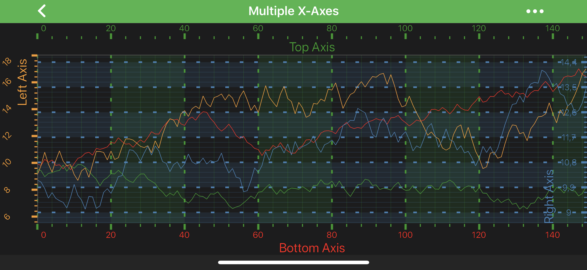

# Axis Styling - Grid Lines, Ticks and Axis Bands
As mentioned in previous article on Axis Styling - [Title and Labels](xref:axisAPIs.AxisStylingTitleAndLabels) -
**each and every** aspect of the axis can be styled. The Axis is responsible for drawing the following parts:
- [Title](xref:axisAPIs.AxisStylingTitleAndLabels#axis-title)
- [Axis Labels](xref:axisAPIs.AxisStylingTitleAndLabels#axis-labels)
- [Tick Lines](#axis-ticks) - small marks on the outside of an axis **next to labels**
- [Grid Lines](#grid-lines) - major and minor
- [Axis Bands](#axis-bands) - shading between the **major** grid-lines

In this article we are going to focus on [Tick Lines](#axis-ticks), [Gridlines](#grid-lines) and [Axis Bands](#axis-bands) styling. So let's pick up where we left off in [previous article](xref:axisAPIs.AxisStylingTitleAndLabels) and proceed with some styling.

> [!NOTE]
> It's important to mention, that `X-Axis` is responsible for **vertical** grid-lines and bands, whereas `Y-Axis` - for **horizontal** ones.

> [!NOTE]
> In SciChart, almost all styling methods expect an instance of either <xref:com.scichart.drawing.common.PenStyle> or <xref:com.scichart.drawing.common.BrushStyle> to be passed in. Those that deals with text styling, expect an instance of a <xref:com.scichart.drawing.common.FontStyle>. To learn more about how to utilize them, please refer to the [PenStyle, BrushStyle and FontStyle](xref:stylingAndTheming.PenStyleBrushStyleAndFontStyle) article.

## Axis Ticks
Axis Ticks can be styled via applying the <xref:com.scichart.drawing.common.PenStyle> onto the [minorTickLineStyle](xref:com.scichart.charting.visuals.axes.IAxisCore.setMinorTickLineStyle(com.scichart.drawing.common.PenStyle)) property to affect **Minor** ticks, or onto the [majorTickLineStyle](xref:com.scichart.charting.visuals.axes.IAxisCore.setMajorTickLineStyle(com.scichart.drawing.common.PenStyle)) - for the **Major** ticks. Ticks **Length** can also be controlled via [majorTickLineLength](xref:com.scichart.charting.visuals.axes.IAxisCore.setMajorTickLineLength(float)) and [minorTickLineLength](xref:com.scichart.charting.visuals.axes.IAxisCore.setMinorTickLineLength(float)) properties.

Also, ticks can be completely hidden or shown on an axis via the [drawMinorTicks](xref:com.scichart.charting.visuals.axes.IAxisCore.setDrawMinorTicks(boolean)) and [drawMajorTicks](xref:com.scichart.charting.visuals.axes.IAxisCore.setDrawMajorTicks(boolean)) properties.

# [Java](#tab/java)
[!code-java[SetTickLineStyle](../../../samples/sandbox/app/src/main/java/com/scichart/docsandbox/examples/java/axisAPIs/AxisStylingGridLinesTicksAndAxisBands.java#SetTickLineStyle)]
# [Java with Builders API](#tab/javaBuilder)
[!code-java[SetTickLineStyle](../../../samples/sandbox/app/src/main/java/com/scichart/docsandbox/examples/javaBuilder/axisAPIs/AxisStylingGridLinesTicksAndAxisBands.java#SetTickLineStyle)]
# [Kotlin](#tab/kotlin)
[!code-swift[SetTickLineStyle](../../../samples/sandbox/app/src/main/java/com/scichart/docsandbox/examples/kotlin/axisAPIs/AxisStylingGridLinesTicksAndAxisBands.kt#SetTickLineStyle)]
***

## Grid Lines
Grid Lines are styled the same way as [Axis ticks](#axis-ticks) - use the following properties to affect gridlines rendering:
- [drawMajorGridLines](xref:com.scichart.charting.visuals.axes.IAxisCore.setDrawMajorGridLines(boolean))
- [drawMinorGridLines](xref:com.scichart.charting.visuals.axes.IAxisCore.setDrawMinorGridLines(boolean))
- [majorGridLineStyle](xref:com.scichart.charting.visuals.axes.IAxisCore.setMajorGridLineStyle(com.scichart.drawing.common.PenStyle))
- [minorGridLineStyle](xref:com.scichart.charting.visuals.axes.IAxisCore.setMinorGridLineStyle(com.scichart.drawing.common.PenStyle))

# [Java](#tab/java)
[!code-java[SetGridLineStyle](../../../samples/sandbox/app/src/main/java/com/scichart/docsandbox/examples/java/axisAPIs/AxisStylingGridLinesTicksAndAxisBands.java#SetGridLineStyle)]
# [Java with Builders API](#tab/javaBuilder)
[!code-java[SetGridLineStyle](../../../samples/sandbox/app/src/main/java/com/scichart/docsandbox/examples/javaBuilder/axisAPIs/AxisStylingGridLinesTicksAndAxisBands.java#SetGridLineStyle)]
# [Kotlin](#tab/kotlin)
[!code-swift[SetGridLineStyle](../../../samples/sandbox/app/src/main/java/com/scichart/docsandbox/examples/kotlin/axisAPIs/AxisStylingGridLinesTicksAndAxisBands.kt#SetGridLineStyle)]
***

## Axis Bands
The colored strips between **Major** grid lines are called **Axis Bands**. They can be made visible or hidden via the [drawMajorBands](xref:com.scichart.charting.visuals.axes.IAxisCore.setDrawMajorBands(boolean)) property. The fill can be changed via the [axisBandsStyle](xref:com.scichart.charting.visuals.axes.IAxisCore.setAxisBandsStyle(com.scichart.drawing.common.BrushStyle)) property, that expects a <xref:com.scichart.drawing.common.BrushStyle>:

# [Java](#tab/java)
[!code-java[SetAxisBandsStyle](../../../samples/sandbox/app/src/main/java/com/scichart/docsandbox/examples/java/axisAPIs/AxisStylingGridLinesTicksAndAxisBands.java#SetAxisBandsStyle)]
# [Java with Builders API](#tab/javaBuilder)
[!code-java[SetAxisBandsStyle](../../../samples/sandbox/app/src/main/java/com/scichart/docsandbox/examples/javaBuilder/axisAPIs/AxisStylingGridLinesTicksAndAxisBands.java#SetAxisBandsStyle)]
# [Kotlin](#tab/kotlin)
[!code-swift[SetAxisBandsStyle](../../../samples/sandbox/app/src/main/java/com/scichart/docsandbox/examples/kotlin/axisAPIs/AxisStylingGridLinesTicksAndAxisBands.kt#SetAxisBandsStyle)]
***
