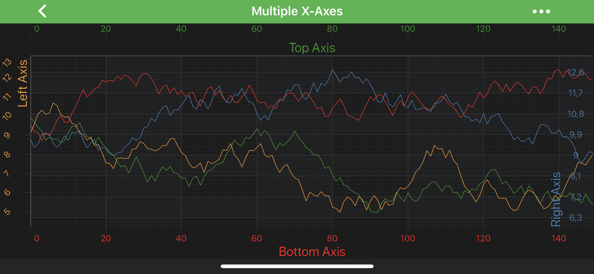

# Axis Styling - Title and Labels
**Each and Every** aspect of the axis can be styled. The Axis is responsible for drawing the following parts:
- [Title](#axis-title)
- [Axis Labels](#axis-labels)
- [Tick Lines](xref:axisAPIs.AxisStylingGridLinesTicksAndAxisBands#axis-ticks) - small marks on the outside of an axis **next to labels**
- [Gridlines](xref:axisAPIs.AxisStylingGridLinesTicksAndAxisBands#grid-lines) - major and minor
- [Axis Bands](xref:axisAPIs.AxisStylingGridLinesTicksAndAxisBands#axis-bands) - shading between the **major** gridlines

In this article we are going to focus on [Axis Title](#axis-title) and [Axis Labels](#axis-labels) styling.

> [!NOTE]
> In SciChart, almost all styling methods expect an instance of either <xref:com.scichart.drawing.common.PenStyle> or <xref:com.scichart.drawing.common.BrushStyle> to be passed in. Those that deal with text styling, expect an instance of a <xref:com.scichart.drawing.common.FontStyle>. To learn more about how to utilize them, please refer to the [PenStyle, BrushStyle and FontStyle](xref:stylingAndTheming.PenStyleBrushStyleAndFontStyle) article.

## Axis Title
The <xref:com.scichart.drawing.common.FontStyle> object can be applied to axis labels via the [titleStyle](xref:com.scichart.charting.visuals.axes.IAxis.setTitleStyle(com.scichart.drawing.common.FontStyle)) property.

In addition to font style, there are several options available for positioning of the title, including inside the axis area:
- [axisTitlePlacement](xref:com.scichart.charting.visuals.axes.IAxis.setAxisTitlePlacement(com.scichart.charting.visuals.axes.AxisTitlePlacement)) - allows placing a title inside or outside the axis area via the <xref:com.scichart.charting.visuals.axes.AxisTitlePlacement>.
- [axisTitleOrientation](xref:com.scichart.charting.visuals.axes.IAxis.setAxisTitleOrientation(com.scichart.charting.visuals.axes.AxisTitleOrientation)) - changes the orientation of the title, making it horizontal or vertical via the <xref:com.scichart.charting.visuals.axes.AxisTitleOrientation> enum.
- [axisTitleGravity](xref:com.scichart.charting.visuals.axes.IAxis.setAxisTitleGravity(int)) - the desired alignment of the title via the [Gravity](https://developer.android.com/reference/android/view/Gravity).
- [axisTitleMargins](xref:com.scichart.charting.visuals.axes.IAxis.setAxisTitleMargins(int)) - margins could be applied to omit overlapping with labels, while using <xref:com.scichart.charting.visuals.axes.AxisTitlePlacement>.Inside mode.

## Axis Labels
The tick labels can be hidden or shown on an axis via the [drawLabels](xref:com.scichart.charting.visuals.axes.IAxisCore.setDrawLabels(boolean)) property. To make the labels at the edges to always appear inside the axis area, use the [autoFitMarginalLabels](xref:com.scichart.charting.visuals.axes.IAxis.setAutoFitMarginalLabels(boolean)) property.

The <xref:com.scichart.drawing.common.FontStyle> object can be applied to axis labels via the [tickLabelStyle](xref:com.scichart.charting.visuals.axes.IAxis.setTickLabelStyle(com.scichart.drawing.common.FontStyle)) property.

Also, there is <xref:com.scichart.charting.visuals.axes.AxisTickLabelStyle> available for controlling **alignment**, **margin** and **rotation angle** of each Label during rendering.

Let's try to modify our [Multiple X-Axis Chart Example](https://www.scichart.com/example/android-chart-example-multiple-xaxis/) with the following code, and see what we can achieve:

# [Java](#tab/java)
[!code-java[SetAxisLabels](../../../samples/sandbox/app/src/main/java/com/scichart/docsandbox/examples/java/axisAPIs/AxisStylingTitleAndLabels.java#SetAxisLabels)]
# [Java with Builders API](#tab/javaBuilder)
[!code-java[SetAxisLabels](../../../samples/sandbox/app/src/main/java/com/scichart/docsandbox/examples/javaBuilder/axisAPIs/AxisStylingTitleAndLabels.java#SetAxisLabels)]
# [Kotlin](#tab/kotlin)
[!code-swift[SetAxisLabels](../../../samples/sandbox/app/src/main/java/com/scichart/docsandbox/examples/kotlin/axisAPIs/AxisStylingTitleAndLabels.kt#SetAxisLabels)]
***

> [!NOTE]
> You might notice, that **Right Axis** title, labels and ticks are placed inside the chart area. This behaviour is controlled by [isCenterAxis](xref:com.scichart.charting.visuals.axes.IAxis.setIsCenterAxis(boolean)). To learn more, please refer to [Axis Placement](xref:axisAPIs.AxisLayoutCentralAxis#axis-placement) article.
