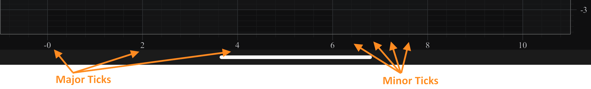
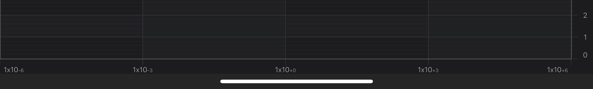
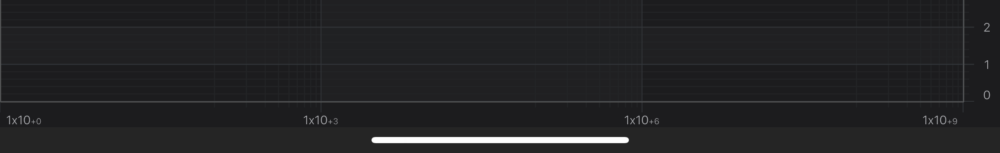

# Axis Ticks - MajorDelta, MinorDelta and AutoTicks

## Axis Ticks, Labels and Grid Lines
In SciChart, the **Ticks** are small marks around the chart on an axis. There are **Minor** and **Major** Ticks, where Minor Ticks are placed in between Major ones. By default, Major Ticks are longer and thicker than Minor Ticks.

**Axis Labels** appears for every Major Tick, if there is enough space around. If Axis Labels are placed too tightly, some of them **get culled** to make more space. If necessary, labels ***culling can be switched off*** via [isLabelCullingEnabled](xref:com.scichart.charting.visuals.axes.IAxis.setIsLabelCullingEnabled(boolean)) property.

**Grid Lines** correspond to **Ticks** on an axis. Likewise, there are Minor and Major Grid lines. In SciChart, **axes are responsible** not only for drawing Ticks and Labels, but also **for the chart grid**. An axis draws only those Grid Lines that can be measured against it, i.e. a horizontal axis draws vertical grid lines and vice versa.

majorDelta = 2; minorDelta = 0.4; autoTicks = NO

To learn more about possible options for Axis Ticks, Gridlines and Labels, please refer to the [Axis Styling - Grid Lines, Ticks and Axis Bands](xref:axisAPIs.AxisStylingGridLinesTicksAndAxisBands) and [Axis Styling - Title and Labels](xref:axisAPIs.AxisStylingTitleAndLabels) articles.

## Automatic Tick Spacing
In SciChart, the **difference** between two Major Ticks **is called MajorDelta**, and that between two minor Ticks - **MinorDelta**. By default, both delta values, and therefore the Tick spacing, are calculated automatically according to the VisibleRange and size of an axis. As zoom level changes, the [majorDelta](xref:com.scichart.charting.visuals.axes.IAxisCore.setMajorDelta(java.lang.Comparable)), [minorDelta](xref:com.scichart.charting.visuals.axes.IAxisCore.setMinorDelta(java.lang.Comparable)) of every axis will be updated correspondingly, and the tick frequency may change.

There are two additional options used to control the auto ticking behavior. The [maxAutoTicks](xref:com.scichart.charting.visuals.axes.IAxisCore.setMaxAutoTicks(int)) property allows to limit the number of generated ticks to the desired number, and the [minorsPerMajor](xref:com.scichart.charting.visuals.axes.IAxisCore.setMinorsPerMajor(int)) - specifies how many Minor Ticks are drawn between two Major Ticks (the default is 5).

# [Java](#tab/java)
[!code-java[AutomaticTickSpacing](../../../samples/sandbox/app/src/main/java/com/scichart/docsandbox/examples/java/axisAPIs/AxisTicksMajorDeltaMinorDeltaAndAutoTicks.java#AutomaticTickSpacing)]
# [Java with Builders API](#tab/javaBuilder)
[!code-java[AutomaticTickSpacing](../../../samples/sandbox/app/src/main/java/com/scichart/docsandbox/examples/javaBuilder/axisAPIs/AxisTicksMajorDeltaMinorDeltaAndAutoTicks.java#AutomaticTickSpacing)]
# [Kotlin](#tab/kotlin)
[!code-swift[AutomaticTickSpacing](../../../samples/sandbox/app/src/main/java/com/scichart/docsandbox/examples/kotlin/axisAPIs/AxisTicksMajorDeltaMinorDeltaAndAutoTicks.kt#AutomaticTickSpacing)]
***

## Altering Tick Spacing
It is also possible to set **MinorDelta** and **MajorDelta** manually. To change them, automatic calculation must be **switched off** via the [autoTicks](xref:com.scichart.charting.visuals.axes.IAxisCore.setAutoTicks(boolean)) property. To set delta values, call the [minorDelta](xref:com.scichart.charting.visuals.axes.IAxisCore.setMinorDelta(java.lang.Comparable)) and [majorDelta](xref:com.scichart.charting.visuals.axes.IAxisCore.setMajorDelta(java.lang.Comparable)) properties. Please note that both delta values need to be set in this case:

# [Java](#tab/java)
[!code-java[AlteringTickSpacing](../../../samples/sandbox/app/src/main/java/com/scichart/docsandbox/examples/java/axisAPIs/AxisTicksMajorDeltaMinorDeltaAndAutoTicks.java#AlteringTickSpacing)]
# [Java with Builders API](#tab/javaBuilder)
[!code-java[AlteringTickSpacing](../../../samples/sandbox/app/src/main/java/com/scichart/docsandbox/examples/javaBuilder/axisAPIs/AxisTicksMajorDeltaMinorDeltaAndAutoTicks.java#AlteringTickSpacing)]
# [Kotlin](#tab/kotlin)
[!code-swift[AlteringTickSpacing](../../../samples/sandbox/app/src/main/java/com/scichart/docsandbox/examples/kotlin/axisAPIs/AxisTicksMajorDeltaMinorDeltaAndAutoTicks.kt#AlteringTickSpacing)]
***

## Altering Tick Spacing for the Logarithmic Axis
<xref:com.scichart.charting.visuals.axes.LogarithmicNumericAxis> is a special case that need to be mentioning here. Due to the exponential nature of this axis type, **MajorDelta** represents the **difference between exponents** of neighbouring major ticks, not between their actual values. For instance, having [majorDelta](xref:com.scichart.charting.visuals.axes.IAxisCore.setMajorDelta(java.lang.Comparable)) = 3 and [logarithmicBase](xref:com.scichart.charting.visuals.axes.ILogarithmicNumericAxis.setLogarithmicBase(double)) = 10 on a <xref:com.scichart.charting.visuals.axes.LogarithmicNumericAxis> specifies that major ticks and gridlines will be spaced at 103 intervals (exponents will be divisors of MajorDelta):

LogarithmicAxis, MajorDelta = 3, minor ticks/gridlines hidden

On the contrary, the difference between neighbouring minor ticks is not exponential. Therefore, **MinorDelta** represents the **difference between the actual values** of neighbouring minor ticks. 

For instance, having [minorDelta](xref:com.scichart.charting.visuals.axes.IAxisCore.setMinorDelta(java.lang.Comparable)) = 100 results in minor ticks and gridlines appearing with the increment of 100x10E, where `E` is the exponent of the nearest major tick to the left. So, the interval will be like the following:

| **Range**                            | **Interval**       | **Raw Interval** |
| ------------------------------------ | ------------------ | ---------------- |
| [1x100, 1x103] | 100x100 | 100              |
| [1x103, 1x106] | 100x103 | 100000           |
| [1x106, 1x109] | 100x106 | 100000000        |

LogarithmicAxis, MajorDelta = 3, MinorDelta = 100

