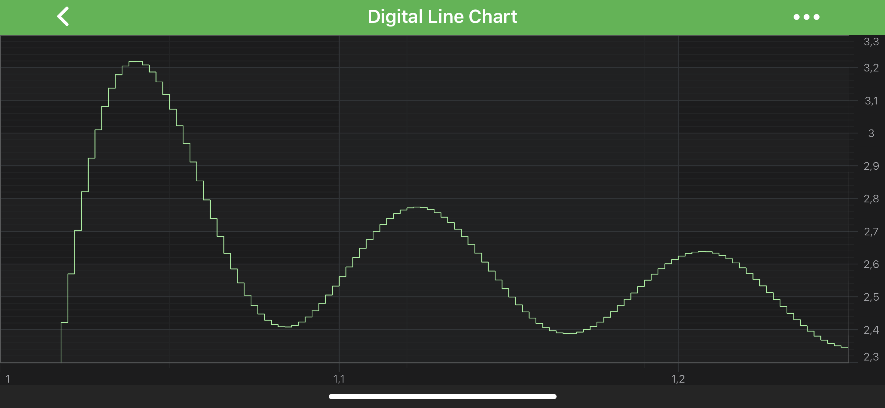
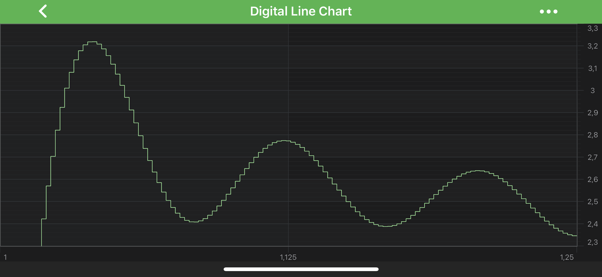

# Axis Ticks - TickProvider and DeltaCalculator API
It is possible to further [customize the MajorDelta, MinorDelta](xref:axisAPIs.AxisTicksMajorDeltaMinorDeltaAndAutoTicks) and affect the tick frequency of an axis, to have a **totally custom** set of axis ticks (gridlines, label intervals) on the chart. That can be achieved quite easily through [DeltaCalculator](#creating-your-own-deltacalculator) and [TickProvider](#creating-your-own-tickprovider) APIs.

## Creating your own DeltaCalculator
To have full control over the calculations of **MajorDelta** and **MinorDelta** you will need to create a custom <xref:com.scichart.charting.numerics.deltaCalculators.IDeltaCalculator>. By default each <xref:com.scichart.charting.numerics.tickProviders.ITickProvider> has a DeltaCalculator created for it. The type of DeltaCalculator depends on the TickProvider. Below is a table of the DeltaCalculator already defined in SciChart Android.

| **Delta Calculator Type**       | **Used By**                                            |
| ------------------------------- | ------------------------------------------------------ |
| <xref:com.scichart.charting.numerics.deltaCalculators.NumericDeltaCalculator>     | <xref:com.scichart.charting.numerics.tickProviders.NumericTickProvider> and <xref:com.scichart.charting.numerics.tickProviders.CategoryTickProvider> |
| <xref:com.scichart.charting.numerics.deltaCalculators.LogarithmicDeltaCalculator> | <xref:com.scichart.charting.numerics.tickProviders.LogarithmicNumericTickProvider>                    |
| <xref:com.scichart.charting.numerics.deltaCalculators.DateDeltaCalculator>        | <xref:com.scichart.charting.numerics.tickProviders.DateTickProvider>                                  |

To create a custom <xref:com.scichart.charting.numerics.deltaCalculators.IDeltaCalculator>, you need to inherit from the correct class, according to the table above, then override <xref:com.scichart.charting.numerics.deltaCalculators.IDeltaCalculator.getDeltaFromRange(java.lang.Comparable&lt;%3F&gt;,java.lang.Comparable&lt;%3F&gt;,int,int)> method. This method is called internally by <xref:com.scichart.charting.numerics.tickProviders.ITickProvider> for every axis when it needs to recalculate <xref:com.scichart.charting.numerics.deltaCalculators.AxisDelta>.

Let's create a custom <xref:com.scichart.charting.numerics.deltaCalculators.IDeltaCalculator> and use it with <xref:com.scichart.charting.numerics.tickProviders.NumericTickProvider> for <xref:com.scichart.charting.visuals.axes.NumericAxis>.

# [Java](#tab/java)
[!code-java[CreateCustomNumericDeltaCalculator](../../../samples/sandbox/app/src/main/java/com/scichart/docsandbox/examples/java/axisAPIs/AxisTicksTickProviderAndDeltaCalculatorAPI.java#CreateCustomNumericDeltaCalculator)]
[!code-java[UseCustomNumericDeltaCalculator](../../../samples/sandbox/app/src/main/java/com/scichart/docsandbox/examples/java/axisAPIs/AxisTicksTickProviderAndDeltaCalculatorAPI.java#UseCustomNumericDeltaCalculator)]
# [Java with Builders API](#tab/javaBuilder)
[!code-java[CreateCustomNumericDeltaCalculator](../../../samples/sandbox/app/src/main/java/com/scichart/docsandbox/examples/javaBuilder/axisAPIs/AxisTicksTickProviderAndDeltaCalculatorAPI.java#CreateCustomNumericDeltaCalculator)]
[!code-java[UseCustomNumericDeltaCalculator](../../../samples/sandbox/app/src/main/java/com/scichart/docsandbox/examples/javaBuilder/axisAPIs/AxisTicksTickProviderAndDeltaCalculatorAPI.java#UseCustomNumericDeltaCalculator)]
# [Kotlin](#tab/kotlin)
[!code-swift[CreateCustomNumericDeltaCalculator](../../../samples/sandbox/app/src/main/java/com/scichart/docsandbox/examples/kotlin/axisAPIs/AxisTicksTickProviderAndDeltaCalculatorAPI.kt#CreateCustomNumericDeltaCalculator)]
[!code-swift[UseCustomNumericDeltaCalculator](../../../samples/sandbox/app/src/main/java/com/scichart/docsandbox/examples/kotlin/axisAPIs/AxisTicksTickProviderAndDeltaCalculatorAPI.kt#UseCustomNumericDeltaCalculator)]
***

## Creating your own TickProvider
If you need to have **fine grained control** over axis ticks output, and custom **Delta Calculator** isn't enough - you might want to use [tickProvider](xref:com.scichart.charting.visuals.axes.IAxisCore.setTickProvider(com.scichart.charting.numerics.tickProviders.ITickProvider)) property, which is available for all [Axis Types](xref:axis.AxisAPIs). To use it - you will need to provide a custom <xref:com.scichart.charting.numerics.tickProviders.ITickProvider> and set it on your axis.

By default each axis has a <xref:com.scichart.charting.numerics.tickProviders.ITickProvider> created and assigned to it. The type of TickProvider depends on the [type of Axis](xref:axis.AxisAPIs). Below is a table of the TickProviders already defined in SciChart Android.

| **Tick Provider Type**              | **Provide ticks For**       |
| ----------------------------------- | --------------------------- |
| <xref:com.scichart.charting.numerics.tickProviders.NumericTickProvider>            | <xref:com.scichart.charting.visuals.axes.NumericAxis>            |
| <xref:com.scichart.charting.numerics.tickProviders.LogarithmicNumericTickProvider> | <xref:com.scichart.charting.visuals.axes.LogarithmicNumericAxis> |
| <xref:com.scichart.charting.numerics.tickProviders.DateTickProvider>               | <xref:com.scichart.charting.visuals.axes.DateAxis>               |
| <xref:com.scichart.charting.numerics.tickProviders.CategoryTickProvider>           | <xref:com.scichart.charting.visuals.axes.CategoryDateAxis>       |

To create a custom <xref:com.scichart.charting.numerics.tickProviders.TickProvider>, you need to inherit from the correct class, according to the [Axis Type](xref:axis.AxisAPIs) you have, and override <xref:com.scichart.charting.numerics.tickProviders.TickProvider.updateTicks(com.scichart.core.model.DoubleValues,com.scichart.core.model.DoubleValues)> method which is called internally for every axis when it needs to recalculate major and minor ticks for drawing.

Let's create custom <xref:com.scichart.charting.numerics.tickProviders.NumericTickProvider> for <xref:com.scichart.charting.visuals.axes.NumericAxis>

# [Java](#tab/java)
[!code-java[CreateCustomNumericTickProvider](../../../samples/sandbox/app/src/main/java/com/scichart/docsandbox/examples/java/axisAPIs/AxisTicksTickProviderAndDeltaCalculatorAPI.java#CreateCustomNumericTickProvider)]
[!code-java[UseCustomNumericTickProvider](../../../samples/sandbox/app/src/main/java/com/scichart/docsandbox/examples/java/axisAPIs/AxisTicksTickProviderAndDeltaCalculatorAPI.java#UseCustomNumericTickProvider)]
# [Java with Builders API](#tab/javaBuilder)
[!code-java[CreateCustomNumericTickProvider](../../../samples/sandbox/app/src/main/java/com/scichart/docsandbox/examples/javaBuilder/axisAPIs/AxisTicksTickProviderAndDeltaCalculatorAPI.java#CreateCustomNumericTickProvider)]
[!code-java[UseCustomNumericTickProvider](../../../samples/sandbox/app/src/main/java/com/scichart/docsandbox/examples/javaBuilder/axisAPIs/AxisTicksTickProviderAndDeltaCalculatorAPI.java#UseCustomNumericTickProvider)]
# [Kotlin](#tab/kotlin)
[!code-swift[CreateCustomNumericTickProvider](../../../samples/sandbox/app/src/main/java/com/scichart/docsandbox/examples/kotlin/axisAPIs/AxisTicksTickProviderAndDeltaCalculatorAPI.kt#CreateCustomNumericTickProvider)]
[!code-swift[UseCustomNumericTickProvider](../../../samples/sandbox/app/src/main/java/com/scichart/docsandbox/examples/kotlin/axisAPIs/AxisTicksTickProviderAndDeltaCalculatorAPI.kt#UseCustomNumericTickProvider)]
***

