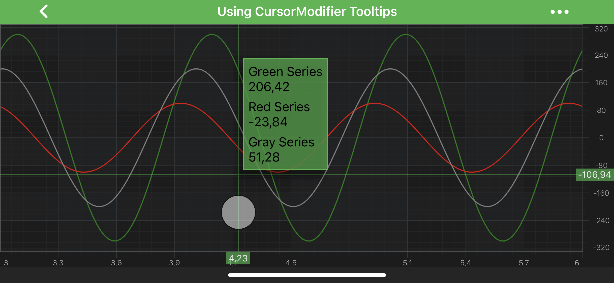
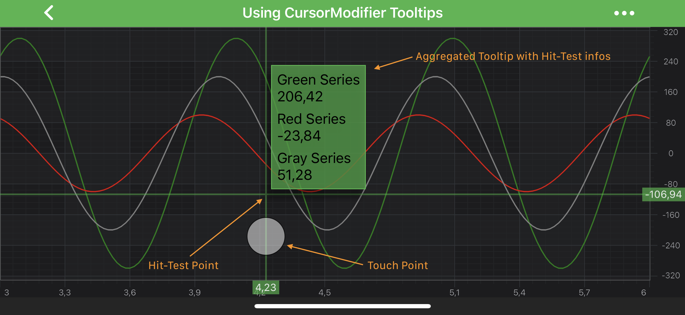
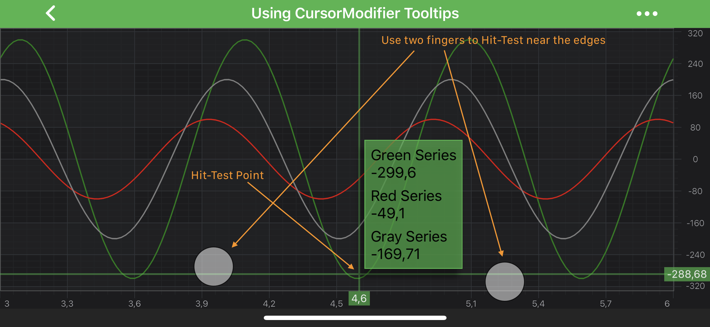

# CursorModifier
SciChart features a **Cursor** or **Crosshair** modifier provided by the <xref:com.scichart.charting.modifiers.CursorModifier>. 
It allows to display a crosshair at the **touch-point** and `X-Axis` and/or `Y-Axis` labels. 
The <xref:com.scichart.charting.modifiers.CursorModifier> is also able to display an aggregated tooltip (all series in one tooltip).

> [!NOTE]
> Examples of the **CursorModifier** usage can be found in the [SciChart Android Examples Suite](https://www.scichart.com/examples/android-chart/) as well as on [GitHub](https://github.com/ABTSoftware/SciChart.Android.Examples):
> - [Native Example](https://www.scichart.com/example/android-chart/android-chart-example-using-cursormodifier-tooltips/)
> - [Xamarin Example](https://www.scichart.com/example/xamarin-chart/xamarin-chart-using-cursormodifier-tooltips-example/)

## CursorModifier Usage
The <xref:com.scichart.charting.modifiers.CursorModifier> allows inspecting [RenderableSeries](xref:chart2d.2DChartTypes) at a touch point. 
For convenience, the actual **hit-test point** is located a bit upper.
Tooltips will appear to the side of it, showing the hit-test result for all RenderableSeries above the cursor horizontal line.
Also, the <xref:com.scichart.charting.modifiers.CursorModifier> shows labels on axes for its horizontal, vertical lines.

For hit-testing series parts that are close to the chart boundaries, a multi-touch finger drag can be used:

## CursorModifier Features
Besides the CursorModifier [specific features](#specific-features), there are some [common features](#common-features) which are shared between [TooltipModifier](xref:chartModifierAPIs.InteractivityTooltipModifier), [RolloverModifier](xref:chartModifierAPIs.InteractivityRolloverModifier) and [CursorModifier](xref:chartModifierAPIs.InteractivityCursorModifier) via common <xref:com.scichart.charting.modifiers.TooltipModifierBase> class.

#### Common Features

| **Feature**                               | **Description**                                                                                                                                                 |
| ----------------------------------------- | --------------------------------------------------------------------------------------------------------------------------------------------------------------- |
| <xref:com.scichart.charting.modifiers.TooltipModifierBase.setShowTooltip(boolean)>      | Allows to **hide or show** modifier's Tooltips.                                                                                                                 |
| <xref:com.scichart.charting.modifiers.TooltipModifierBase.setUseInterpolation(boolean)> | Allows to show **interpolated** values between data points. It is a `true` by default. If `false` - modifier's Tooltips will report the info about **closest** data points. |
| <xref:com.scichart.charting.modifiers.TooltipModifierBase.setSourceMode(com.scichart.charting.modifiers.SourceMode)>       | Allows to specify which <xref:com.scichart.charting.visuals.renderableSeries.IRenderableSeries> are to be inspected by a modifier, e.g. **Visible**, **Selected**, etc. Other will be ignored by the modifier. Expects a member of the <xref:com.scichart.charting.modifiers.SourceMode> enumeration. |

#### Specific Features

| **Feature**                           | **Description**                                                                                                                                                                           |
| ------------------------------------- | ----------------------------------------------------------------------------------------------------------------------------------------------------------------------------------------- |
| <xref:com.scichart.charting.modifiers.CursorModifier.setOffset(float)>            | Specifies **how far** the hit-test point is **from** the actual **touch point**. This value will be used for either `X` or `Y` coordinate, or both, depending on `markerPlacement`.       |
| <xref:com.scichart.charting.modifiers.CursorModifier.setCustomPointOffset(android.graphics.PointF)> | Specifies **how far** the hit-test point is **from** the actual **touch point**. As opposed to `offset`, both `X` and `Y` coordinate will always be applied.                              |
| <xref:com.scichart.charting.modifiers.CursorModifier.setMarkerPlacement(com.scichart.charting.modifiers.Placement)>   | Allows to specify the **position** of the hit-test point relative to the **touch point**, e.g. Left, Top, etc... Expects a member of the <xref:com.scichart.charting.modifiers.Placement> enumeration.                      |
| <xref:com.scichart.charting.modifiers.CursorModifier.setTooltipPosition(com.scichart.charting.modifiers.TooltipPosition)>   | Allows to specify the **position** of modifier's Tooltips relative to the **hit-test point**, e.g. TopLeft, BottomRight, etc.... Expects a member of the <xref:com.scichart.charting.modifiers.TooltipPosition> enumeration. |
| <xref:com.scichart.charting.modifiers.CursorModifier.getCrosshairPaint()>   | Returns the [Paint](https://developer.android.com/reference/android/graphics/Paint.html) object that is responsible for the crosshair ("sniper aim") drawing (marking the hit-test point). Can be used to change style and color properties of the crosshair. |

## Adding a CursorModifier to a Chart
Any [Chart Modifier](xref:chartModifierAPIs.ChartModifierAPIs) can be [added to a <xref:com.scichart.charting.visuals.SciChartSurface>](xref:chartModifierAPIs.ChartModifierAPIs#adding-a-chart-modifier) via the [chartModifiers](xref:com.scichart.charting.visuals.ISciChartSurface.getChartModifiers()) property and <xref:com.scichart.charting.modifiers.CursorModifier> is no difference:

# [Java](#tab/java)
[!code-java[AddCursorModifier](../../../../samples/sandbox/app/src/main/java/com/scichart/docsandbox/examples/java/chartModifier2D/InteractivityCursorModifier.java#AddCursorModifier)]
# [Java with Builders API](#tab/javaBuilder)
[!code-java[AddCursorModifier](../../../../samples/sandbox/app/src/main/java/com/scichart/docsandbox/examples/javaBuilder/chartModifier2D/InteractivityCursorModifier.java#AddCursorModifier)]
# [Kotlin](#tab/kotlin)
[!code-swift[AddCursorModifier](../../../../samples/sandbox/app/src/main/java/com/scichart/docsandbox/examples/kotlin/chartModifier2D/InteractivityCursorModifier.kt#AddCursorModifier)]
***

> [!NOTE]
> To learn more about features available, please visit the [Chart Modifier APIs](xref:chartModifierAPIs.ChartModifierAPIs#common-chart-modifier-features) article.
