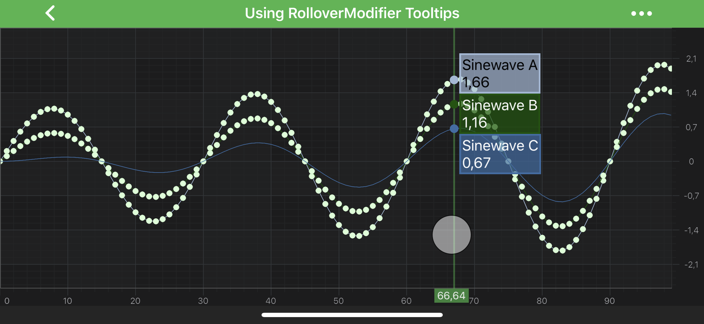

# RolloverModifier
The <xref:com.scichart.charting.modifiers.RolloverModifier> can be used to show tooltips for **all the series** under the vertical line drawn at the touch position:

> [!NOTE]
> The <xref:com.scichart.charting.modifiers.RolloverModifier> is specifically suited to inspect data across many series are the same. For scatter charts, or irregular charts, please try the [TooltipModifier](xref:chartModifierAPIs.InteractivityTooltipModifier).

> [!NOTE]
> Examples of the <xref:com.scichart.charting.modifiers.RolloverModifier> usage can be found in the [SciChart Android Examples Suite](https://www.scichart.com/examples/android-chart/) as well as on [GitHub](https://github.com/ABTSoftware/SciChart.android.Examples)

## RolloverModifier Features
Besides the RolloverModifier [specific features](#specific-features), there are some [common features](#common-features) which are shared between [TooltipModifier](xref:chartModifierAPIs.InteractivityTooltipModifier), [RolloverModifier](xref:chartModifierAPIs.InteractivityRolloverModifier) and [CursorModifier](xref:chartModifierAPIs.InteractivityCursorModifier) via common <xref:com.scichart.charting.modifiers.TooltipModifierBase> class.

#### Common Features

| **Feature**                               | **Description**                                                                                                                                                 |
| ----------------------------------------- | --------------------------------------------------------------------------------------------------------------------------------------------------------------- |
| <xref:com.scichart.charting.modifiers.TooltipModifierBase.setShowTooltip(boolean)>      | Allows to **hide or show** modifier's Tooltips.                                                                                                                 |
| <xref:com.scichart.charting.modifiers.TooltipModifierBase.setUseInterpolation(boolean)> | Allows to show **interpolated** values between data points. It is a `true` by default. If `false` - modifier's Tooltips will report the info about **closest** data points. |
| <xref:com.scichart.charting.modifiers.TooltipModifierBase.setSourceMode(com.scichart.charting.modifiers.SourceMode)>       | Allows to specify which <xref:com.scichart.charting.visuals.renderableSeries.IRenderableSeries> are to be inspected by a modifier, e.g. **Visible**, **Selected**, etc. Other will be ignored by the modifier. Expects a member of the <xref:com.scichart.charting.modifiers.SourceMode> enumeration. |

#### Specific Features

| **Feature**                                          | **Description**                                                                       |
| ---------------------------------------------------- | ------------------------------------------------------------------------------------- |
| <xref:com.scichart.charting.modifiers.TooltipModifierWithAxisLabelsBase.setShowAxisLabels(boolean)> | Allows to **hide or show** Rollover's **axis label**                                  |
| <xref:com.scichart.charting.modifiers.RolloverModifier.setDrawVerticalLine(boolean)>               | Allows to **hide or show** Rollover's **vertical line**.                              |
| <xref:com.scichart.charting.modifiers.RolloverModifier.getVerticalLinePaint()>              | Returns the [Paint](https://developer.android.com/reference/android/graphics/Paint.html) object for the Rollover's vertical line. Can be used to change style and color properties of the line. |

## Adding a RolloverModifier to a Chart
Any [Chart Modifier](xref:chartModifierAPIs.ChartModifierAPIs) can be [added to a <xref:com.scichart.charting.visuals.SciChartSurface>](xref:chartModifierAPIs.ChartModifierAPIs#adding-a-chart-modifier) via the [chartModifiers](xref:com.scichart.charting.visuals.ISciChartSurface.getChartModifiers()) property and <xref:com.scichart.charting.modifiers.RolloverModifier> is no difference:

# [Java](#tab/java)
[!code-java[AddRolloverModifier](../../../../samples/sandbox/app/src/main/java/com/scichart/docsandbox/examples/java/chartModifier2D/InteractivityRolloverModifier.java#AddRolloverModifier)]
# [Java with Builders API](#tab/javaBuilder)
[!code-java[AddRolloverModifier](../../../../samples/sandbox/app/src/main/java/com/scichart/docsandbox/examples/javaBuilder/chartModifier2D/InteractivityRolloverModifier.java#AddRolloverModifier)]
# [Kotlin](#tab/kotlin)
[!code-swift[AddRolloverModifier](../../../../samples/sandbox/app/src/main/java/com/scichart/docsandbox/examples/kotlin/chartModifier2D/InteractivityRolloverModifier.kt#AddRolloverModifier)]
***

> [!NOTE]
> To learn more about features available, please visit the [Chart Modifier APIs](xref:chartModifierAPIs.ChartModifierAPIs#common-chart-modifier-features) article.
