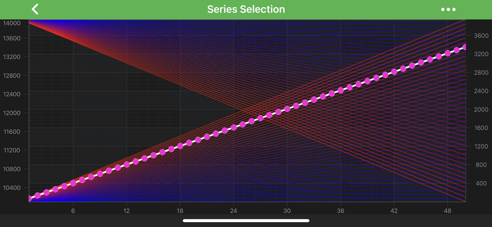

# SeriesSelectionModifier
SciChart features the <xref:com.scichart.charting.modifiers.SeriesSelectionModifier>, which allows selection of the upmost [RenderableSeries](xref:chart2d.2DChartTypes) at a touch position:

> [!NOTE]
> Examples of the **SeriesSelectionModifier usage** can be found in the [SciChart Android Examples Suite](https://www.scichart.com/examples/Android-chart/) as well as on [GitHub](https://github.com/ABTSoftware/SciChart.Android.Examples):
> - [Native Example](https://www.scichart.com/example/android-chart/android-chart-example-series-selection/)
> - [Xamarin Example](https://www.scichart.com/example/xamarin-chart/xamarin-chart-series-selection-example/)

## SeriesSelectionModifier Usage
The <xref:com.scichart.charting.modifiers.SeriesSelectionModifier> allows setting of **SelectedSeriesStyle** of <xref:com.scichart.charting.visuals.renderableSeries.IStyle> type, which is applied to a [RenderableSeries](xref:chart2d.2DChartTypes) after it has been selected by the modifier. 
Internally, the modifier modifies the <xref:com.scichart.charting.visuals.renderableSeries.IRenderableSeriesCore.setIsSelected(boolean)> property on the topmost **RenderableSeries** to make it selected and tries to apply the <xref:com.scichart.charting.visuals.renderableSeries.IStyle> onto <xref:com.scichart.charting.visuals.renderableSeries.IRenderableSeriesCore.setSelectedSeriesStyle(com.scichart.charting.visuals.renderableSeries.IStyle)> property.

The **SelectedSeriesStyle** has to conform to the <xref:com.scichart.charting.visuals.renderableSeries.IStyle> protocol, which requires implementation of the following:

| **Method**                          | **Description**                                                                                                                                        |
| ----------------------------------- | ------------------------------------------------------------------------------------------------------------------------------------------------------ |
| <xref:com.scichart.charting.visuals.renderableSeries.IStyle.tryApplyStyle(java.lang.Object)>     | In this method you have to **make** the desired changes to a [RenderableSeries](xref:chart2d.2DChartTypes). It is called when a series gets selected. |
| <xref:com.scichart.charting.visuals.renderableSeries.IStyle.tryDiscardStyle(java.lang.Object)> | In this method you have to **discard** all the changes made in the <xref:com.scichart.charting.visuals.renderableSeries.IStyle.tryApplyStyle(java.lang.Object)> call.                                               |
| <xref:com.scichart.charting.visuals.renderableSeries.IStyle.getStyleableObjectType()>     | Provides the type of an object (**RenderableSeries**) that this Style is to be applied to.                                                             |

For convenience purposes, there is a base implementation provided in <xref:com.scichart.charting.visuals.renderableSeries.StyleBase> class. 
You can **derive** from it then you will only need to implement the <xref:com.scichart.charting.visuals.renderableSeries.StyleBase.applyStyleInternal(T)> and <xref:com.scichart.charting.visuals.renderableSeries.StyleBase.discardStyleInternal(T)> methods instead. 
Please find a code sample [below](#adding-a-seriesselectionmodifier-to-a-chart).

> [!NOTE]
> If you need to be able **to select** multiple RenderableSeries of **different types**, you can return the <xref:com.scichart.charting.visuals.renderableSeries.IRenderableSeries> as the RenderableSeries type, as it is shown in the code sample below. 
> Alternatively, it is possible to have several <xref:com.scichart.charting.modifiers.SeriesSelectionModifier>s instances with <xref:com.scichart.charting.visuals.renderableSeries.IStyle>s for different RenderableSeries types by calling <xref:com.scichart.charting.modifiers.ChartModifierCore.setReceiveHandledEvents(boolean)> with `true`.

## Adding a SeriesSelectionModifier to a Chart
Any [Chart Modifier](xref:chartModifierAPIs.ChartModifierAPIs) can be [added to a <xref:com.scichart.charting.visuals.SciChartSurface>](xref:chartModifierAPIs.ChartModifierAPIs#adding-a-chart-modifier) via the [chartModifiers](xref:com.scichart.charting.visuals.ISciChartSurface.getChartModifiers()) property and <xref:com.scichart.charting.modifiers.SeriesSelectionModifier> is no difference.

In the example below, we will create **SelectedSeriesStyle** and use it with <xref:com.scichart.charting.modifiers.SeriesSelectionModifier>:

# [Java](#tab/java)
[!code-java[CreateSelectedSeriesStyle](../../../../samples/sandbox/app/src/main/java/com/scichart/docsandbox/examples/java/chartModifier2D/InteractivitySeriesSelectionModifier.java#CreateSelectedSeriesStyle)]
# [Java with Builders API](#tab/javaBuilder)
[!code-java[CreateSelectedSeriesStyle](../../../../samples/sandbox/app/src/main/java/com/scichart/docsandbox/examples/javaBuilder/chartModifier2D/InteractivitySeriesSelectionModifier.java#CreateSelectedSeriesStyle)]
# [Kotlin](#tab/kotlin)
[!code-swift[CreateSelectedSeriesStyle](../../../../samples/sandbox/app/src/main/java/com/scichart/docsandbox/examples/kotlin/chartModifier2D/InteractivitySeriesSelectionModifier.kt#CreateSelectedSeriesStyle)]
***

Now, create and add <xref:com.scichart.charting.modifiers.SeriesSelectionModifier> onto your <xref:com.scichart.charting.visuals.SciChartSurface>:

# [Java](#tab/java)
[!code-java[AddSeriesSelectionModifier](../../../../samples/sandbox/app/src/main/java/com/scichart/docsandbox/examples/java/chartModifier2D/InteractivitySeriesSelectionModifier.java#AddSeriesSelectionModifier)]
# [Java with Builders API](#tab/javaBuilder)
[!code-java[AddSeriesSelectionModifier](../../../../samples/sandbox/app/src/main/java/com/scichart/docsandbox/examples/javaBuilder/chartModifier2D/InteractivitySeriesSelectionModifier.java#AddSeriesSelectionModifier)]
# [Kotlin](#tab/kotlin)
[!code-swift[AddSeriesSelectionModifier](../../../../samples/sandbox/app/src/main/java/com/scichart/docsandbox/examples/kotlin/chartModifier2D/InteractivitySeriesSelectionModifier.kt#AddSeriesSelectionModifier)]
***

> [!NOTE]
> To learn more about features available, please visit the [Chart Modifier APIs](xref:chartModifierAPIs.ChartModifierAPIs#common-chart-modifier-features) article.
