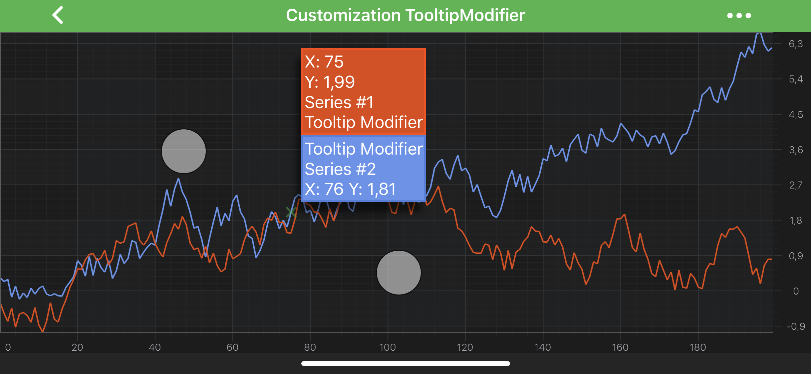
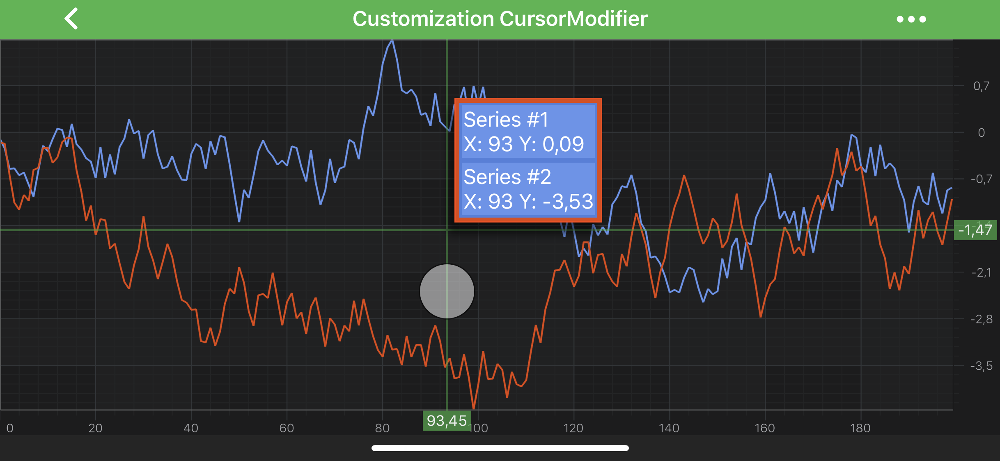
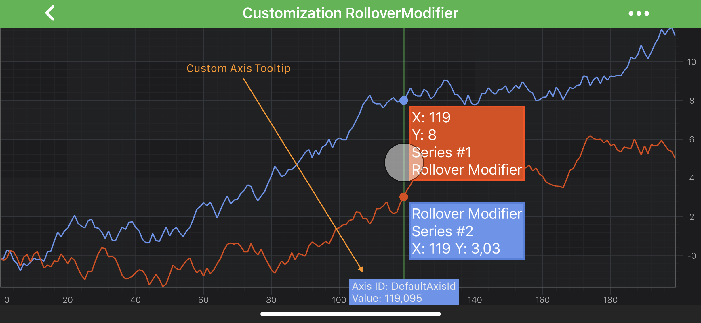

# Tooltips Customization
In SciChart, you can fully customize tooltips for [TooltipModifier](xref:chartModifierAPIs.InteractivityTooltipModifier), [RolloverModifier](xref:chartModifierAPIs.InteractivityRolloverModifier) and [CursorModifier](xref:chartModifierAPIs.InteractivityCursorModifier).
Those customizations can be achieved via the <xref:com.scichart.charting.visuals.renderableSeries.hitTest.ISeriesInfoProvider> and <xref:com.scichart.charting.visuals.renderableSeries.tooltips.ISeriesTooltip> protocols.
Moreover - tooltips can be made **unique** per a **RenderableSeries** instance via the <xref:com.scichart.charting.visuals.renderableSeries.IRenderableSeries.setSeriesInfoProvider(com.scichart.charting.visuals.renderableSeries.hitTest.ISeriesInfoProvider)> method.

We have several examples (listed below) which shows how to customize tooltips for the modifiers:
- [Customization of Tooltip Modifier Tooltips](#customization-of-tooltip-modifier-tooltips)
- [Customization of Rollover Modifier Tooltips](#customization-of-rollover-modifier-tooltips)
- [Customization of Cursor Modifier Tooltips](#customization-of-cursor-modifier-tooltips)

> [!NOTE]
> All examples can be found in the [SciChart Android Examples Suite](https://www.scichart.com/examples/Android-chart/) as well as on [GitHub](https://github.com/ABTSoftware/SciChart.Android.Examples):
> - [Native Custom Cursors Example](https://www.scichart.com/example/android-chart-custom-cursors-example/)
> - [Native Custom RolloverModifier Example](https://www.scichart.com/example/android-chart-custom-rollovermodifier-example/)
> - [Native Custom Tooltips Example](https://www.scichart.com/example/android-chart-example-custom-tooltips-with-modifiers/)

To have fully custom tooltip for your modifier, you will need to provide **custom** <xref:com.scichart.charting.visuals.renderableSeries.hitTest.ISeriesInfoProvider> for your **RenderableSeries** via inheriting from <xref:com.scichart.charting.visuals.renderableSeries.hitTest.SeriesInfoProviderBase> which contains some base functionality.
From there - you might want to override one of the following (or both):

- <xref:com.scichart.charting.visuals.renderableSeries.hitTest.SeriesInfoProviderBase.getSeriesInfoInternal()> - allows to provide custom implementation of <xref:com.scichart.charting.visuals.renderableSeries.hitTest.SeriesInfo>, which simply contains information about a **RenderableSeries** and should be created based on it
- <xref:com.scichart.charting.visuals.renderableSeries.hitTest.SeriesInfoProviderBase.getSeriesTooltipInternal(android.content.Context,TSeriesInfo,java.lang.Class&lt;%3F&gt;)> - allows to provide **custom tooltip** for your series, based on `seriesInfo` and `modifierType`

#### Customization of Rollover Modifier Tooltips
Let's consider [Customization of Rollover Modifier Tooltips](#customization-of-rollover-modifier-tooltips) as an example, since customizations for other modifiers are nearly the same.

> [!NOTE]
> Full example sources are available in [Android Chart Custom RolloverModifier](https://www.scichart.com/example/android-chart-custom-rollovermodifier-example/)

First thing, we will need to create custom <xref:com.scichart.charting.visuals.renderableSeries.tooltips.ISeriesTooltip> and implement <xref:com.scichart.charting.visuals.renderableSeries.tooltips.SeriesTooltipBase.internalUpdate(T)> method in which we update tooltip instance based on passed in <xref:com.scichart.charting.visuals.renderableSeries.hitTest.SeriesInfo> instance. 
Then, in custom <xref:com.scichart.charting.visuals.renderableSeries.hitTest.ISeriesInfoProvider> we override <xref:com.scichart.charting.visuals.renderableSeries.hitTest.SeriesInfoProviderBase.getSeriesTooltipInternal(android.content.Context,TSeriesInfo,java.lang.Class&lt;%3F&gt;)> and provide our custom tooltip for <xref:com.scichart.charting.modifiers.RolloverModifier> type, since we want to customize tooltips only for **RolloverModifier**.
Finally, we provide our **custom** SeriesInfoProvider to our RenderableSeries instance via the corresponding property.

Let's see the code below:

# [Java](#tab/java)
[!code-java[CustomSeriesInfoProvider](../../../../samples/sandbox/app/src/main/java/com/scichart/docsandbox/examples/java/chartModifier2D/InteractivityTooltipsCustomization.java#CustomSeriesInfoProvider)]
[!code-java[UseCustomSeriesInfoProvider](../../../../samples/sandbox/app/src/main/java/com/scichart/docsandbox/examples/java/chartModifier2D/InteractivityTooltipsCustomization.java#UseCustomSeriesInfoProvider)]

# [Java with Builders API](#tab/javaBuilder)
[!code-java[CustomSeriesInfoProvider](../../../../samples/sandbox/app/src/main/java/com/scichart/docsandbox/examples/javaBuilder/chartModifier2D/InteractivityTooltipsCustomization.java#CustomSeriesInfoProvider)]
[!code-java[UseCustomSeriesInfoProvider](../../../../samples/sandbox/app/src/main/java/com/scichart/docsandbox/examples/javaBuilder/chartModifier2D/InteractivityTooltipsCustomization.java#UseCustomSeriesInfoProvider)]

# [Kotlin](#tab/kotlin)
[!code-swift[CustomSeriesInfoProvider](../../../../samples/sandbox/app/src/main/java/com/scichart/docsandbox/examples/kotlin/chartModifier2D/InteractivityTooltipsCustomization.kt#CustomSeriesInfoProvider)]
[!code-swift[UseCustomSeriesInfoProvider](../../../../samples/sandbox/app/src/main/java/com/scichart/docsandbox/examples/kotlin/chartModifier2D/InteractivityTooltipsCustomization.kt#UseCustomSeriesInfoProvider)]
***

> [!NOTE]
> A custom Tooltip has to implement the <xref:com.scichart.charting.visuals.renderableSeries.tooltips.ISeriesTooltip> or extend the <xref:com.scichart.charting.visuals.renderableSeries.tooltips.SeriesTooltipBase> class, which is derived from [TextView](https://developer.android.com/reference/android/widget/TextView).

#### Customization of Tooltip Modifier Tooltips

> [!NOTE]
> Full example source code is available in [Android Chart Custom Tooltips](https://www.scichart.com/example/android-chart-example-custom-tooltips-with-modifiers/)

#### Customization of Cursor Modifier Tooltips

> [!NOTE]
> Full example sources is available in [Android Chart Custom Cursors](https://www.scichart.com/example/android-chart-custom-cursors-example/)

## Axis Tooltips Customization
Axes tooltips for modifiers are customized the same way as **Series Tooltips** - via custom <xref:com.scichart.charting.visuals.axes.AxisTooltip> and <xref:com.scichart.charting.visuals.axes.IAxisInfoProvider>. Please see the code below, which is from the same [Android Chart Custom RolloverModifier](https://www.scichart.com/example/android-chart-custom-rollovermodifier-example/) example:

# [Java](#tab/java)
[!code-java[CreateCustomAxisInfoProvider](../../../../samples/sandbox/app/src/main/java/com/scichart/docsandbox/examples/java/chartModifier2D/InteractivityTooltipsCustomization.java#CreateCustomAxisInfoProvider)]
[!code-java[UseCustomAxisInfoProvider](../../../../samples/sandbox/app/src/main/java/com/scichart/docsandbox/examples/java/chartModifier2D/InteractivityTooltipsCustomization.java#UseCustomAxisInfoProvider)]

# [Java with Builders API](#tab/javaBuilder)
[!code-java[CreateCustomAxisInfoProvider](../../../../samples/sandbox/app/src/main/java/com/scichart/docsandbox/examples/javaBuilder/chartModifier2D/InteractivityTooltipsCustomization.java#CreateCustomAxisInfoProvider)]
[!code-java[UseCustomAxisInfoProvider](../../../../samples/sandbox/app/src/main/java/com/scichart/docsandbox/examples/javaBuilder/chartModifier2D/InteractivityTooltipsCustomization.java#UseCustomAxisInfoProvider)]

# [Kotlin](#tab/kotlin)
[!code-swift[CreateCustomAxisInfoProvider](../../../../samples/sandbox/app/src/main/java/com/scichart/docsandbox/examples/kotlin/chartModifier2D/InteractivityTooltipsCustomization.kt#CreateCustomAxisInfoProvider)]
[!code-swift[UseCustomAxisInfoProvider](../../../../samples/sandbox/app/src/main/java/com/scichart/docsandbox/examples/kotlin/chartModifier2D/InteractivityTooltipsCustomization.kt#UseCustomAxisInfoProvider)]
***

