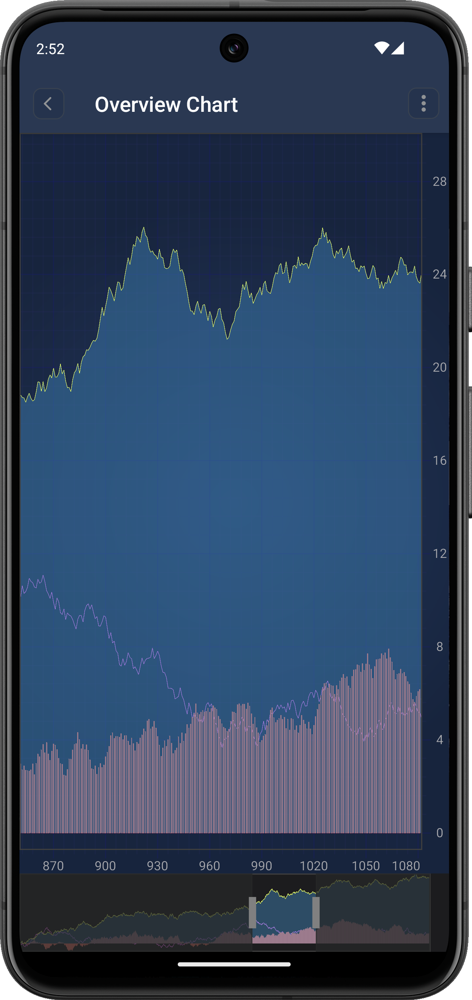

# SciChart Overview Chart

The **SciChart Overview Chart** is a miniature, zoomed-out representation of the main `SciChartSurface`. It allows users to **visually navigate**, **scroll**, and **zoom** through large datasets using **draggable grip handles**.

---

## What is the SciChart Overview Chart?

The `SciChartOverview` provides a high-level summary of the visible data range in your main chart. It allows users to interact with **grips** (movable handles) to control the viewport of the main chart, acting like a scrollbar for data. This makes it ideal for charts with large datasets where continuous zooming and panning can be tedious or slow.



---

## Use Cases

The `SciChartOverview` is useful in applications such as:

- **Financial/Stock charting apps**: Show an overview of an entire time period while the user zooms into specific regions.
- **Scientific data analysis**: Where users might need to zoom into a segment of continuous sensor or telemetry data.
- **Data logging tools**: For monitoring and navigating across long durations of data.
- **Dashboard visualizations**: Providing both a summary and detail view simultaneously.

---

## 1. Layout XML Setup

Add both `SciChartSurface` and `SciChartOverview` to your layout:

```xml
<LinearLayout xmlns:android="http://schemas.android.com/apk/res/android"
    android:layout_width="match_parent"
    android:layout_height="match_parent"
    android:orientation="vertical">

    <com.scichart.charting.visuals.SciChartSurface
        android:id="@+id/surface"
        android:layout_width="match_parent"
        android:layout_height="0dp"
        android:layout_weight="1" />

    <com.scichart.charting.visuals.overview.SciChartOverview
        android:id="@+id/overview"
        android:layout_width="match_parent"
        android:layout_height="75dp" />
</LinearLayout>
```

---

## 2. Link Overview with Main Chart

In your `Activity` or `Fragment`, bind the overview chart to your main chart surface:


# [Java](#tab/java)
[!code-java[AddPinchZoomModifier](../../../../samples/sandbox/app/src/main/java/com/scichart/docsandbox/examples/java/series2d/ChartOverview.java#LinkOverviewChart)]
# [Kotlin](#tab/kotlin)
[!code-swift[AddPinchZoomModifier](../../../../samples/sandbox/app/src/main/java/com/scichart/docsandbox/examples/kotlin/series2d/ChartOverview.kt#LinkOverviewChart)]
***

---

## 3. Customize Grip Handles

You can customize the draggable grip handles using `VerticalLineAnnotation`:

# [Java](#tab/java)
[!code-java[AddPinchZoomModifier](../../../../samples/sandbox/app/src/main/java/com/scichart/docsandbox/examples/java/series2d/ChartOverview.java#CustomizeOverviewGrip)]
# [Kotlin](#tab/kotlin)
[!code-swift[AddPinchZoomModifier](../../../../samples/sandbox/app/src/main/java/com/scichart/docsandbox/examples/kotlin/series2d/ChartOverview.kt#CustomizeOverviewGrip)]
***

Here’s how you can create a grip annotation:

# [Java](#tab/java)
[!code-java[AddPinchZoomModifier](../../../../samples/sandbox/app/src/main/java/com/scichart/docsandbox/examples/java/series2d/ChartOverview.java#GenerateOverviewGrip)]
# [Kotlin](#tab/kotlin)
[!code-swift[AddPinchZoomModifier](../../../../samples/sandbox/app/src/main/java/com/scichart/docsandbox/examples/kotlin/series2d/ChartOverview.kt#GenerateOverviewGrip)]
***

---

## 4. Apply Transformation to Renderable Series

You can use `setOverviewTransformation` to modify the series displayed in the overview. This allows you to use a different series type, reduce resolution, or filter noise for better performance.

### Example: Replace Candlestick with Line Series

# [Kotlin](#tab/kotlin)
[!code-swift[AddPinchZoomModifier](../../../../samples/sandbox/app/src/main/java/com/scichart/docsandbox/examples/kotlin/series2d/ChartOverview.kt#OverviewTransformation)]
# [Java](#tab/java)
[!code-java[AddPinchZoomModifier](../../../../samples/sandbox/app/src/main/java/com/scichart/docsandbox/examples/kotlin/series2d/ChartOverview.kt#OverviewTransformation)]

***

This transformation replaces a heavy candlestick chart with a lightweight average line in the overview.

**Benefits:**

- Reduce data resolution for performance
- Use lighter renderable types (e.g., `FastLineRenderableSeries`)
- Customize which series are shown

---

## 5. Additional API

### `getxAxis()`

Retrieve the X-axis used in the overview chart. You can use this to synchronize properties like visible range, label formatting, or styles.

# [Java](#tab/java)
[!code-java[AddPinchZoomModifier](../../../../samples/sandbox/app/src/main/java/com/scichart/docsandbox/examples/java/series2d/ChartOverview.java#OverviewGetAxis)]
# [Kotlin](#tab/kotlin)
[!code-swift[AddPinchZoomModifier](../../../../samples/sandbox/app/src/main/java/com/scichart/docsandbox/examples/kotlin/series2d/ChartOverview.kt#OverviewGetAxis)]
***

---

### `setGripThreshold(threshold: Double)`

This sets the pixel threshold that determines when grip dragging should activate. Useful when you have multiple touchable elements and want to avoid accidental grip movement.


# [Java](#tab/java)
[!code-java[AddPinchZoomModifier](../../../../samples/sandbox/app/src/main/java/com/scichart/docsandbox/examples/java/series2d/ChartOverview.java#OverviewSetGripThreshold)]
# [Kotlin](#tab/kotlin)
[!code-swift[AddPinchZoomModifier](../../../../samples/sandbox/app/src/main/java/com/scichart/docsandbox/examples/kotlin/series2d/ChartOverview.kt#OverviewSetGripThreshold)]
***

---

### `setOverviewTransformation(transformation: ISciChartOverviewTransformation)`

This lets you dynamically transform the series rendered inside the overview chart.

---

## Summary

The `SciChartOverview` component:

- Provides a small, scrollable representation of the main chart
- Enables fast and intuitive zoom/pan across large datasets
- Supports full customization via grips and transformation APIs

It’s a **must-have feature for large, scrollable, or real-time datasets** in Android applications using SciChart.

