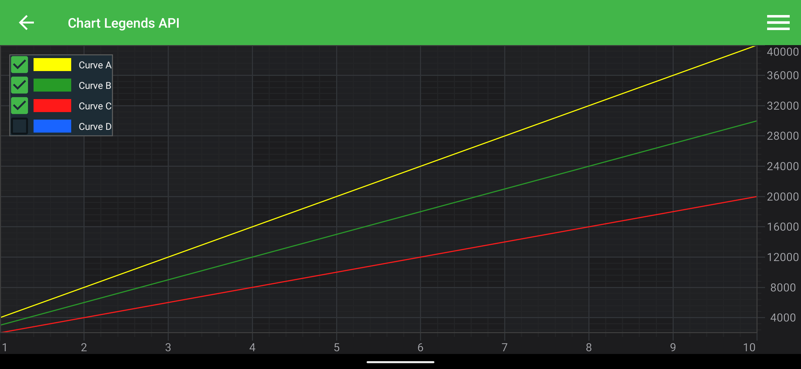
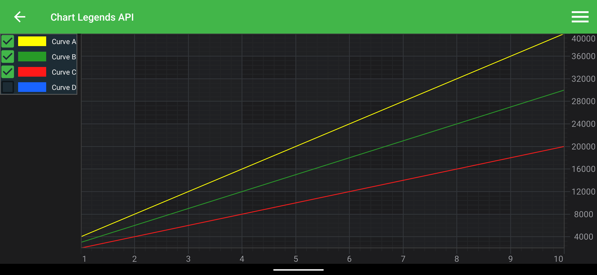
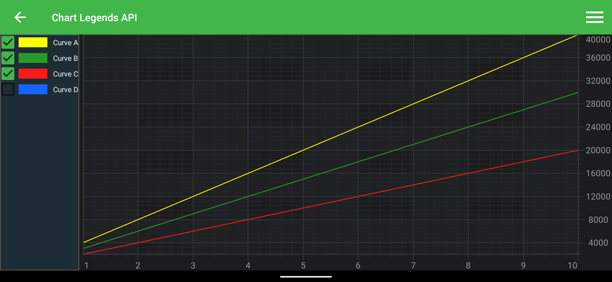
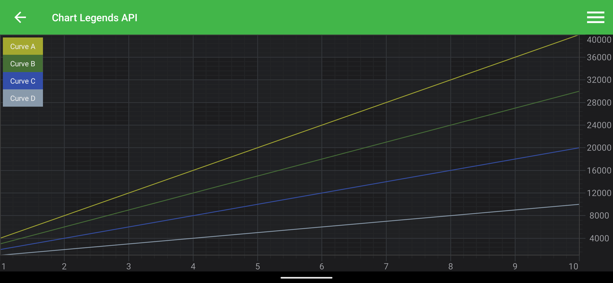

# LegendModifier
In SciChart, the easiest way to add a **Legend** onto a chart is to use a <xref:com.scichart.charting.modifiers.LegendModifier>



> [!NOTE]
> Example of the **LegendModifier usage** can be found in the [SciChart Android Examples Suite](https://www.scichart.com/examples/Android-chart/) as well as on [GitHub](https://github.com/ABTSoftware/SciChart.Android.Examples):
> - [Native Example](https://www.scichart.com/example/android-chart-legends-api-example/)
> - [Xamarin Example](https://www.scichart.com/example/xamarin-chart-with-legends-example/)

The <xref:com.scichart.charting.modifiers.LegendModifier> class exposes several **configurational** properties. Please find them explained in the table below:

| **Feature**                           | **Description**                                                                 |
| ------------------------------------- | ------------------------------------------------------------------------------- |
| <xref:com.scichart.charting.modifiers.LegendModifier.setLegendPosition(int,int,int,int,int)>          | Allows to specify Gravity and Margins for the Legend.                            |
| <xref:com.scichart.charting.modifiers.LegendModifier.setOrientation(int)>       | Determines **orientation** of the Legend. Can be either Horizontal or Vertical. |
| <xref:com.scichart.charting.modifiers.LegendModifier.setShowLegend(boolean)>        | Allows to **hide or show** the Legend.                                          |
| <xref:com.scichart.charting.modifiers.LegendModifier.setShowCheckboxes(boolean)>    | Determines whether to show **visibility checkboxes** for every [RenderableSeries](xref:chart2d.2DChartTypes) in the Legend or not. These allow hiding or showing their corresponding RenderableSeries. |
| <xref:com.scichart.charting.modifiers.LegendModifier.setShowSeriesMarkers(boolean)> | Determines whether to show **colored markers** for every [RenderableSeries](xref:chart2d.2DChartTypes) in the Legend or not.                                                                           |
| <xref:com.scichart.charting.modifiers.LegendModifier.setSourceMode(com.scichart.charting.modifiers.SourceMode)>        | Allows to specify which [RenderableSeries](xref:chart2d.2DChartTypes) should appear in the Legend, e.g. Visible, Selected, etc. Series. Other will be ignored by the modifier. Expects a member of the <xref:com.scichart.charting.modifiers.SourceMode> enumeration. |

## Adding the LegendModifier to a Chart
Any [Chart Modifier](xref:chartModifierAPIs.ChartModifierAPIs) can be [added to a <xref:com.scichart.charting.visuals.SciChartSurface>](xref:chartModifierAPIs.ChartModifierAPIs#adding-a-chart-modifier) via the [chartModifiers](xref:com.scichart.charting.visuals.ISciChartSurface.getChartModifiers()) property and <xref:com.scichart.charting.modifiers.LegendModifier> is no difference.

# [Java](#tab/java)
[!code-java[CreateLegendModifier](../../../../samples/sandbox/app/src/main/java/com/scichart/docsandbox/examples/java/chartModifier2D/LegendModifierFragment.java#CreateLegendModifier)]
[!code-java[AddLegendModifier](../../../../samples/sandbox/app/src/main/java/com/scichart/docsandbox/examples/java/chartModifier2D/LegendModifierFragment.java#AddLegendModifier)]

# [Java with Builders API](#tab/javaBuilder)
[!code-java[CreateLegendModifier](../../../../samples/sandbox/app/src/main/java/com/scichart/docsandbox/examples/javaBuilder/chartModifier2D/LegendModifierFragment.java#CreateLegendModifier)]
[!code-java[AddLegendModifier](../../../../samples/sandbox/app/src/main/java/com/scichart/docsandbox/examples/javaBuilder/chartModifier2D/LegendModifierFragment.java#AddLegendModifier)]

# [Kotlin](#tab/kotlin)
[!code-swift[CreateLegendModifier](../../../../samples/sandbox/app/src/main/java/com/scichart/docsandbox/examples/kotlin/chartModifier2D/LegendModifierFragment.kt#CreateLegendModifier)]
[!code-swift[AddLegendModifier](../../../../samples/sandbox/app/src/main/java/com/scichart/docsandbox/examples/kotlin/chartModifier2D/LegendModifierFragment.kt#AddLegendModifier)]
***

> [!NOTE]
> To learn more about features available, please visit the [Chart Modifier APIs](xref:chartModifierAPIs.ChartModifierAPIs#common-chart-modifier-features) article.

## Placing Legend outside the Chart
To place a **Legend** outside the chart you will need to:
1. Declare <xref:com.scichart.charting.visuals.legend.SciChartLegend> somewhere in your layout.
2. Find the legend using findViewById() in code and use it to create <xref:com.scichart.charting.modifiers.LegendModifier> instance with `useAutoPlacement = false` parameter using the <xref:com.scichart.charting.modifiers.LegendModifier.LegendModifier(com.scichart.charting.visuals.legend.SciChartLegend,boolean)> initializer.

```xml
<?xml version="1.0" encoding="utf-8"?>
<LinearLayout xmlns:android="http://schemas.android.com/apk/res/android"
    android:layout_width="match_parent"
    android:layout_height="match_parent"
    android:orientation="horizontal">
    <com.scichart.charting.visuals.legend.SciChartLegend
        android:id="@+id/legend"
        android:layout_width="wrap_content"
        android:layout_height="wrap_content"
        android:layout_gravity="top"
        android:layout_marginEnd="5dp"/>
    <com.scichart.charting.visuals.SciChartSurface
        android:id="@+id/surface"
        android:layout_width="0dp"
        android:layout_weight="1"
        android:layout_height="match_parent"/>
</LinearLayout>
```

# [Java](#tab/java)
[!code-java[CreateLegendModifierOutsideSurface](../../../../samples/sandbox/app/src/main/java/com/scichart/docsandbox/examples/java/chartModifier2D/LegendModifierFragment.java#CreateLegendModifierOutsideSurface)]
# [Java with Builders API](#tab/javaBuilder)
[!code-java[CreateLegendModifierOutsideSurface](../../../../samples/sandbox/app/src/main/java/com/scichart/docsandbox/examples/javaBuilder/chartModifier2D/LegendModifierFragment.java#CreateLegendModifierOutsideSurface)]
# [Kotlin](#tab/kotlin)
[!code-swift[CreateLegendModifierOutsideSurface](../../../../samples/sandbox/app/src/main/java/com/scichart/docsandbox/examples/kotlin/chartModifier2D/LegendModifierFragment.kt#CreateLegendModifierOutsideSurface)]
***

> [!NOTE]
> By passing `false` to `useAutoPlacement` argument you indicate that you want to place <xref:com.scichart.charting.visuals.legend.SciChartLegend> instance manually, in this case - outside the Chart Surface.

Since <xref:com.scichart.charting.visuals.legend.SciChartLegend> is an [Android LinearLayout](https://developer.android.com/reference/android/widget/LinearLayout) under the hood, you can play with its content resizing, as you would do normally with any other LinearLayout content. So, for example, if you want to resize the legend according to the legend content you can pass [wrap_content](https://developer.android.com/reference/android/view/ViewGroup.LayoutParams#WRAP_CONTENT) into the [layout_width](https://developer.android.com/reference/android/view/ViewGroup.LayoutParams#attr_android:layout_width) and [layout_height](https://developer.android.com/reference/android/view/ViewGroup.LayoutParams#attr_android:layout_height) properties, like this:

```xml
<com.scichart.charting.visuals.legend.SciChartLegend
    android:id="@+id/legend"
    android:layout_width="wrap_content"
    android:layout_height="wrap_content"
    android:layout_gravity="top"
    android:layout_marginEnd="5dp"/>
```

It will produce the following result:



To fill all available space defined by the parent view, you can pass [fill_parent](https://developer.android.com/reference/android/view/ViewGroup.LayoutParams#FILL_PARENT) into the [layout_height](https://developer.android.com/reference/android/view/ViewGroup.LayoutParams#attr_android:layout_height) property, like this:

```xml
<com.scichart.charting.visuals.legend.SciChartLegend
    android:id="@+id/legend"
    android:layout_width="wrap_content"
    android:layout_height="fill_parent"
    android:layout_gravity="top"
    android:layout_marginEnd="5dp"/>
```

It will produce the following result:



## Create Legend with a custom item
To create a <xref:com.scichart.charting.visuals.legend.SciChartLegend> with custom items, you will need to create a <xref:com.scichart.charting.visuals.legend.SeriesInfoLegendAdapter> with custom <xref:com.scichart.charting.visuals.legend.ILegendItemsFactory>.
Read on to learn how to do that.

#### Create a Custom Legend Item
In order to create our factory, first we need to create our **CustomLegendItem** class. It must implement <xref:com.scichart.charting.visuals.legend.ILegendItem> protocol and wrap views of your **custom_legend_item.xml**.

Please see a simple example below:
```xml
<?xml version="1.0" encoding="utf-8"?>
<FrameLayout xmlns:android="http://schemas.android.com/apk/res/android"
    xmlns:tools="http://schemas.android.com/tools"
    android:layout_width="wrap_content"
    android:layout_height="wrap_content"
    android:orientation="horizontal">

    <TextView
        android:id="@+id/name"
        android:background="@android:color/holo_blue_bright"
        android:layout_width="wrap_content"
        android:layout_height="wrap_content"
        android:layout_gravity="center"
        android:paddingHorizontal="10dp"
        android:paddingVertical="5dp"
        android:textSize="@dimen/legendTextSize"
        android:textStyle="bold"
        tools:text="Curve A"
        />
</FrameLayout>
```

# [Java](#tab/java)
[!code-java[CreateCustomLegendItem](../../../../samples/sandbox/app/src/main/java/com/scichart/docsandbox/examples/java/chartModifier2D/LegendModifierFragment.java#CreateCustomLegendItem)]
# [Java with Builders API](#tab/javaBuilder)
[!code-java[CreateCustomLegendItem](../../../../samples/sandbox/app/src/main/java/com/scichart/docsandbox/examples/javaBuilder/chartModifier2D/LegendModifierFragment.java#CreateCustomLegendItem)]
# [Kotlin](#tab/kotlin)
[!code-swift[CreateCustomLegendItem](../../../../samples/sandbox/app/src/main/java/com/scichart/docsandbox/examples/kotlin/chartModifier2D/LegendModifierFragment.kt#CreateCustomLegendItem)]
***

#### Create a Custom Legend Items Factory

Let's create our custom <xref:com.scichart.charting.visuals.legend.ILegendItemsFactory> by subclassing an abstract class <xref:com.scichart.charting.visuals.legend.DefaultLegendItemFactoryBase>. Here we will override <xref:com.scichart.charting.visuals.legend.DefaultLegendItemFactoryBase.createLegendItemView(android.view.ViewGroup)> method and our **Custom Legend Item** view.

Please see a simple example below:

# [Java](#tab/java)
[!code-java[CreateCustomLegendItemsFactory](../../../../samples/sandbox/app/src/main/java/com/scichart/docsandbox/examples/java/chartModifier2D/LegendModifierFragment.java#CreateCustomLegendItemsFactory)]
# [Java with Builders API](#tab/javaBuilder)
[!code-java[CreateCustomLegendItemsFactory](../../../../samples/sandbox/app/src/main/java/com/scichart/docsandbox/examples/javaBuilder/chartModifier2D/LegendModifierFragment.java#CreateCustomLegendItemsFactory)]
# [Kotlin](#tab/kotlin)
[!code-swift[CreateCustomLegendItemsFactory](../../../../samples/sandbox/app/src/main/java/com/scichart/docsandbox/examples/kotlin/chartModifier2D/LegendModifierFragment.kt#CreateCustomLegendItemsFactory)]
***

#### Adding a Legend with CustomItem to a Chart
To add a Legend with previously created Custom Legend Item you will need to do the following:
- create <xref:com.scichart.charting.visuals.legend.SciChartLegend> instance.
- create <xref:com.scichart.charting.visuals.legend.ILegendItemsFactory> instance
- use the <xref:com.scichart.charting.visuals.legend.SeriesInfoLegendAdapter.SeriesInfoLegendAdapter(com.scichart.charting.visuals.legend.ILegendItemsFactory)> initializer to create a legend **Adapter**. Pass the legend and the factory, created in the previous steps.
- use the <xref:com.scichart.charting.modifiers.LegendModifier.LegendModifier(com.scichart.charting.visuals.legend.SciChartLegend,com.scichart.charting.visuals.legend.SeriesInfoLegendAdapter,boolean)> initializer to create <xref:com.scichart.charting.visuals.legend.SciChartLegend> instance. Pass previously created **Legend** and **Adapter** objects.

> [!NOTE]
> By passing `true` or `false` to `useAutoPlacement` argument you indicate whether you want to place your <xref:com.scichart.charting.visuals.legend.SciChartLegend> instance manually, e.g. - [inside](#adding-the-legendmodifier-to-a-chart) or [outside](#placing-legend-outside-the-chart) the Chart Surface.

Please see the code sample on how to do that below:

# [Java](#tab/java)
[!code-java[CreateLegendWithCustomItem](../../../../samples/sandbox/app/src/main/java/com/scichart/docsandbox/examples/java/chartModifier2D/LegendModifierFragment.java#CreateLegendWithCustomItem)]
# [Java with Builders API](#tab/javaBuilder)
[!code-java[CreateLegendWithCustomItem](../../../../samples/sandbox/app/src/main/java/com/scichart/docsandbox/examples/javaBuilder/chartModifier2D/LegendModifierFragment.java#CreateLegendWithCustomItem)]
# [Kotlin](#tab/kotlin)
[!code-swift[CreateLegendWithCustomItem](../../../../samples/sandbox/app/src/main/java/com/scichart/docsandbox/examples/kotlin/chartModifier2D/LegendModifierFragment.kt#CreateLegendWithCustomItem)]
***

This produces the following output:

