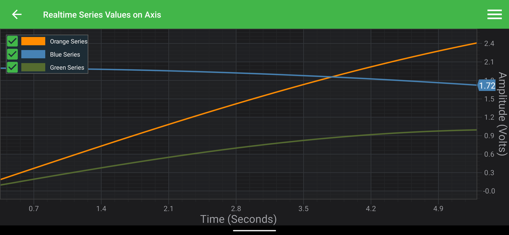
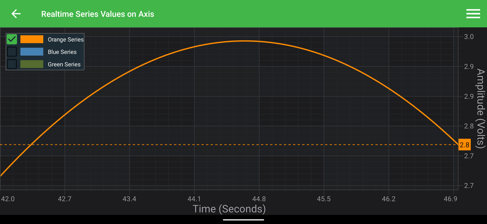

# SeriesValueModifier

The <xref:com.scichart.charting.modifiers.SeriesValueModifier> is a custom ChartModifier that places a <xref:com.scichart.charting.modifiers.SeriesValueModifier.SeriesValueMarkerAnnotation> on the YAxis for each RenderableSeries in the chart, showing the current <xref:com.scichart.charting.visuals.renderableSeries.IRenderableSeries> latest Y-value.

 as well as on [GitHub](https://github.com/ABTSoftware/SciChart.Android.Examples):
> - [Native Example](https://www.scichart.com/example/android-chart/android-chart-series-value-modifier-example/)
> - [Xamarin Example](https://www.scichart.com/example/xamarin-chart/xamarin-chart-series-value-modifier-example/)

## Adding the SeriesValueModifier to a Chart
Any [Chart Modifier](xref:chartModifierAPIs.ChartModifierAPIs) can be [added to a <xref:com.scichart.charting.visuals.SciChartSurface>](xref:chartModifierAPIs.ChartModifierAPIs#adding-a-chart-modifier) via the [chartModifiers](xref:com.scichart.charting.visuals.ISciChartSurface.getChartModifiers()) property and <xref:com.scichart.charting.modifiers.SeriesValueModifier> is no different.

# [Java](#tab/java)
[!code-java[CreateSeriesValueModifier](../../../../samples/sandbox/app/src/main/java/com/scichart/docsandbox/examples/java/chartModifier2D/SeriesValueModifierFragment.java#CreateSeriesValueModifier)]
# [Java with Builders API](#tab/javaBuilder)
[!code-java[CreateSeriesValueModifier](../../../../samples/sandbox/app/src/main/java/com/scichart/docsandbox/examples/javaBuilder/chartModifier2D/SeriesValueModifierFragment.java#CreateSeriesValueModifier)]
# [Kotlin](#tab/kotlin)
[!code-swift[CreateSeriesValueModifier](../../../../samples/sandbox/app/src/main/java/com/scichart/docsandbox/examples/kotlin/chartModifier2D/SeriesValueModifierFragment.kt#CreateSeriesValueModifier)]
***

> [!NOTE]
> To learn more about features available, [Chart Modifier APIs](xref:chartModifierAPIs.ChartModifierAPIs#common-chart-modifier-features) article.

## Excluding a Series from the SeriesValueModifier

By default, all RenderableSeries from [renderableSeries](xref:com.scichart.charting.visuals.ISciChartSurface.getRenderableSeries()) collection are included in the <xref:com.scichart.charting.modifiers.SeriesValueModifier> and thus will have an axis marker placed on YAxis. This behavior can be controlled and to do so you’ll need to create a <xref:com.scichart.charting.modifiers.SeriesValueModifier.DefaultSeriesValueMarkerFactory> instance with a predicate to decide which series would you like to include or exclude. 

Imagine you have three <xref:com.scichart.charting.visuals.renderableSeries.IRenderableSeries> and you want to show marker only for a series with the name "Blue Series". Please see the code below, which shows how to do just that:

# [Java](#tab/java)
[!code-java[ExcludingSeries](../../../../samples/sandbox/app/src/main/java/com/scichart/docsandbox/examples/java/chartModifier2D/SeriesValueModifierFragment.java#ExcludingSeries)]
# [Java with Builders API](#tab/javaBuilder)
[!code-java[ExcludingSeries](../../../../samples/sandbox/app/src/main/java/com/scichart/docsandbox/examples/javaBuilder/chartModifier2D/SeriesValueModifierFragment.java#ExcludingSeries)]
# [Kotlin](#tab/kotlin)
[!code-swift[ExcludingSeries](../../../../samples/sandbox/app/src/main/java/com/scichart/docsandbox/examples/kotlin/chartModifier2D/SeriesValueModifierFragment.kt#ExcludingSeries)]
***

The result is that only the blue series has a marker:

## Styling the SeriesValueModifier Axis Markers

By default, <xref:com.scichart.charting.modifiers.SeriesValueModifier> uses <xref:com.scichart.charting.modifiers.SeriesValueModifier.DefaultSeriesValueMarker> to create <xref:com.scichart.charting.modifiers.SeriesValueModifier.SeriesValueMarkerAnnotation>. You can customize a marker annotation style or provide some complete custom annotation. 

> [!NOTE]
> To learn more about <xref:com.scichart.charting.visuals.annotations.AxisMarkerAnnotation> API, follow [AxisMarkerAnnotation API](xref:annotationsAPIs.AxisMarkerAnnotation) article.

As an example of such customization, let’s place a <xref:com.scichart.charting.visuals.annotations.HorizontalLineAnnotation> with an axis label. You will need to write few classes with some implementations to inject the desired marker into the <xref:com.scichart.charting.modifiers.SeriesValueModifier> pipeline. Those are:

 - Subclass <xref:com.scichart.charting.visuals.annotations.HorizontalLineAnnotation> with <xref:com.scichart.charting.modifiers.SeriesValueModifier.SeriesValueMarkerAnnotationHelper> as a initializer parameter to call <xref:com.scichart.charting.modifiers.SeriesValueModifier.DefaultSeriesValueMarkerAnnotationHelper.tryUpdateAnnotation(TAnnotation)> method when needed:
 
# [Java](#tab/java)
[!code-java[CreateHorizontalLineSeriesValueMarkerAnnotation](../../../../samples/sandbox/app/src/main/java/com/scichart/docsandbox/examples/java/chartModifier2D/SeriesValueModifierFragment.java#CreateHorizontalLineSeriesValueMarkerAnnotation)]
# [Java with Builders API](#tab/javaBuilder)
[!code-java[CreateHorizontalLineSeriesValueMarkerAnnotation](../../../../samples/sandbox/app/src/main/java/com/scichart/docsandbox/examples/javaBuilder/chartModifier2D/SeriesValueModifierFragment.java#CreateHorizontalLineSeriesValueMarkerAnnotation)]
# [Kotlin](#tab/kotlin)
[!code-swift[CreateHorizontalLineSeriesValueMarkerAnnotation](../../../../samples/sandbox/app/src/main/java/com/scichart/docsandbox/examples/kotlin/chartModifier2D/SeriesValueModifierFragment.kt#CreateHorizontalLineSeriesValueMarkerAnnotation)]
***

- Subclass <xref:com.scichart.charting.modifiers.SeriesValueModifier.SeriesValueMarkerAnnotationHelper> where we will style our annotation and annotation labels:

# [Java](#tab/java)
[!code-java[CreateHorizontalLineSeriesValueMarkerAnnotationHelper](../../../../samples/sandbox/app/src/main/java/com/scichart/docsandbox/examples/java/chartModifier2D/SeriesValueModifierFragment.java#CreateHorizontalLineSeriesValueMarkerAnnotationHelper)]
# [Java with Builders API](#tab/javaBuilder)
[!code-java[CreateHorizontalLineSeriesValueMarkerAnnotationHelper](../../../../samples/sandbox/app/src/main/java/com/scichart/docsandbox/examples/javaBuilder/chartModifier2D/SeriesValueModifierFragment.java#CreateHorizontalLineSeriesValueMarkerAnnotationHelper)]
# [Kotlin](#tab/kotlin)
[!code-swift[CreateHorizontalLineSeriesValueMarkerAnnotationHelper](../../../../samples/sandbox/app/src/main/java/com/scichart/docsandbox/examples/kotlin/chartModifier2D/SeriesValueModifierFragment.kt#CreateHorizontalLineSeriesValueMarkerAnnotationHelper)]
***
 
 - Subclass <xref:com.scichart.charting.modifiers.SeriesValueModifier.SeriesValueMarkerBase>, where we will create, destroy, add ot remove our custom **markerAnnotation** when needed:

# [Java](#tab/java)
[!code-java[CreateHorizontalLineSeriesValueMarker](../../../../samples/sandbox/app/src/main/java/com/scichart/docsandbox/examples/java/chartModifier2D/SeriesValueModifierFragment.java#CreateHorizontalLineSeriesValueMarker)]
# [Java with Builders API](#tab/javaBuilder)
[!code-java[CreateHorizontalLineSeriesValueMarker](../../../../samples/sandbox/app/src/main/java/com/scichart/docsandbox/examples/javaBuilder/chartModifier2D/SeriesValueModifierFragment.java#CreateHorizontalLineSeriesValueMarker)]
# [Kotlin](#tab/kotlin)
[!code-swift[CreateHorizontalLineSeriesValueMarker](../../../../samples/sandbox/app/src/main/java/com/scichart/docsandbox/examples/kotlin/chartModifier2D/SeriesValueModifierFragment.kt#CreateHorizontalLineSeriesValueMarker)]
***

 - Create a custom <xref:com.scichart.charting.modifiers.SeriesValueModifier.ISeriesValueMarkerFactory> and implement <xref:com.scichart.charting.modifiers.SeriesValueModifier.ISeriesValueMarkerFactory.createMarkerFor(com.scichart.charting.visuals.renderableSeries.IRenderableSeries)> which will return our custom marker:

 # [Java](#tab/java)
[!code-java[CreateHorizontalLineSeriesValueMarkerFactory](../../../../samples/sandbox/app/src/main/java/com/scichart/docsandbox/examples/java/chartModifier2D/SeriesValueModifierFragment.java#CreateHorizontalLineSeriesValueMarkerFactory)]
# [Java with Builders API](#tab/javaBuilder)
[!code-java[CreateHorizontalLineSeriesValueMarkerFactory](../../../../samples/sandbox/app/src/main/java/com/scichart/docsandbox/examples/javaBuilder/chartModifier2D/SeriesValueModifierFragment.java#CreateHorizontalLineSeriesValueMarkerFactory)]
# [Kotlin](#tab/kotlin)
[!code-swift[CreateHorizontalLineSeriesValueMarkerFactory](../../../../samples/sandbox/app/src/main/java/com/scichart/docsandbox/examples/kotlin/chartModifier2D/SeriesValueModifierFragment.kt#CreateHorizontalLineSeriesValueMarkerFactory)]
***
 
 - Create a <xref:com.scichart.charting.modifiers.SeriesValueModifier> with your custom factory and add it to the surface:

  # [Java](#tab/java)
[!code-java[CreateSeriesValueModifierWithCustomFactory](../../../../samples/sandbox/app/src/main/java/com/scichart/docsandbox/examples/java/chartModifier2D/SeriesValueModifierFragment.java#CreateSeriesValueModifierWithCustomFactory)]
# [Java with Builders API](#tab/javaBuilder)
[!code-java[CreateSeriesValueModifierWithCustomFactory](../../../../samples/sandbox/app/src/main/java/com/scichart/docsandbox/examples/javaBuilder/chartModifier2D/SeriesValueModifierFragment.java#CreateSeriesValueModifierWithCustomFactory)]
# [Kotlin](#tab/kotlin)
[!code-swift[CreateSeriesValueModifierWithCustomFactory](../../../../samples/sandbox/app/src/main/java/com/scichart/docsandbox/examples/kotlin/chartModifier2D/SeriesValueModifierFragment.kt#CreateSeriesValueModifierWithCustomFactory)]
***

This produces the following output:

