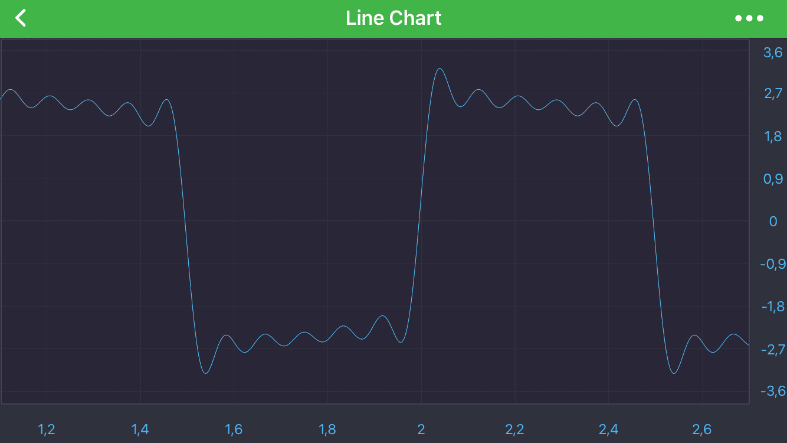

# Modify built-in Themes
Maybe you don’t want to create an entire [custom theme](xref:stylingAndTheming.CreateACustomTheme), but just want to **override one color or brush** from one of our standard themes or your custom theme.  

> [!NOTE]
> The full list of our standard themes can be found in [Styling and Theming](xref:stylingAndTheming.StylingAndTheming) article.

As an example let's take our <xref:com.scichart.charting.R.style.SciChart_SciChartv4DarkStyle> theme as a parent one and change few properties there.

First, what you need to define style with new theme in styles.xml and specify **parent** theme name.

Next, add the keys you want to override, like this:

# [XML](#tab/xml)
[!code-xml[CreateCustomTheme](../../../samples/sandbox/app/src/main/res/values/styles.xml#ModifyExistingTheme)]
***

Now, you can add and apply your newly created theme as you would do with any [Custom Theme](xref:stylingAndTheming.CreateACustomTheme):

# [Java](#tab/java)
[!code-java[SetModifiedTheme](../../../samples/sandbox/app/src/main/java/com/scichart/docsandbox/examples/java/stylingAndTheming/StylingAndTheming.java#SetModifiedTheme)]
# [Java with Builders API](#tab/javaBuilder)
[!code-java[SetModifiedTheme](../../../samples/sandbox/app/src/main/java/com/scichart/docsandbox/examples/javaBuilder/stylingAndTheming/StylingAndTheming.java#SetModifiedTheme)]
# [Kotlin](#tab/kotlin)
[!code-swift[SetModifiedTheme](../../../samples/sandbox/app/src/main/java/com/scichart/docsandbox/examples/kotlin/stylingAndTheming/StylingAndTheming.kt#SetModifiedTheme)]
***

Here is the result:

