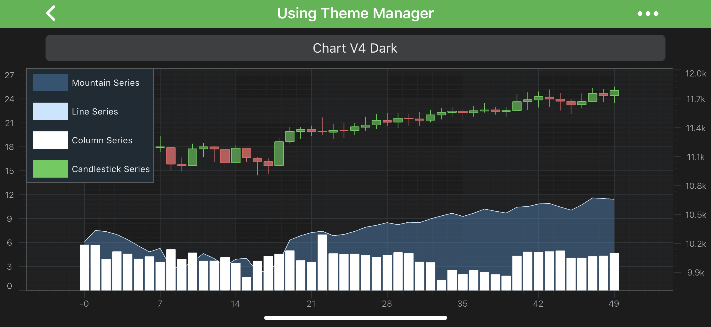

# Styling and Theming

SciChart ships with **8 stunning themes** which you can select and apply to the charts in your application. Most of the components of SciChart are also stylable, so you can truly customize the chart to fit your application.

The 8 built-in themes are shown below. You can also create your own [custom theme](xref:stylingAndTheming.CreateACustomTheme), or [modify ours](xref:stylingAndTheming.ModifyBuiltInThemes) to meet your needs.

| **Theme Name**     | **Associated theme object**                                         | **Result when Applied**                                                                |
| ------------------ | ------------------------------------------------------------------- | -------------------------------------------------------------------------------------- |
| v4 Dark            | <xref:com.scichart.charting.R.style.SciChart_SciChartv4DarkStyle>   |                   | 
| Oscilloscope       | <xref:com.scichart.charting.R.style.SciChart_OscilloscopeStyle>     |         |
| Expression Light   | <xref:com.scichart.charting.R.style.SciChart_ExpressionLightStyle>  | |
| Expression Dark    | <xref:com.scichart.charting.R.style.SciChart_ExpressionDarkStyle>   |   |
| Electric           | <xref:com.scichart.charting.R.style.SciChart_ElectricStyle>         |                 |
| Chrome             | <xref:com.scichart.charting.R.style.SciChart_ChromeStyle>           |                     |
| Bright Spark       | <xref:com.scichart.charting.R.style.SciChart_Bright_Spark>          |         |
| Black Steel        | <xref:com.scichart.charting.R.style.SciChart_BlackSteel>            |           |

#### Applying a Theme to the SciChartSurface
To apply a theme to a <xref:com.scichart.charting.visuals.SciChartSurface>, simply use the following code. Allowable theme objects are available in the table above:

# [Java](#tab/java)
[!code-java[SetTheme](../../../samples/sandbox/app/src/main/java/com/scichart/docsandbox/examples/java/stylingAndTheming/StylingAndTheming.java#SetTheme)]
# [Java with Builders API](#tab/javaBuilder)
[!code-java[SetTheme](../../../samples/sandbox/app/src/main/java/com/scichart/docsandbox/examples/javaBuilder/stylingAndTheming/StylingAndTheming.java#SetTheme)]
# [Kotlin](#tab/kotlin)
[!code-swift[SetTheme](../../../samples/sandbox/app/src/main/java/com/scichart/docsandbox/examples/kotlin/stylingAndTheming/StylingAndTheming.kt#SetTheme)]
***

## See Also
- [PenStyle, BrushStyle and FontStyle](xref:stylingAndTheming.PenStyleBrushStyleAndFontStyle)
- [Templating and Styling Chart Parts](xref:stylingAndTheming.TemplatingAndStylingChartParts)
- [Modify built-in Themes](xref:stylingAndTheming.ModifyBuiltInThemes)
- [Create a Custom Theme](xref:stylingAndTheming.CreateACustomTheme)
