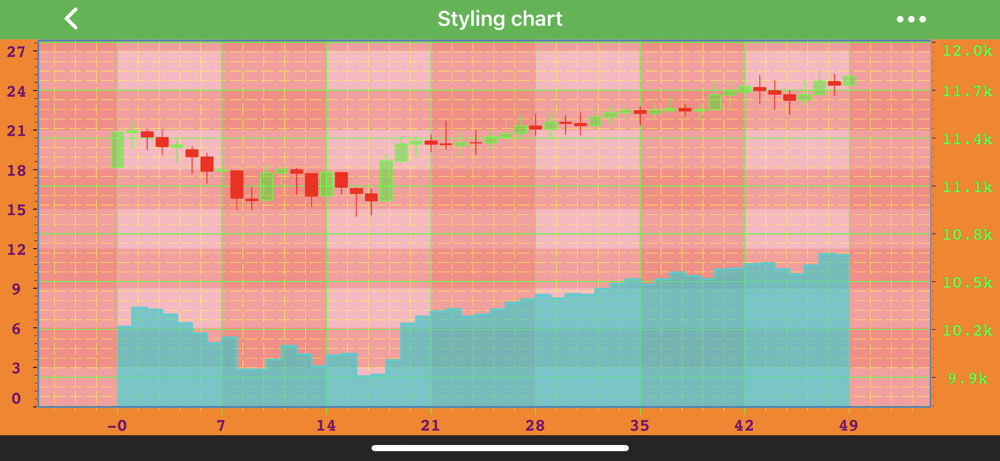

# Templating and Styling Chart Parts
Most of the parts within SciChart can be template and styled independently of [Themes](xref:stylingAndTheming.StylingAndTheming)

> [!NOTE]
> **Styling Chart** example can be found in the [SciChart Android Examples Suite](https://www.scichart.com/examples/Android-chart/) as well as on [GitHub](https://github.com/ABTSoftware/SciChart.Android.Examples):
<!-- 
TODO: Add StylingSciChartFragment to the website
> - [Native Example]()
 -->

## Styling the Chart Viewport

# [Java](#tab/java)
[!code-java[StylingTheChartViewport](../../../samples/sandbox/app/src/main/java/com/scichart/docsandbox/examples/java/stylingAndTheming/TemplatingAndStylingChartParts.java#StylingTheChartViewport)]
# [Java with Builders API](#tab/javaBuilder)
[!code-java[StylingTheChartViewport](../../../samples/sandbox/app/src/main/java/com/scichart/docsandbox/examples/javaBuilder/stylingAndTheming/TemplatingAndStylingChartParts.java#StylingTheChartViewport)]
# [Kotlin](#tab/kotlin)
[!code-swift[StylingTheChartViewport](../../../samples/sandbox/app/src/main/java/com/scichart/docsandbox/examples/kotlin/stylingAndTheming/TemplatingAndStylingChartParts.kt#StylingTheChartViewport)]
***

## Styling Axis
**Each and Every** aspect of the axis can be styled. The Axis is responsible for drawing the following parts:
- [Title](xref:axisAPIs.AxisStylingTitleAndLabels#axis-title)
- [Axis Labels](xref:axisAPIs.AxisStylingTitleAndLabels#axis-labels)
- [Tick Lines](xref:axisAPIs.AxisStylingGridLinesTicksAndAxisBands#axis-ticks) - small marks on the outside of an axis **next to labels**
- [Gridlines](xref:axisAPIs.AxisStylingGridLinesTicksAndAxisBands#grid-lines) - major and minor
- [Axis Bands](xref:axisAPIs.AxisStylingGridLinesTicksAndAxisBands#axis-bands) - shading between the **major** gridlines

> [!NOTE]
> You can read more about axis styling in the following articles: 
> - [Axis Styling - Title and Labels](xref:axisAPIs.AxisStylingTitleAndLabels) 
> - [Axis Styling - Grid Lines, Ticks and Axis Bands](xref:axisAPIs.AxisStylingGridLinesTicksAndAxisBands)
