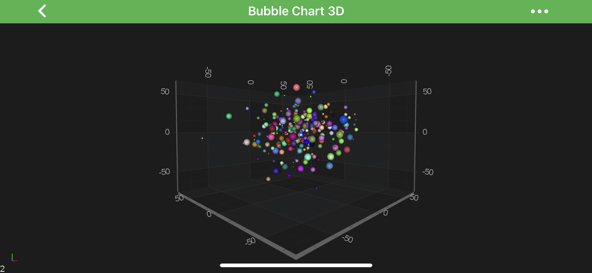

# The Bubble 3D Chart Type
The Bubble 3D Chart can be created using the <xref:com.scichart.charting3d.visuals.renderableSeries.scatter.ScatterRenderableSeries3D> type.
It is exactly the same Chart Type that **[Scatter Chart 3D](xref:chart3d.ScatterSeries3D)** is except it has individually colored points via the [MetadataProvider API](xref:chart3d.MetadataProvider3DAPI).

> [!NOTE]
> Please see the [Scatter Chart 3D](xref:chart3d.ScatterSeries3D) article for more information about <xref:com.scichart.charting3d.visuals.renderableSeries.scatter.ScatterRenderableSeries3D>.

> [!NOTE]
> Examples for the **Bubble Series 3D** can be found in the [SciChart Android Examples Suite](https://www.scichart.com/examples/Android-chart/) as well as on [GitHub](https://github.com/ABTSoftware/SciChart.Android.Examples):
> - [Native Example](https://www.scichart.com/example/android-3d-chart-example-simple-bubble/)
> - [Xamarin Example](https://www.scichart.com/example/xamarin-3d-chart-example-simple-bubble/)

There is a special class <xref:com.scichart.charting3d.visuals.renderableSeries.metadataProviders.PointMetadataProvider3D> which stores collection of <xref:com.scichart.charting3d.visuals.renderableSeries.metadataProviders.PointMetadataProvider3D.PointMetadata3D>.
Is expects to have metadata for each point in your <xref:com.scichart.charting3d.model.dataSeries.IDataSeries3D>.

The <xref:com.scichart.charting3d.visuals.renderableSeries.metadataProviders.PointMetadataProvider3D.PointMetadata3D> allows you to change the **Color** as well as **Scale** of your vertexes in point-by-point basis.

Please see the code below to see how to use <xref:com.scichart.charting3d.visuals.renderableSeries.metadataProviders.PointMetadataProvider3D> to provide metadata for the <xref:com.scichart.charting3d.visuals.renderableSeries.scatter.ScatterRenderableSeries3D>:

# [Java](#tab/java)
[!code-java[CreatePointMetaDataProvider](../../../samples/sandbox/app/src/main/java/com/scichart/docsandbox/examples/java/series3d/BubbleSeries3D.java#CreatePointMetaDataProvider)]
[!code-java[ApplyPointMetaDataProvider](../../../samples/sandbox/app/src/main/java/com/scichart/docsandbox/examples/java/series3d/BubbleSeries3D.java#ApplyPointMetaDataProvider)]
# [Java with Builders API](#tab/javaBuilder)
[!code-java[CreatePointMetaDataProvider](../../../samples/sandbox/app/src/main/java/com/scichart/docsandbox/examples/javaBuilder/series3d/BubbleSeries3D.java#CreatePointMetaDataProvider)]
[!code-java[ApplyPointMetaDataProvider](../../../samples/sandbox/app/src/main/java/com/scichart/docsandbox/examples/javaBuilder/series3d/BubbleSeries3D.java#ApplyPointMetaDataProvider)]
# [Kotlin](#tab/kotlin)
[!code-swift[CreatePointMetaDataProvider](../../../samples/sandbox/app/src/main/java/com/scichart/docsandbox/examples/kotlin/series3d/BubbleSeries3D.kt#CreatePointMetaDataProvider)]
[!code-swift[ApplyPointMetaDataProvider](../../../samples/sandbox/app/src/main/java/com/scichart/docsandbox/examples/kotlin/series3d/BubbleSeries3D.kt#ApplyPointMetaDataProvider)]
***