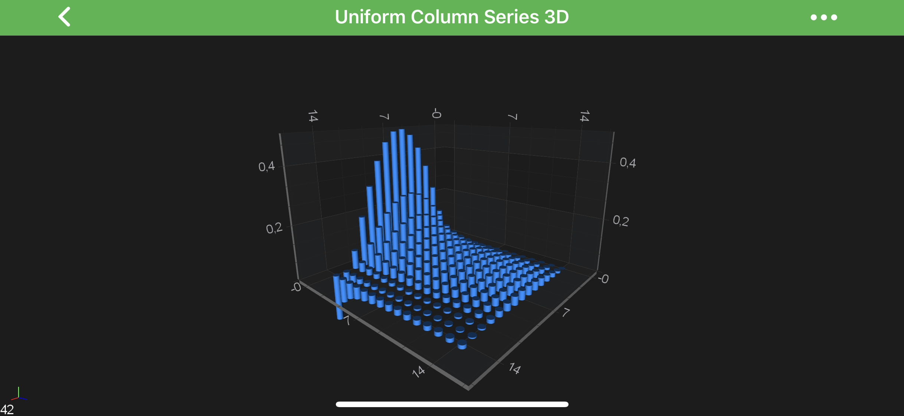
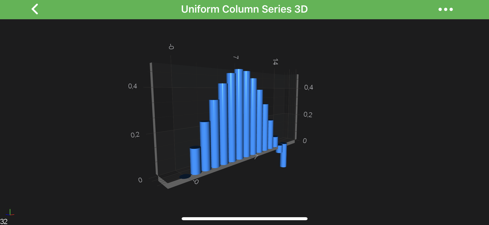
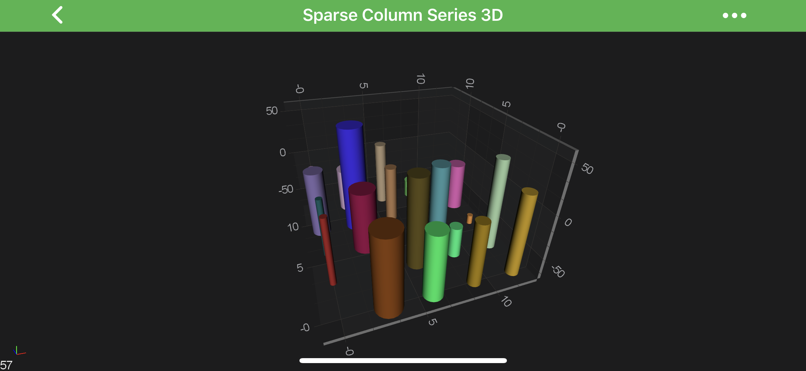
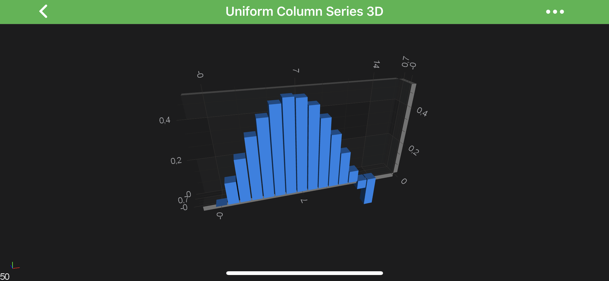
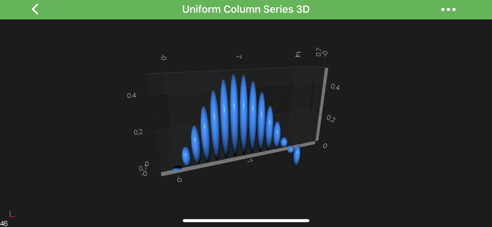
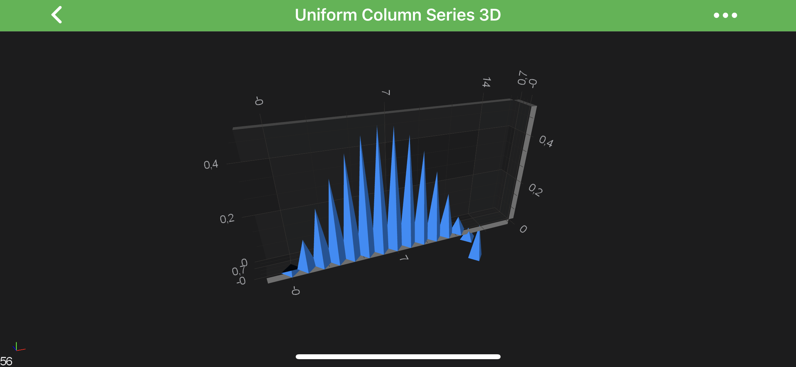

# The Column 3D Chart Type
The 3D Column Charts are provided by the <xref:com.scichart.charting3d.visuals.renderableSeries.columns.ColumnRenderableSeries3D> class.

> [!NOTE]
> Examples for the **Column Series 3D** can be found in the [SciChart Android Examples Suite](https://www.scichart.com/examples/Android-chart/) as well as on [GitHub](https://github.com/ABTSoftware/SciChart.Android.Examples):
> - [Native Example](https://www.scichart.com/example/android-3d-chart-example-sparse-column/)
> - [Xamarin Example](https://www.scichart.com/example/xamarin-3d-chart-example-sparse-column/)

## Create a Column Series 3D
In SciChart you can achieve either ***[Uniform](#uniform-column-series-3d)*** or ***[Non-Uniform](#non-uniform-column-series-3d)*** **Column Series 3D**.
Both are provided by the <xref:com.scichart.charting3d.visuals.renderableSeries.columns.ColumnRenderableSeries3D> but underlying <xref:com.scichart.charting3d.model.dataSeries.IDataSeries3D> is different.

The **Column Series 3D** can be configured via the following properties:

| **Property**                                    | **Description**                                                                                 |
| ----------------------------------------------- | ----------------------------------------------------------------------------------------------- |
| [fill](xref:com.scichart.charting3d.visuals.renderableSeries.columns.ColumnRenderableSeries3D.setFill(int))         | allows to specify the **fill color** for the column shapes.                                     |
| [dataPointWidth](xref:com.scichart.charting3d.visuals.renderableSeries.columns.ColumnRenderableSeries3D.setDataPointWidth(double))    | defines the fraction of available space each column should occupy in `X and Z dimensions`. Should be in `[0.0...1.0]` range. |
| [dataPointWidthX](xref:com.scichart.charting3d.visuals.renderableSeries.columns.ColumnRenderableSeries3D.setDataPointWidthX(double))   | defines the fraction of available space each column should occupy in `X dimension`. Should be in `[0.0...1.0]` range. |
| [dataPointWidthZ](xref:com.scichart.charting3d.visuals.renderableSeries.columns.ColumnRenderableSeries3D.setDataPointWidthZ(double))   | defines the fraction of available space each column should occupy in `Z dimension`. Should be in `[0.0...1.0]` range. |
| [columnSpacingMode](xref:com.scichart.charting3d.visuals.renderableSeries.columns.ColumnRenderableSeries3D.setColumnSpacingMode(com.scichart.charting3d.visuals.renderableSeries.columns.ColumnSpacingMode)) | allows to specify whether the column size should be ***fixed*** or ***max available*** while not overlapping with each other. Expects <xref:com.scichart.charting3d.visuals.renderableSeries.columns.ColumnSpacingMode> enumeration. |
| [columnFixedSize](xref:com.scichart.charting3d.visuals.renderableSeries.columns.ColumnRenderableSeries3D.setColumnFixedSize(float))   | allows to specify the size for column while using  the <xref:com.scichart.charting3d.visuals.renderableSeries.columns.ColumnSpacingMode>.**FixedSize** mode. |
| [columnShape](xref:com.scichart.charting3d.visuals.renderableSeries.columns.ColumnRenderableSeries3D.setColumnShape(com.scichart.charting3d.visuals.rendering.SciChartMeshTemplate))       | allows to change the columns ***shape***. See the [3D Column Shapes](#3d-column-shapes) section. |

> [!NOTE]
> The ***dataPointWidth's*** of columns are set as a ratio of the available space between the neighboring points.

#### Uniform Column Series 3D
In order to create **Uniform** Column Series 3D - you will need to provide the <xref:com.scichart.charting3d.model.dataSeries.grid.UniformGridDataSeries3D> with `N x M` array of points.

The above graph is rendered with the following code:

# [Java](#tab/java)
[!code-java[CreateUniformColumnSeries3D](../../../samples/sandbox/app/src/main/java/com/scichart/docsandbox/examples/java/series3d/ColumnSeries3D.java#CreateUniformColumnSeries3D)]
# [Java with Builders API](#tab/javaBuilder)
[!code-java[CreateUniformColumnSeries3D](../../../samples/sandbox/app/src/main/java/com/scichart/docsandbox/examples/javaBuilder/series3d/ColumnSeries3D.java#CreateUniformColumnSeries3D)]
# [Kotlin](#tab/kotlin)
[!code-swift[CreateUniformColumnSeries3D](../../../samples/sandbox/app/src/main/java/com/scichart/docsandbox/examples/kotlin/series3d/ColumnSeries3D.kt#CreateUniformColumnSeries3D)]
***

#### Single Row Column 3D Charts
You might also want to create a ***Single-Row*** of 3D Columns.
It's easily achievable via providing <xref:com.scichart.charting3d.model.dataSeries.grid.UniformGridDataSeries3D> with size of `1` in `Z-Direction` and update the `worldDimensions` like below:

# [Java](#tab/java)
[!code-java[CreateSingleRowColumn3DCharts](../../../samples/sandbox/app/src/main/java/com/scichart/docsandbox/examples/java/series3d/ColumnSeries3D.java#CreateSingleRowColumn3DCharts)]
[!code-java[UpdateSurfaceWorldDimensions](../../../samples/sandbox/app/src/main/java/com/scichart/docsandbox/examples/java/series3d/ColumnSeries3D.java#UpdateSurfaceWorldDimensions)]
# [Java with Builders API](#tab/javaBuilder)
[!code-java[CreateSingleRowColumn3DCharts](../../../samples/sandbox/app/src/main/java/com/scichart/docsandbox/examples/javaBuilder/series3d/ColumnSeries3D.java#CreateSingleRowColumn3DCharts)]
[!code-java[UpdateSurfaceWorldDimensions](../../../samples/sandbox/app/src/main/java/com/scichart/docsandbox/examples/javaBuilder/series3d/ColumnSeries3D.java#UpdateSurfaceWorldDimensions)]
# [Kotlin](#tab/kotlin)
[!code-swift[CreateSingleRowColumn3DCharts](../../../samples/sandbox/app/src/main/java/com/scichart/docsandbox/examples/kotlin/series3d/ColumnSeries3D.kt#CreateSingleRowColumn3DCharts)]
[!code-swift[UpdateSurfaceWorldDimensions](../../../samples/sandbox/app/src/main/java/com/scichart/docsandbox/examples/kotlin/series3d/ColumnSeries3D.kt#UpdateSurfaceWorldDimensions)]
***

and results in the following chart:

#### Non-Uniform Column Series 3D
In order to create **Non-Uniform** Column Series 3D - you will need to provide the <xref:com.scichart.charting3d.model.dataSeries.xyz.XyzDataSeries3D> with points.

# [Java](#tab/java)
[!code-java[CreateNonUniformColumnSeries3D](../../../samples/sandbox/app/src/main/java/com/scichart/docsandbox/examples/java/series3d/ColumnSeries3D.java#CreateNonUniformColumnSeries3D)]
# [Java with Builders API](#tab/javaBuilder)
[!code-java[CreateNonUniformColumnSeries3D](../../../samples/sandbox/app/src/main/java/com/scichart/docsandbox/examples/javaBuilder/series3d/ColumnSeries3D.java#CreateNonUniformColumnSeries3D)]
# [Kotlin](#tab/kotlin)
[!code-swift[CreateNonUniformColumnSeries3D](../../../samples/sandbox/app/src/main/java/com/scichart/docsandbox/examples/kotlin/series3d/ColumnSeries3D.kt#CreateNonUniformColumnSeries3D)]
***

which will result in the following chart:

> [!NOTE]
> Full example code for the **Sparse Column Series 3D** can be found in the [SciChart Android Examples Suite](https://www.scichart.com/examples/Android-chart/) as well as on [GitHub](https://github.com/ABTSoftware/SciChart.Android.Examples):
> - [Native Example](https://www.scichart.com/example/android-3d-chart-example-sparse-column/)
> - [Xamarin Example](https://www.scichart.com/example/xamarin-3d-chart-example-sparse-column/)

#### 3D Column Shapes
There are several shapes provided out of the box for **3D Column Series** via the [columnShape](xref:com.scichart.charting3d.visuals.renderableSeries.columns.ColumnRenderableSeries3D.setColumnShape(com.scichart.charting3d.visuals.rendering.SciChartMeshTemplate)), 
and expects type from the <xref:com.scichart.charting3d.visuals.rendering.SciChartMeshTemplate> enumeration.

The possible ***Shapes*** are showed in the table below:

| **Shape**                                                                          | **Output**                                                                                             |
| ---------------------------------------------------------------------------------- | ------------------------------------------------------------------------------------------------------ |
| <xref:com.scichart.charting3d.visuals.rendering.SciChartMeshTemplate>.**Cube**     |                     |
| <xref:com.scichart.charting3d.visuals.rendering.SciChartMeshTemplate>.**Sphere**   |                 |
| <xref:com.scichart.charting3d.visuals.rendering.SciChartMeshTemplate>.**Pyramid**  |               |
| <xref:com.scichart.charting3d.visuals.rendering.SciChartMeshTemplate>.**Cylinder** |   |
