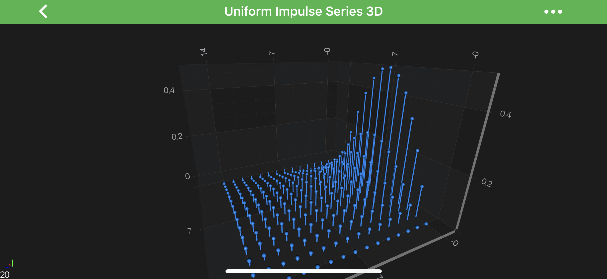
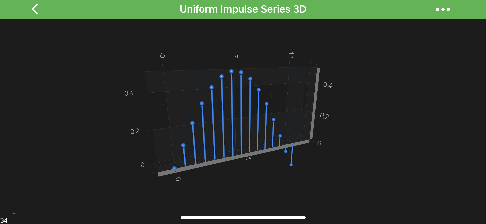
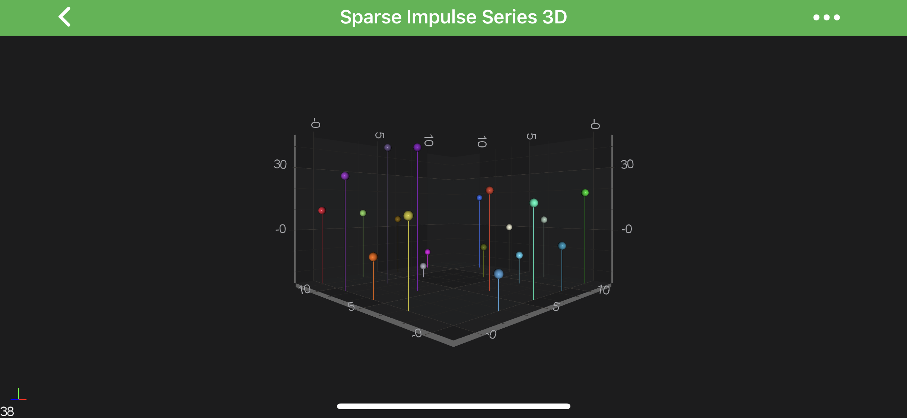

# The Impulse Series 3D
The 3D Impulse (Stem) Charts are provided by the <xref:com.scichart.charting3d.visuals.renderableSeries.impulse.ImpulseRenderableSeries3D> class.

A ***stem chart*** is visualized by small stems pointing up or down to a value with a **sphere or marker** at the top.

> [!NOTE]
> Examples for the **Impulse Series 3D** can be found in the [SciChart Android Examples Suite](https://www.scichart.com/examples/android-chart/) as well as on [GitHub](https://github.com/ABTSoftware/SciChart.Android.Examples):
> - [Native Example](https://www.scichart.com/example/xamarin-3d-chart-example-uniform-impulse-series/)
> - [Xamarin Example](https://www.scichart.com/example/xamarin-3d-chart-example-uniform-impulse-series/)

## Create a Impulse Series 3D
In SciChart you can have either ***[Uniform](#uniform-impulse-series-3d)*** or ***[Non-Uniform](#non-uniform-impulse-series-3d)*** **Impulse Series 3D**.
Both are provided by the <xref:com.scichart.charting3d.visuals.renderableSeries.impulse.ImpulseRenderableSeries3D> but underlying <xref:com.scichart.charting3d.model.dataSeries.IDataSeries3D> is different.

<xref:com.scichart.charting3d.visuals.renderableSeries.impulse.ImpulseRenderableSeries3D> allow you to specify the **stroke color** of the lines(stems) as well as it's **thickness** via the corresponding properties:
- [stroke](xref:com.scichart.charting3d.visuals.renderableSeries.pointLine.PointLineRenderableSeries3D.setStroke(int))
- [strokeThickness](xref:com.scichart.charting3d.visuals.renderableSeries.pointLine.PointLineRenderableSeries3D.setStrokeThickness(float))

In addition, in the same manner as a [Scatter Series 3D](xref:chart3d.ScatterSeries3D) - **Impulse Series 3D** requires a shape to be specified using one of the <xref:com.scichart.charting3d.visuals.pointMarkers.BasePointMarker3D> and assigning it to the [pointMarker](xref:com.scichart.charting3d.visuals.renderableSeries.IRenderableSeries3D.setPointMarker(com.scichart.charting3d.visuals.pointMarkers.BasePointMarker3D)) property.
There are number of **PointMarkers** available out of the box:

| **Flat-Texture PointMarkers**                                                | **Mesh (Volumetric) PointMarkers**                                                |
| ---------------------------------------------------------------------------- | --------------------------------------------------------------------------------- |
| <xref:com.scichart.charting3d.visuals.pointMarkers.TrianglePointerMarker3D>  | <xref:com.scichart.charting3d.visuals.pointMarkers.PyramidPointMarker3D>          |
| <xref:com.scichart.charting3d.visuals.pointMarkers.QuadPointMarker3D>        | <xref:com.scichart.charting3d.visuals.pointMarkers.CubePointMarker3D>             |
| <xref:com.scichart.charting3d.visuals.pointMarkers.EllipsePointMarker3D>     | <xref:com.scichart.charting3d.visuals.pointMarkers.SpherePointMarker3D>           |
| <xref:com.scichart.charting3d.visuals.pointMarkers.PixelPointMarker3D>       | <xref:com.scichart.charting3d.visuals.pointMarkers.CylinderPointMarker3D>         |
| <xref:com.scichart.charting3d.visuals.pointMarkers.CustomPointMarker3D>      |

It is also possible to [define custom texture](xref:chart3d.PointMarker3DAPI#custom-pointmarkers-3d) for the Point Markers via the <xref:com.scichart.charting3d.visuals.pointMarkers.CustomPointMarker3D>.
Please refer to the [PointMarkers 3D API](xref:chart3d.PointMarker3DAPI) article to learn more.

> [!NOTE]
> Same way as with other [3D Chart Types](xref:chart3d.3DChartTypes) you can use [The MetadataProvider API](xref:chart3d.MetadataProvider3DAPI).

#### Uniform Impulse Series 3D
In order to create **Uniform** Impulse Series 3D - you will need to provide the <xref:com.scichart.charting3d.model.dataSeries.grid.UniformGridDataSeries3D> with `N x M` array of points.

The above graph is rendered with the following code:

# [Java](#tab/java)
[!code-java[CreateUniformImpulseSeries3D](../../../samples/sandbox/app/src/main/java/com/scichart/docsandbox/examples/java/series3d/ImpulseSeries3D.java#CreateUniformImpulseSeries3D)]
# [Java with Builders API](#tab/javaBuilder)
[!code-java[CreateUniformImpulseSeries3D](../../../samples/sandbox/app/src/main/java/com/scichart/docsandbox/examples/javaBuilder/series3d/ImpulseSeries3D.java#CreateUniformImpulseSeries3D)]
# [Kotlin](#tab/kotlin)
[!code-swift[CreateUniformImpulseSeries3D](../../../samples/sandbox/app/src/main/java/com/scichart/docsandbox/examples/kotlin/series3d/ImpulseSeries3D.kt#CreateUniformImpulseSeries3D)]
***

#### Single Row Impulse 3D Charts
You might also want to create a ***Single-Row*** of 3D Impulses.
It's easily achievable via providing <xref:com.scichart.charting3d.model.dataSeries.grid.UniformGridDataSeries3D> with size of `1` in `Z-Direction` and update the `worldDimensions` like below:

# [Java](#tab/java)
[!code-java[CreateSingleRowImpulse](../../../samples/sandbox/app/src/main/java/com/scichart/docsandbox/examples/java/series3d/ImpulseSeries3D.java#CreateSingleRowImpulse)]
[!code-java[SetSingleRowImpulse](../../../samples/sandbox/app/src/main/java/com/scichart/docsandbox/examples/java/series3d/ImpulseSeries3D.java#SetSingleRowImpulse)]
# [Java with Builders API](#tab/javaBuilder)
[!code-java[CreateSingleRowImpulse](../../../samples/sandbox/app/src/main/java/com/scichart/docsandbox/examples/javaBuilder/series3d/ImpulseSeries3D.java#CreateSingleRowImpulse)]
[!code-java[SetSingleRowImpulse](../../../samples/sandbox/app/src/main/java/com/scichart/docsandbox/examples/javaBuilder/series3d/ImpulseSeries3D.java#SetSingleRowImpulse)]
# [Kotlin](#tab/kotlin)
[!code-swift[CreateSingleRowImpulse](../../../samples/sandbox/app/src/main/java/com/scichart/docsandbox/examples/kotlin/series3d/ImpulseSeries3D.kt#CreateSingleRowImpulse)]
[!code-swift[SetSingleRowImpulse](../../../samples/sandbox/app/src/main/java/com/scichart/docsandbox/examples/kotlin/series3d/ImpulseSeries3D.kt#SetSingleRowImpulse)]
***

and results in the following chart:

#### Non-Uniform Impulse Series 3D
In order to create **Non-Uniform** Impulse Series 3D - you will need to provide the `XyzDataSeries3D` with points.

# [Java](#tab/java)
[!code-java[CreateNonUniformImpulseSeries3D](../../../samples/sandbox/app/src/main/java/com/scichart/docsandbox/examples/java/series3d/ImpulseSeries3D.java#CreateNonUniformImpulseSeries3D)]
# [Java with Builders API](#tab/javaBuilder)
[!code-java[CreateNonUniformImpulseSeries3D](../../../samples/sandbox/app/src/main/java/com/scichart/docsandbox/examples/javaBuilder/series3d/ImpulseSeries3D.java#CreateNonUniformImpulseSeries3D)]
# [Kotlin](#tab/kotlin)
[!code-swift[CreateNonUniformImpulseSeries3D](../../../samples/sandbox/app/src/main/java/com/scichart/docsandbox/examples/kotlin/series3d/ImpulseSeries3D.kt#CreateNonUniformImpulseSeries3D)]
***

which will result in the following chart:

> [!NOTE]
> Full example code for the **Impulse Column Series 3D** can be found in the [SciChart Android Examples Suite](https://www.scichart.com/examples/android-chart/) as well as on [GitHub](https://github.com/ABTSoftware/SciChart.Android.Examples):
> - [Native Example](https://www.scichart.com/example/xamarin-3d-chart-example-uniform-impulse-series/)
> - [Xamarin Example](https://www.scichart.com/example/xamarin-3d-chart-example-uniform-impulse-series/)
