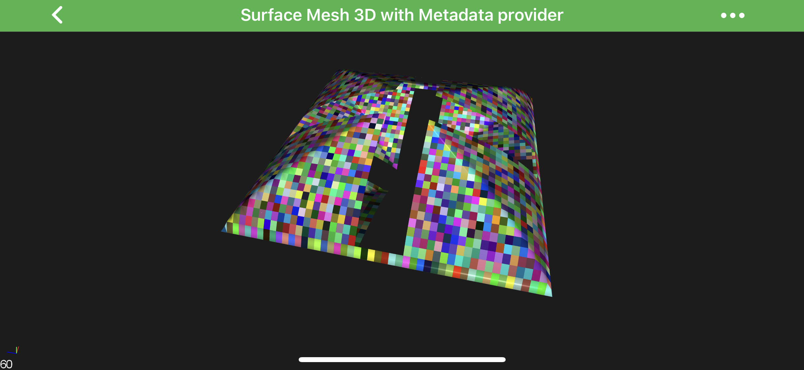

# MetadataProvider 3D API
SciChart Android 3D features a rich **MetadataProvider API** with gives the ability to change color on a ***point-by-point*** basis.

> [!NOTE]
> Examples of using **MetadataProvider API** can be found in the [SciChart Android Examples Suite](https://www.scichart.com/examples/android-chart/) as well as on [GitHub](https://github.com/ABTSoftware/SciChart.Android.Examples):
> - [Native Example](https://www.scichart.com/example/android-chart/android-3d-chart-example-surface-mesh-palette-provider/)
> - [Xamarin Example](https://www.scichart.com/example/xamarin-chart/xamarin-3d-chart-example-surface-mesh-palette-provider/)

To enable series coloring with **MetadataProvider**, you need to create a class which conforms to one of the following protocol (or possibly to all of them):

| **Protocol**                        | **Descriptions**                                                                          |
| ----------------------------------- | ----------------------------------------------------------------------------------------- | 
| <xref:com.scichart.charting3d.visuals.renderableSeries.metadataProviders.IPointMetadataProvider3D>       | allows changing the **fill** for **[PointMarkers 3D](xref:chart3d.PointMarker3DAPI)**.          |
| <xref:com.scichart.charting3d.visuals.renderableSeries.metadataProviders.IStrokeMetadataProvider3D>       | allows painting parts of the **series' stroke**;                                          |
| <xref:com.scichart.charting3d.visuals.renderableSeries.metadataProviders.IFillMetadataProvider3D>         | allows changing the **fill** color for <xref:com.scichart.charting3d.visuals.renderableSeries.IRenderableSeries3D>.                          |
| <xref:com.scichart.charting3d.visuals.renderableSeries.metadataProviders.ISurfaceMeshMetadataProvider3D> | allows overriding a specific cell or cells in the for <xref:com.scichart.charting3d.visuals.renderableSeries.surfaceMesh.SurfaceMeshRenderableSeries3D>. |
| <xref:com.scichart.charting3d.visuals.renderableSeries.metadataProviders.ISelectableMetadataProvider3D>  | allows provide different colors for selected points.                                      |

> [!NOTE]
> The ***MetadataProvider API*** is very similar to the [PaletteProvider API](xref:chart2d.PaletteProviderAPI) from SciChart 2D.

A choice depends on a [RenderableSeries 3D](xref:chart3d.3DChartTypes) type, which **MetadataProvider 3D** is designed for.

Each **MetadataProvider** protocol declares method(s), which provides a way to update series ***colors*** for every data points. 
Mentioned methods are called every time **RenderableSeries 3D** requires a redraw, so it expects that the colors array should be updated there correspondingly.

For the convenience, there is the <xref:com.scichart.charting3d.visuals.renderableSeries.metadataProviders.MetadataProvider3DBase> class, which provides some basic implementation, so it's recommended to inherit from it while implementing custom **MetadataProvider**. There is also some predefined **MetadataProviders** listed below:
- <xref:com.scichart.charting3d.visuals.renderableSeries.metadataProviders.DefaultSelectableMetadataProvider3D> - allows provide different colors for selected points. You can find it in our examples which demonstrate selection such as - [***Waterfall Chart 3D***](https://www.scichart.com/example/android-3d-chart-example-simple-waterfall/) and [***Select Scatter Point 3D Chart***](https://www.scichart.com/example/android-chart/android-3d-chart-example-select-scatter-point/).

## Create Custom MetadataProvider
The following code snippet demonstrates how to create a custom **MetadataProvider** which conforms to the - **Stroke** and **PointMarker** - metadata providers and colors them respectively to the [orbitalYaw](xref:com.scichart.charting3d.visuals.camera.ICameraController.setOrbitalYaw(float)) and [orbitalPitch](xref:com.scichart.charting3d.visuals.camera.ICameraController.setOrbitalPitch(float)).

> [!NOTE]
> The below code is based on the **Point-Line Chart 3D** example which can be found in the [SciChart Android Examples Suite](https://www.scichart.com/examples/android-chart/) as well as on [GitHub](https://github.com/ABTSoftware/SciChart.Android.Examples):
> - [Native Example](https://www.scichart.com/example/android-3d-chart-example-simple-point-lines/)
> - [Xamarin Example](https://www.scichart.com/example/xamarin-3d-chart-example-simple-point-lines/)

# [Java](#tab/java)
[!code-java[CreateCustomMetadataProvider](../../../samples/sandbox/app/src/main/java/com/scichart/docsandbox/examples/java/series3d/MetadataProvider3DAPI.java#CreateCustomMetadataProvider)]
# [Java with Builders API](#tab/javaBuilder)
[!code-java[CreateCustomMetadataProvider](../../../samples/sandbox/app/src/main/java/com/scichart/docsandbox/examples/javaBuilder/series3d/MetadataProvider3DAPI.java#CreateCustomMetadataProvider)]
# [Kotlin](#tab/kotlin)
[!code-swift[CreateCustomMetadataProvider](../../../samples/sandbox/app/src/main/java/com/scichart/docsandbox/examples/kotlin/series3d/MetadataProvider3DAPI.kt#CreateCustomMetadataProvider)]
***

Once the **MetadataProvider** class is ready, its instances can be used to set it for a RenderableSeries via the [metadataProvider](xref:com.scichart.charting3d.visuals.renderableSeries.IRenderableSeries3D.setMetadataProvider(com.scichart.charting3d.visuals.renderableSeries.metadataProviders.IMetadataProvider3D)) property:

# [Java](#tab/java)
[!code-java[SetCustomMetadataProvider](../../../samples/sandbox/app/src/main/java/com/scichart/docsandbox/examples/java/series3d/MetadataProvider3DAPI.java#SetCustomMetadataProvider)]
# [Java with Builders API](#tab/javaBuilder)
[!code-java[SetCustomMetadataProvider](../../../samples/sandbox/app/src/main/java/com/scichart/docsandbox/examples/javaBuilder/series3d/MetadataProvider3DAPI.java#SetCustomMetadataProvider)]
# [Kotlin](#tab/kotlin)
[!code-swift[SetCustomMetadataProvider](../../../samples/sandbox/app/src/main/java/com/scichart/docsandbox/examples/kotlin/series3d/MetadataProvider3DAPI.kt#SetCustomMetadataProvider)]
***

Which will result with the following:

<video autoplay loop muted playsinline src="images/metadata-provider-thresholds.mp4"></video>