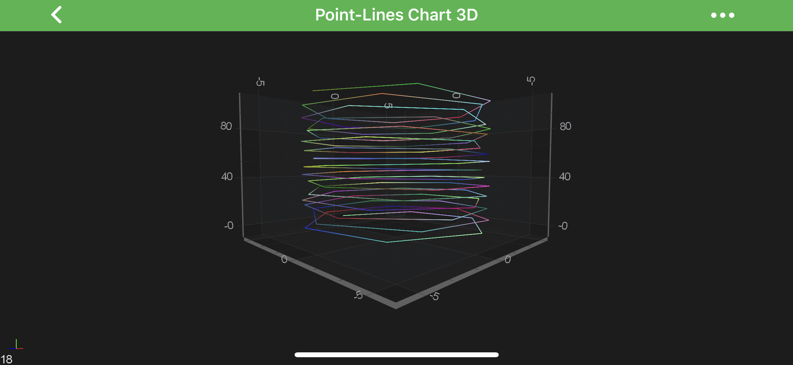
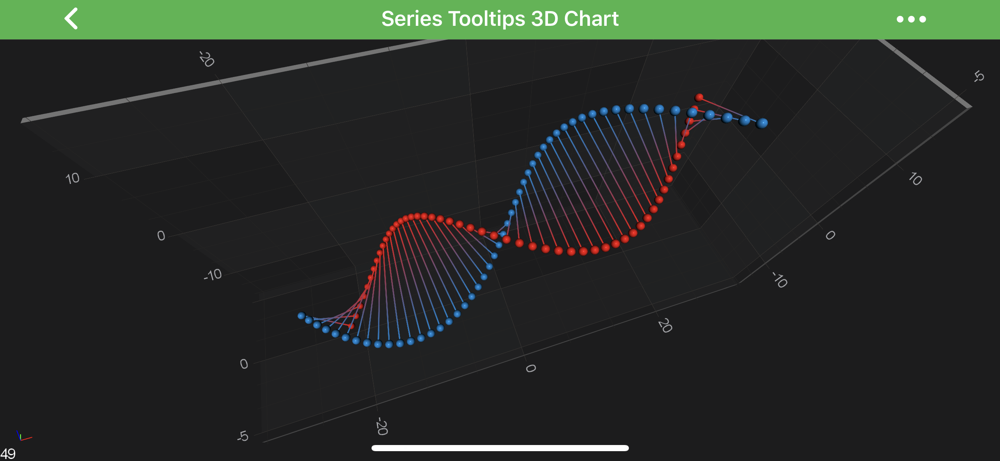
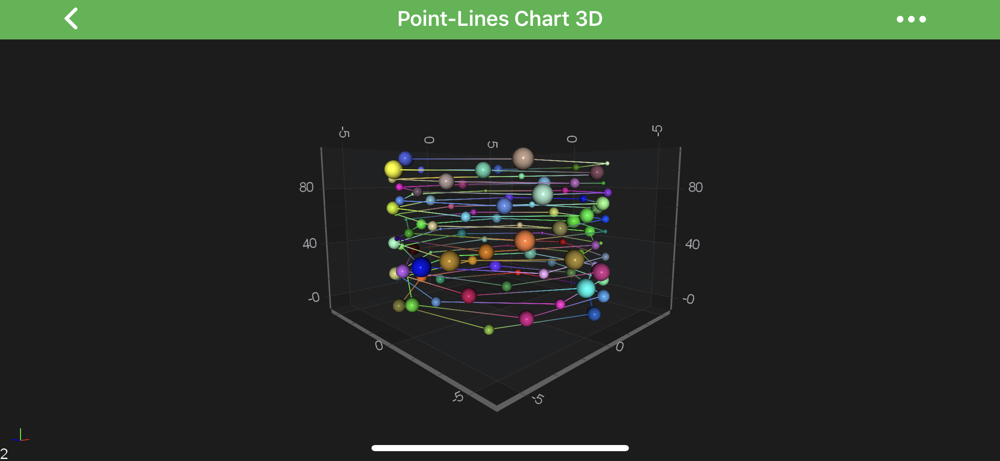

# The Point-Line 3D Chart Type
The 3D Point-Line Charts are provided by the <xref:com.scichart.charting3d.visuals.renderableSeries.pointLine.PointLineRenderableSeries3D> class.

> [!NOTE]
> Examples of the **Point-Line 3D** Series can be found in the [SciChart Android Examples Suite](https://www.scichart.com/examples/android-chart/) as well as on [GitHub](https://github.com/ABTSoftware/SciChart.Android.Examples):
> - [Native Example](https://www.scichart.com/example/android-3d-chart-example-simple-point-lines/)
> - [Xamarin Example](https://www.scichart.com/example/xamarin-3d-chart-example-simple-point-lines/)

Besides the [Common Features](xref:chart3d.3DChartTypes#common-renderableseries-3d-features) which are shared between all [3D Chart Types](xref:chart3d.3DChartTypes),
the <xref:com.scichart.charting3d.visuals.renderableSeries.pointLine.PointLineRenderableSeries3D> allows you to customize it's specific properties:

| **Feature**                                      | **Description**                                              |
| ------------------------------------------------ | ------------------------------------------------------------ |
| [stroke](xref:com.scichart.charting3d.visuals.renderableSeries.pointLine.PointLineRenderableSeries3D.setStroke(int))          | allows to specify the **stroke color** of the lines.         |
| [strokeThickness](xref:com.scichart.charting3d.visuals.renderableSeries.pointLine.PointLineRenderableSeries3D.setStrokeThickness(float)) | allows to specify Line **thickness**.                        |
| [isAntialiased](xref:com.scichart.charting3d.visuals.renderableSeries.pointLine.PointLineRenderableSeries3D.setIsAntialiased(boolean))   | allows to specify if lines should be **antialiased** or not. |
| [isLineStrips](xref:com.scichart.charting3d.visuals.renderableSeries.pointLine.PointLineRenderableSeries3D.setIsLineStrips(boolean))    | Defines a value indicating whether the lines should be drawn as ***line strips*** or as ***separate lines***. See the [IsLineStrips Property](#islinestrips-property) section. |

Also, it is possible to show a gap in a **Point-Line 3D Series** simply by passing a data-point with a `NaN` as the Y value. 

#### IsLineStrips Property
The <xref:com.scichart.charting3d.visuals.renderableSeries.pointLine.PointLineRenderableSeries3D> can be configured to split the line at every other point.
This is quite useful if you want to use it to draw a ***free-form grid***. 
That's achieved via the [isLineStrips](xref:com.scichart.charting3d.visuals.renderableSeries.pointLine.PointLineRenderableSeries3D.setIsLineStrips(boolean)) property.

> [!NOTE]
> Full example sources are available in [3D Charts -> Tooltips and Hit-Test 3D Charts -> Series Tooltips 3D Chart](https://www.scichart.com/example/android-3d-chart-example-series-tooltips/)

## Create a Line Series
To create a <xref:com.scichart.charting3d.visuals.renderableSeries.pointLine.PointLineRenderableSeries3D>, use the following code:

# [Java](#tab/java)
[!code-java[CreateLineSeries](../../../samples/sandbox/app/src/main/java/com/scichart/docsandbox/examples/java/series3d/PointLineSeries3D.java#CreateLineSeries)]
# [Java with Builders API](#tab/javaBuilder)
[!code-java[CreateLineSeries](../../../samples/sandbox/app/src/main/java/com/scichart/docsandbox/examples/javaBuilder/series3d/PointLineSeries3D.java#CreateLineSeries)]
# [Kotlin](#tab/kotlin)
[!code-swift[CreateLineSeries](../../../samples/sandbox/app/src/main/java/com/scichart/docsandbox/examples/kotlin/series3d/PointLineSeries3D.kt#CreateLineSeries)]
***

In the code above, a **Point-Line Series 3D** instance is created. It is assigned to draw the data that is provided by the <xref:com.scichart.charting3d.model.dataSeries.IDataSeries3D> assigned to it.
The line is drawn with a `stroke` color provided by <xref:com.scichart.charting3d.visuals.renderableSeries.metadataProviders.PointMetadataProvider3D> instance, but in this particular example, we used our [MetadataProvider 3D API](xref:chart3d.MetadataProvider3DAPI), which provides custom colors for individual points of the series.
Finally, the **Point-Line Series 3D** is added to the <xref:com.scichart.charting3d.visuals.ISciChartSurface3D.getRenderableSeries()> property.

> [!NOTE]
> For more information about **MetadataProviders** - please refer to the **[MetadataProvider 3D API](xref:chart3d.MetadataProvider3DAPI)** article.

#### Add Point Markers onto a Point-Line3D Series
Every data point of a **Point-Line 3D Series** can be marked with a [PointMarker 3D](xref:chart3d.PointMarker3DAPI).
To add Point Markers to the Point-Line 3D, use the following code:

# [Java](#tab/java)
[!code-java[AddPointMarkers](../../../samples/sandbox/app/src/main/java/com/scichart/docsandbox/examples/java/series3d/PointLineSeries3D.java#AddPointMarkers)]
# [Java with Builders API](#tab/javaBuilder)
[!code-java[AddPointMarkers](../../../samples/sandbox/app/src/main/java/com/scichart/docsandbox/examples/javaBuilder/series3d/PointLineSeries3D.java#AddPointMarkers)]
# [Kotlin](#tab/kotlin)
[!code-swift[AddPointMarkers](../../../samples/sandbox/app/src/main/java/com/scichart/docsandbox/examples/kotlin/series3d/PointLineSeries3D.kt#AddPointMarkers)]
***

To learn more about **Point Markers 3D**, please refer to the [PointMarkers 3D API](xref:chart3d.PointMarker3DAPI) article.

> [!NOTE]
> This feature can be used to create a [Scatter 3D Series](xref:chart3d.ScatterSeries3D).

#### Paint Line Segments With Different Colors
Is SciChart, you can draw line segments with different colors using the [MetadataProvider 3D API](xref:chart3d.MetadataProvider3DAPI).
To Use metadata provider for **Point-Line 3D Series** - a <xref:com.scichart.charting3d.visuals.renderableSeries.metadataProviders.PointMetadataProvider3D.PointMetadata3D> has to be provided to the [metadataProvider](xref:com.scichart.charting3d.visuals.renderableSeries.IRenderableSeries3D.setMetadataProvider(com.scichart.charting3d.visuals.renderableSeries.metadataProviders.IMetadataProvider3D)) property.
For more information - please refer to the **[MetadataProvider 3D API](xref:chart3d.MetadataProvider3DAPI)** article.
