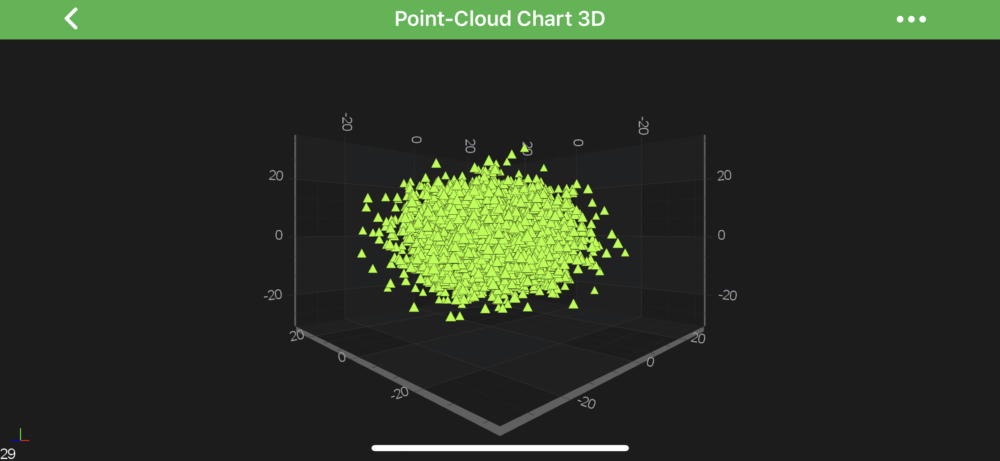
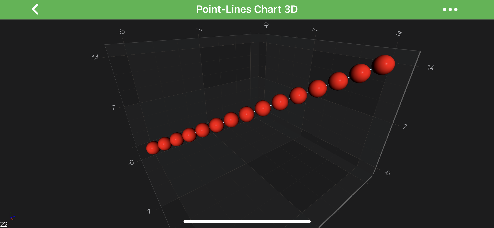
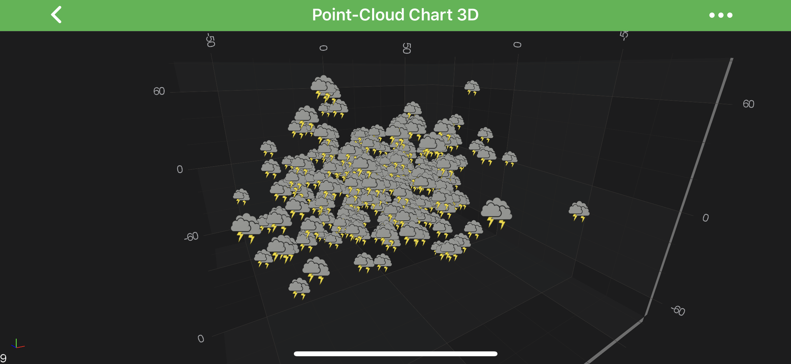

# PointMarker 3D API
SciChart features a rich **PointMarkers 3D API** to annotate the data-points of certain 3D series with markers, e.g. **Pyramid**, **Sphere**, **Ellipse**, **Quad** or even a **Custom Shape** marker. Some series types, such as **[Scatter RenderableSeries 3D](xref:chart3d.ScatterSeries3D)** or **[Impulse RenderableSeries 3D](xref:chart3d.ImpulseSeries3D)**, require a **PointMarker3D** assigned to them unless they won't render at all.

This article is about how to configure and add PointMarkers 3D to a <xref:com.scichart.charting3d.visuals.renderableSeries.IRenderableSeries3D> to render markers for every data point.

> [!NOTE]
> Examples of **Using PointMarkers API** can be found in the [SciChart Android Examples Suite](https://www.scichart.com/examples/ios-chart/) as well as on [GitHub](https://github.com/ABTSoftware/SciChart.Android.Examples):
> - [Native Example](https://www.scichart.com/example/android-3d-chart-example-simple-point-cloud/)
> - [Xamarin Example](https://www.scichart.com/example/xamarin-3d-chart-example-simple-point-cloud/)

## PointMarker 3D Types
SciChart provides several **PointMarker 3D** shapes out of the box, which are of 2 types: ***Flat-Texture*** and ***Mesh (Volumetric)*** which can be found below:

| **Flat-Texture PointMarkers** | **Mesh (Volumetric) PointMarkers** |
| ----------------------------- | ---------------------------------- |
| <xref:com.scichart.charting3d.visuals.pointMarkers.TrianglePointerMarker3D>    | <xref:com.scichart.charting3d.visuals.pointMarkers.PyramidPointMarker3D>          |
| <xref:com.scichart.charting3d.visuals.pointMarkers.QuadPointMarker3D>        | <xref:com.scichart.charting3d.visuals.pointMarkers.CubePointMarker3D>             |
| <xref:com.scichart.charting3d.visuals.pointMarkers.EllipsePointMarker3D>     | <xref:com.scichart.charting3d.visuals.pointMarkers.SpherePointMarker3D>           |
| <xref:com.scichart.charting3d.visuals.pointMarkers.PixelPointMarker3D>       | <xref:com.scichart.charting3d.visuals.pointMarkers.CylinderPointMarker3D>         |
| <xref:com.scichart.charting3d.visuals.pointMarkers.CustomPointMarker3D>      |

It is possible to have a custom ***Flat-Texture*** PointMarker, and there is a <xref:com.scichart.charting3d.visuals.pointMarkers.CustomPointMarker3D> for such purpose.
It allows to render a point marker from a [Bitmap](https://developer.android.com/reference/android/graphics/Bitmap). 
For more details, refer to the [Custom PointMarkers 3D](#custom-pointmarkers-3d) section down the page.

All the **PointMarker** types are inherited from the <xref:com.scichart.charting3d.visuals.pointMarkers.BasePointMarker3D>, which provides the following properties for styling point markers:

| **PointMarker property**          | **Description**                                                                                    |
| --------------------------------- | -------------------------------------------------------------------------------------------------- |
| [size](xref:com.scichart.charting3d.visuals.pointMarkers.BasePointMarker3D.setSize(float))       | Allows to specify the size of a PointMarker. PointMarkers will not appear if this value isn't set. |
| [fill](xref:com.scichart.charting3d.visuals.pointMarkers.BasePointMarker3D.setFill(int))  | Specifies the fill color which will be used while drawing the PointMarker instance.                |
| [markerType](xref:com.scichart.charting3d.visuals.pointMarkers.BasePointMarker3D.markerType) | Defines the <xref:com.scichart.charting3d.visuals.pointMarkers.MarkerType> for this point marker.                                                 |

## Using PointMarkers 3D
Code for creation and assigning a **PointMarker 3D** to a <xref:com.scichart.charting3d.visuals.renderableSeries.IRenderableSeries3D> is essentially the same regardless of a PointMarker type. 
After an instance of it has been created, it can be configured and then applied to the [pointMarker](xref:com.scichart.charting3d.visuals.renderableSeries.IRenderableSeries3D.setPointMarker(com.scichart.charting3d.visuals.pointMarkers.BasePointMarker3D)) property:

# [Java](#tab/java)
[!code-java[CreatePointMarker3D](../../../samples/sandbox/app/src/main/java/com/scichart/docsandbox/examples/java/series3d/PointMarker3DAPI.java#CreatePointMarker3D)]
# [Java with Builders API](#tab/javaBuilder)
[!code-java[CreatePointMarker3D](../../../samples/sandbox/app/src/main/java/com/scichart/docsandbox/examples/javaBuilder/series3d/PointMarker3DAPI.java#CreatePointMarker3D)]
# [Kotlin](#tab/kotlin)
[!code-swift[CreatePointMarker3D](../../../samples/sandbox/app/src/main/java/com/scichart/docsandbox/examples/kotlin/series3d/PointMarker3DAPI.kt#CreatePointMarker3D)]
***

The code above will produce the following chart (assuming that the data has been added to the **[PointLine Series](xref:chart3d.PointLineSeries3D)**):

## Custom PointMarkers 3D
SciChart Android 3D provides a possibility to draw custom ***Flat-Texture*** PointMarkers via the <xref:com.scichart.charting3d.visuals.pointMarkers.CustomPointMarker3D> class.
All you need to do - is to provide Bitmap texture which will be used as sprite, and then - rendered onto a 3d world.

Please see the example below:

# [Java](#tab/java)
[!code-java[CreateCustomPointMarker3D](../../../samples/sandbox/app/src/main/java/com/scichart/docsandbox/examples/java/series3d/PointMarker3DAPI.java#CreateCustomPointMarker3D)]
# [Java with Builders API](#tab/javaBuilder)
[!code-java[CreateCustomPointMarker3D](../../../samples/sandbox/app/src/main/java/com/scichart/docsandbox/examples/javaBuilder/series3d/PointMarker3DAPI.java#CreateCustomPointMarker3D)]
# [Kotlin](#tab/kotlin)
[!code-swift[CreateCustomPointMarker3D](../../../samples/sandbox/app/src/main/java/com/scichart/docsandbox/examples/kotlin/series3d/PointMarker3DAPI.kt#CreateCustomPointMarker3D)]
***

This would result in the following chart:

