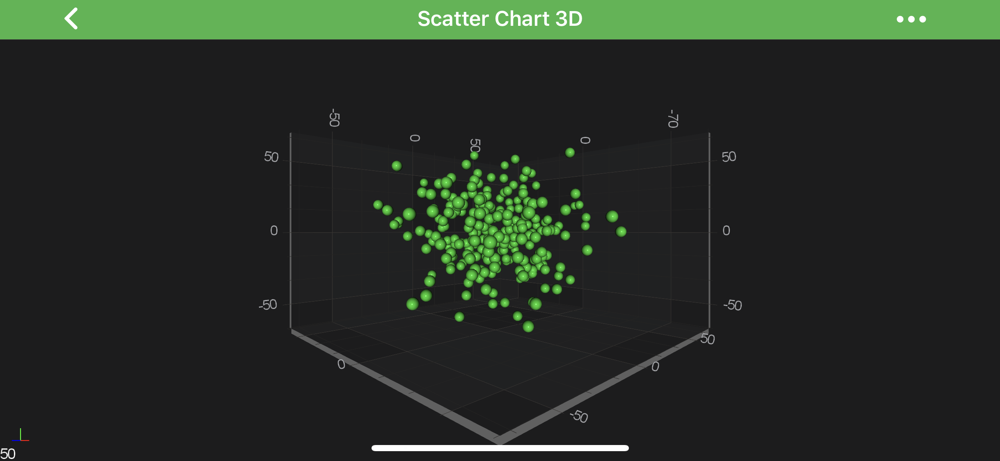

# The Scatter 3D Chart Type
3D Scatter Charts can be created using the <xref:com.scichart.charting3d.visuals.renderableSeries.scatter.ScatterRenderableSeries3D> type.

> [!NOTE]
> Examples for the **Scatter Series 3D** can be found in the [SciChart Android Examples Suite](https://www.scichart.com/examples/ios-chart/) as well as on [GitHub](https://github.com/ABTSoftware/SciChart.Android.Examples):
> - [Native Example](https://www.scichart.com/example/android-3d-chart-example-simple-scatter/)
> - [Xamarin Example](https://www.scichart.com/example/xamarin-3d-chart-example-simple-scatter/)

The Scatter Series 3D requires a shape to be specified using the **Point Markers 3D**. SciChart provides several shapes out of the box:

| **Flat-Texture PointMarkers** | **Mesh (Volumetric) PointMarkers** |
| ----------------------------- | ---------------------------------- |
| <xref:com.scichart.charting3d.visuals.pointMarkers.TrianglePointerMarker3D>    | <xref:com.scichart.charting3d.visuals.pointMarkers.PyramidPointMarker3D>          |
| <xref:com.scichart.charting3d.visuals.pointMarkers.QuadPointMarker3D>        | <xref:com.scichart.charting3d.visuals.pointMarkers.CubePointMarker3D>             |
| <xref:com.scichart.charting3d.visuals.pointMarkers.EllipsePointMarker3D>     | <xref:com.scichart.charting3d.visuals.pointMarkers.SpherePointMarker3D>           |
| <xref:com.scichart.charting3d.visuals.pointMarkers.PixelPointMarker3D>       | <xref:com.scichart.charting3d.visuals.pointMarkers.CylinderPointMarker3D>         |
| <xref:com.scichart.charting3d.visuals.pointMarkers.CustomPointMarker3D>      |

It is also possible to [define custom texture](xref:chart3d.PointMarker3DAPI#custom-pointmarkers-3d) for the Point Markers via the <xref:com.scichart.charting3d.visuals.pointMarkers.CustomPointMarker3D>.
Please refer to the [PointMarkers 3D API](xref:chart3d.PointMarker3DAPI) article to learn more.
You can also [override colors](#paint-scatters-with-different-colors) of the **Point Markers 3D** individually using [The MetadataProvider API](xref:chart3d.MetadataProvider3DAPI).

## Create a 3D Scatter Series
To create a <xref:com.scichart.charting3d.visuals.renderableSeries.scatter.ScatterRenderableSeries3D>, use the following code:

# [Java](#tab/java)
[!code-java[CreateScatterSeries3D](../../../samples/sandbox/app/src/main/java/com/scichart/docsandbox/examples/java/series3d/ScatterSeries3D.java#CreateScatterSeries3D)]
# [Java with Builders API](#tab/javaBuilder)
[!code-java[CreateScatterSeries3D](../../../samples/sandbox/app/src/main/java/com/scichart/docsandbox/examples/javaBuilder/series3d/ScatterSeries3D.java#CreateScatterSeries3D)]
# [Kotlin](#tab/kotlin)
[!code-swift[CreateScatterSeries3D](../../../samples/sandbox/app/src/main/java/com/scichart/docsandbox/examples/kotlin/series3d/ScatterSeries3D.kt#CreateScatterSeries3D)]
***

In the code above, a **Scatter Series** instance is created and assigned to draw the data provided by the <xref:com.scichart.charting3d.model.dataSeries.IDataSeries3D> assigned to it.
The ***Scatters 3D*** are drawn with a **PointMarker** provided by the <xref:com.scichart.charting3d.visuals.pointMarkers.SpherePointMarker3D> instance.
Finally, the **3D Scatter Series** is added to the <xref:com.scichart.charting3d.visuals.ISciChartSurface3D.getRenderableSeries()> collection.

#### Paint Scatters With Different Colors
Is SciChart, you can draw each scatter of the **Scatter Series 3D** with the different color using the [MetadataProvider API](xref:chart3d.MetadataProvider3DAPI).
To use **MetadataProvider** for scatters 3D - a custom <xref:com.scichart.charting3d.visuals.renderableSeries.metadataProviders.IPointMetadataProvider3D> has to be provided to the [metadataProvider](xref:com.scichart.charting3d.visuals.renderableSeries.IRenderableSeries3D.setMetadataProvider(com.scichart.charting3d.visuals.renderableSeries.metadataProviders.IMetadataProvider3D)) property. Also, there is <xref:com.scichart.charting3d.visuals.renderableSeries.metadataProviders.PointMetadataProvider3D> provided out of the box, as a general case for **Scatter Series 3D**.

Individually colored **Scatter Series 3D** are also known as [Bubble 3D Chart](xref:chart3d.BubbleSeries3D). Please visit the corresponding article for more information about it.

> [!NOTE]
> To learn more about coloring <xref:com.scichart.charting3d.visuals.renderableSeries.IRenderableSeries3D> points individually - refer to the [MetadataProvider API](xref:chart3d.MetadataProvider3DAPI) article for more info.
