# The Surface Mesh 3D Chart Type
The ***surface mesh*** renders a two-dimensional array as a heightmap.
In SciChart it's defined by the <xref:com.scichart.charting3d.visuals.renderableSeries.surfaceMesh.SurfaceMeshRenderableSeries3D> class and provides a number of configurable chart types in SciChart 3D, including:
- dynamic **real-time** Surfaces (terrains or height maps).
- **texturing** of surfaces or terrains or height maps.
- **Non-uniform** or **uniform** grid spacing.
- **Contour mapping** or **wireframe** on terrain or height maps.

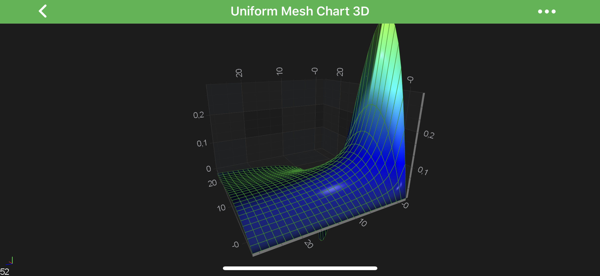

> [!NOTE]
> Examples of the [***Surface Mesh 3D***]() Series can be found in the [SciChart Android Examples Suite](https://www.scichart.com/examples/android-chart/) as well as on [GitHub](https://github.com/ABTSoftware/SciChart.Android.Examples):
> - [Native Example](https://www.scichart.com/example/android-chart/android-3d-chart-example-simple-uniform-mesh/)
> - [Xamarin Example](https://www.scichart.com/example/xamarin-chart/xamarin-3d-chart-example-simple-uniform-mesh/)

In the Surface Mesh 3D Series, the data is stored in the <xref:com.scichart.charting3d.model.dataSeries.grid.UniformGridDataSeries3D>.
This represents a ***2-dimensional grid***, typically of type `double`.

Some important points which is mandatory to understand while configuring the Surface Meshes:
- The **double values** which are stored in the <xref:com.scichart.charting3d.model.dataSeries.grid.UniformGridDataSeries3D> correspond to the **heights** on the chart (the `Y-Axis`). They are transformed into chart [World Coordinates](xref:axis3DAPIs.SciChart3DBasicsCoordinatesIn3DSpace#world-coordinates) via the [yAxis](xref:com.scichart.charting3d.visuals.ISciChartSurface3D.getYAxis()).
- The `Z` and `X` **Data-Value** are defined by the [startX](xref:com.scichart.charting3d.model.dataSeries.grid.UniformGridDataSeries3D.setStartX(TX)), [stepX](xref:com.scichart.charting3d.model.dataSeries.grid.UniformGridDataSeries3D.setStepX(TX)), [startZ](xref:com.scichart.charting3d.model.dataSeries.grid.UniformGridDataSeries3D.setStartZ(TZ)) and [stepZ](xref:com.scichart.charting3d.model.dataSeries.grid.UniformGridDataSeries3D.setStepZ(TZ)) properties on <xref:com.scichart.charting3d.model.dataSeries.grid.UniformGridDataSeries3D>. These are transformed into [World Coordinates](xref:axis3DAPIs.SciChart3DBasicsCoordinatesIn3DSpace#world-coordinates) via the [xAxis](xref:com.scichart.charting3d.visuals.ISciChartSurface3D.getXAxis()) and [zAxis](xref:com.scichart.charting3d.visuals.ISciChartSurface3D.getZAxis()) respectively.
- The **Colours** on the SurfaceMesh are defined by the <xref:com.scichart.charting3d.visuals.renderableSeries.data.MeshColorPalette>. More on this in the [following sections](#mesh-palette-modes).

The <xref:com.scichart.charting3d.visuals.renderableSeries.surfaceMesh.SurfaceMeshRenderableSeries3D> is ***highly configurable***, so please read on the [Configuring Surface Mesh 3D Series](#configuring-surface-mesh-3d-series) section.

## Create a Surface Mesh Series 3D
In order to create **Uniform Surface Mesh 3D** - you will need to provide the <xref:com.scichart.charting3d.model.dataSeries.grid.UniformGridDataSeries3D> with `N x M` array of points.

The above graph is rendered with the following code:

# [Java](#tab/java)
[!code-java[CreateSurfaceMeshSeries3D](../../../samples/sandbox/app/src/main/java/com/scichart/docsandbox/examples/java/series3d/SurfaceMeshSeries3D.java#CreateSurfaceMeshSeries3D)]
# [Java with Builders API](#tab/javaBuilder)
[!code-java[CreateSurfaceMeshSeries3D](../../../samples/sandbox/app/src/main/java/com/scichart/docsandbox/examples/javaBuilder/series3d/SurfaceMeshSeries3D.java#CreateSurfaceMeshSeries3D)]
# [Kotlin](#tab/kotlin)
[!code-swift[CreateSurfaceMeshSeries3D](../../../samples/sandbox/app/src/main/java/com/scichart/docsandbox/examples/kotlin/series3d/SurfaceMeshSeries3D.kt#CreateSurfaceMeshSeries3D)]
***

## Configuring Surface Mesh 3D Series
There are several properties which affect rendering of the <xref:com.scichart.charting3d.visuals.renderableSeries.surfaceMesh.SurfaceMeshRenderableSeries3D> and those are listed below:

| **Property**                                            | **Description**                                             |
| ------------------------------------------------------- | ----------------------------------------------------------- |
| [highlight](xref:com.scichart.charting3d.visuals.renderableSeries.ContourMeshRenderableSeries3DBase.setHighlight(float)) | Changes the lighting algorithm to make cells appear ***lighter***. |
| [meshColorPalette](xref:com.scichart.charting3d.visuals.renderableSeries.ContourMeshRenderableSeries3DBase.setHighlight(float)) | defines the <xref:com.scichart.charting3d.visuals.renderableSeries.data.MeshColorPalette> which is used to calculate color from data value. See the [Applying Palettes to the 3D Surface Meshes](#applying-palettes-to-the-3d-surface-meshes) section for more information. |
| [meshPaletteMode](xref:com.scichart.charting3d.visuals.renderableSeries.ContourMeshRenderableSeries3DBase.setMeshPaletteMode(com.scichart.charting3d.visuals.renderableSeries.data.MeshPaletteMode))  | Changes how the ***heightmap*** is applied. See the [Applying Palettes to the 3D Surface Meshes](#applying-palettes-to-the-3d-surface-meshes) section for more information. |
| [heightScaleFactor](xref:com.scichart.charting3d.visuals.renderableSeries.surfaceMesh.SurfaceMeshRenderableSeries3D.setHeightScaleFactor(float))    | Applies a constant ***scaling factor*** to the heights, e.g. setting to 0 will make the surface mesh flat. |
| [yOffset](xref:com.scichart.charting3d.visuals.renderableSeries.surfaceMesh.SurfaceMeshRenderableSeries3D.setYOffset(float))              | Applies a constant ***offset heights***, e.g. setting to 1 will move the SurfaceMesh `1-Data-Value` in the `Y-direction`. |

The effect of these properties are demonstrated in the images below.

| **Highlight = 0**         | **Highlight = 1**                         |
| ------------------------- | ----------------------------------------- |
| 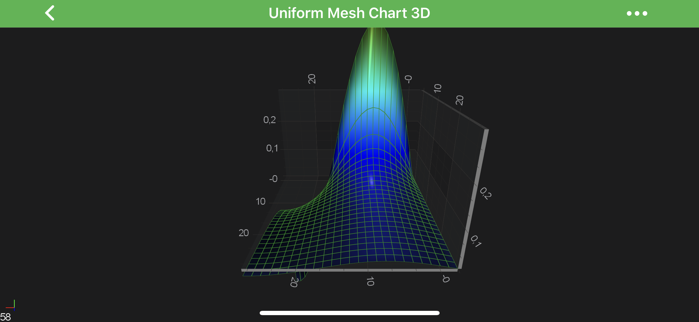 | 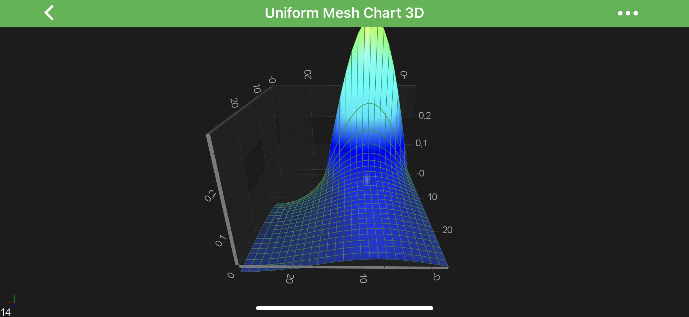 |
| **HeightScaleFactor = 0** | **meshPaletteMode = HeightMapSolidCells** |
| 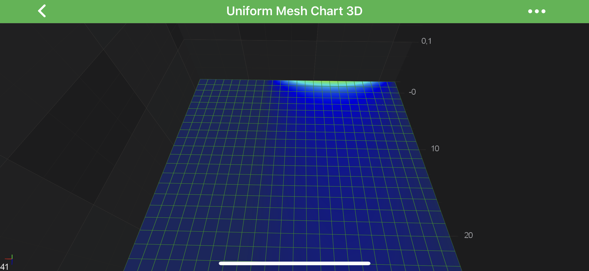 |  |

### Applying Palettes to the 3D Surface Meshes
The <xref:com.scichart.charting3d.visuals.renderableSeries.surfaceMesh.SurfaceMeshRenderableSeries3D> accepts color palettes via the [meshColorPalette](xref:com.scichart.charting3d.visuals.renderableSeries.ContourMeshRenderableSeries3DBase.setMeshColorPalette(com.scichart.charting3d.visuals.renderableSeries.data.MeshColorPalette)) property.
There are several palettes available out of the box, including the following:
- [SolidColorBrushPalette](#solid-color-palette) - applies a solid color to all cells in the mesh
- [GradientColorPalette](#gradient-color-palette) - maps a linear gradient to the mesh.
- [BrushColorPalette](#brush-color-palette) - maps a <xref:com.scichart.drawing.common.BrushStyle> to the mesh. For example, this can be used to map an image via the <xref:com.scichart.drawing.common.TextureBrushStyle> type.
- [Custom Palette](#create-a-custom-palette) - maps a custom Texture to the mesh.

Read on to learn more about each of these options.

In addition, rendering all of the above palettes can be affected by the <xref:com.scichart.charting3d.visuals.renderableSeries.data.MeshPaletteMode>.
See the [Mesh Palette Modes](#mesh-palette-modes) section below for more information. 

#### Mesh Palette Modes
The [meshPaletteMode](xref:com.scichart.charting3d.visuals.renderableSeries.ContourMeshRenderableSeries3DBase.setMeshPaletteMode(com.scichart.charting3d.visuals.renderableSeries.data.MeshPaletteMode)) property changes how the palette is applied to the Mesh.
Possible <xref:com.scichart.charting3d.visuals.renderableSeries.data.MeshPaletteMode> are listed in the table below:

| **Mode**                | **Description**                                                                                                    |
| ----------------------- | ------------------------------------------------------------------------------------------------------------------ |
| <xref:com.scichart.charting3d.visuals.renderableSeries.data.MeshPaletteMode.HeightMapInterpolated> | the palette is applied in the `Y-direction` (vertically).                                                          |
| <xref:com.scichart.charting3d.visuals.renderableSeries.data.MeshPaletteMode.HeightMapSolidCells>   | same as <xref:com.scichart.charting3d.visuals.renderableSeries.data.MeshPaletteMode.HeightMapInterpolated> but no ***interpolation***. Use this if you want each cell have a separate colour. |
| <xref:com.scichart.charting3d.visuals.renderableSeries.data.MeshPaletteMode.Textured>              | palette is applied to the mesh in the **[XZ plane](xref:axis3DAPIs.Axis3DLabelsLabelsConfiguration#axis-cube-planes)**. Imagine the palette is stretched over the mesh itself. |
| <xref:com.scichart.charting3d.visuals.renderableSeries.data.MeshPaletteMode.TexturedSolidCells>    | same as <xref:com.scichart.charting3d.visuals.renderableSeries.data.MeshPaletteMode.Textured> but no ***interpolation***. Use this if you want each cell have a separate colour.              |

#### Solid Color Palette
The Solid palette if provided by the <xref:com.scichart.charting3d.visuals.renderableSeries.data.SolidColorBrushPalette> class. It's quite simple, let's dig into declaration:

# [Java](#tab/java)
[!code-java[CreateSolidColorPalette](../../../samples/sandbox/app/src/main/java/com/scichart/docsandbox/examples/java/series3d/SurfaceMeshSeries3D.java#CreateSolidColorPalette)]
# [Java with Builders API](#tab/javaBuilder)
[!code-java[CreateSolidColorPalette](../../../samples/sandbox/app/src/main/java/com/scichart/docsandbox/examples/javaBuilder/series3d/SurfaceMeshSeries3D.java#CreateSolidColorPalette)]
# [Kotlin](#tab/kotlin)
[!code-swift[CreateSolidColorPalette](../../../samples/sandbox/app/src/main/java/com/scichart/docsandbox/examples/kotlin/series3d/SurfaceMeshSeries3D.kt#CreateSolidColorPalette)]
***

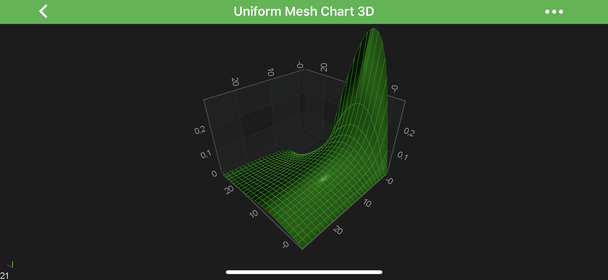

#### Gradient Color Palette
The <xref:com.scichart.charting3d.visuals.renderableSeries.data.GradientColorPalette> can be used to map a ***Gradient Brush*** set of colors to heights in the **Surface Mesh**.
The mapping is similar to that performed by the [Heatmap Series](xref:chart2d.renderableSeries.UniformHeatmapSeries) in 2D Charts.

Given the following code:

# [Java](#tab/java)
[!code-java[CreateGradientColorPalette](../../../samples/sandbox/app/src/main/java/com/scichart/docsandbox/examples/java/series3d/SurfaceMeshSeries3D.java#CreateGradientColorPalette)]
# [Java with Builders API](#tab/javaBuilder)
[!code-java[CreateGradientColorPalette](../../../samples/sandbox/app/src/main/java/com/scichart/docsandbox/examples/javaBuilder/series3d/SurfaceMeshSeries3D.java#CreateGradientColorPalette)]
# [Kotlin](#tab/kotlin)
[!code-swift[CreateGradientColorPalette](../../../samples/sandbox/app/src/main/java/com/scichart/docsandbox/examples/kotlin/series3d/SurfaceMeshSeries3D.kt#CreateGradientColorPalette)]
***

Colors are mapped onto `Y-values` as follows:
- [minimum](xref:com.scichart.charting3d.visuals.renderableSeries.surfaceMesh.SurfaceMeshRenderableSeries3D.setMinimum(double)) are drawn with the gradient stop color at offset 0.
- [maximum](xref:com.scichart.charting3d.visuals.renderableSeries.surfaceMesh.SurfaceMeshRenderableSeries3D.setMaximum(double)) are drawn with the gradient stop color at offset 1.
- All other values are linearly interpolated (including `Y-Values` outside of ***minimum*** and ***maximum*** values).

It's also possible to specify whether gradient is ***stepped*** or not. See code which creates ***stepped*** palette below:

# [Java](#tab/java)
[!code-java[SetIsStepped](../../../samples/sandbox/app/src/main/java/com/scichart/docsandbox/examples/java/series3d/SurfaceMeshSeries3D.java#SetIsStepped)]
# [Java with Builders API](#tab/javaBuilder)
[!code-java[SetIsStepped](../../../samples/sandbox/app/src/main/java/com/scichart/docsandbox/examples/javaBuilder/series3d/SurfaceMeshSeries3D.java#SetIsStepped)]
# [Kotlin](#tab/kotlin)
[!code-swift[SetIsStepped](../../../samples/sandbox/app/src/main/java/com/scichart/docsandbox/examples/kotlin/series3d/SurfaceMeshSeries3D.kt#SetIsStepped)]
***

And the difference is showed below:

| **Linear Gradient**       | **Stepped Gradient (isStepped = YES)**  |
| ------------------------- | --------------------------------------- |
| 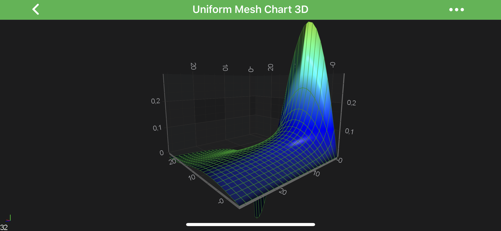 | 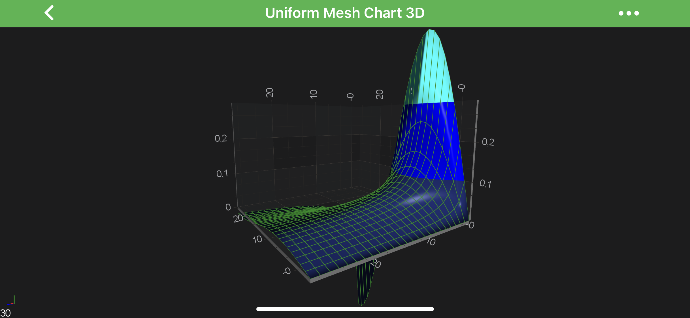

#### Brush Color Palette
A texture can be applied to the SurfaceMesh and mapped over it in the [XZ plane](xref:axis3DAPIs.Axis3DLabelsLabelsConfiguration#axis-cube-planes) plane by using a ***combination*** of the following:
- <xref:com.scichart.charting3d.visuals.renderableSeries.data.BrushColorPalette>
- <xref:com.scichart.charting3d.visuals.renderableSeries.data.MeshPaletteMode.Textured>
- [meshColorPaletteSize](xref:com.scichart.charting3d.visuals.renderableSeries.ContourMeshRenderableSeries3DBase.setMeshColorPaletteSize(com.scichart.core.common.Size))

See the code below:

# [Java](#tab/java)
[!code-java[SetBrushColorPalette](../../../samples/sandbox/app/src/main/java/com/scichart/docsandbox/examples/java/series3d/SurfaceMeshSeries3D.java#SetBrushColorPalette)]
# [Java with Builders API](#tab/javaBuilder)
[!code-java[SetBrushColorPalette](../../../samples/sandbox/app/src/main/java/com/scichart/docsandbox/examples/javaBuilder/series3d/SurfaceMeshSeries3D.java#SetBrushColorPalette)]
# [Kotlin](#tab/kotlin)
[!code-swift[SetBrushColorPalette](../../../samples/sandbox/app/src/main/java/com/scichart/docsandbox/examples/kotlin/series3d/SurfaceMeshSeries3D.kt#SetBrushColorPalette)]
***

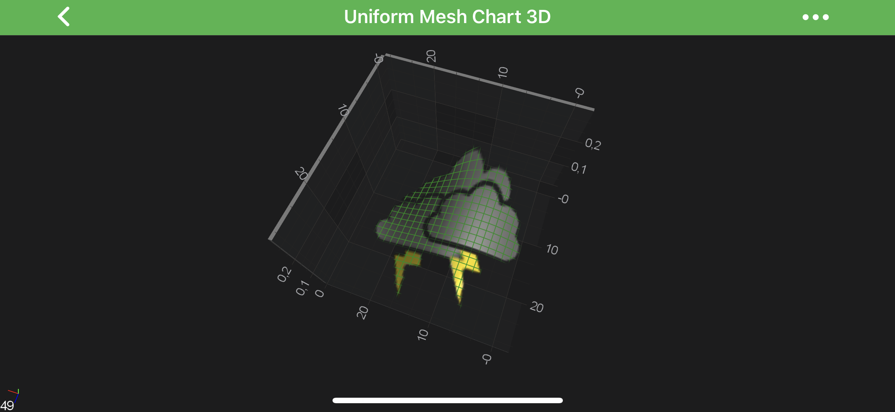

#### Create a Custom Palette
In addition to all of the above, you can create your own ***custom*** Color Palette by inheriting <xref:com.scichart.charting3d.visuals.renderableSeries.data.MeshColorPalette> and overriding the <xref:com.scichart.charting3d.visuals.renderableSeries.data.MeshColorPalette.getTexture(int,int)> method. 

For example, see the following code snippet:

# [Java](#tab/java)
[!code-java[SetCustomPalette](../../../samples/sandbox/app/src/main/java/com/scichart/docsandbox/examples/java/series3d/SurfaceMeshSeries3D.java#SetCustomPalette)]
# [Java with Builders API](#tab/javaBuilder)
[!code-java[SetCustomPalette](../../../samples/sandbox/app/src/main/java/com/scichart/docsandbox/examples/javaBuilder/series3d/SurfaceMeshSeries3D.java#SetCustomPalette)]
# [Kotlin](#tab/kotlin)
[!code-swift[SetCustomPalette](../../../samples/sandbox/app/src/main/java/com/scichart/docsandbox/examples/kotlin/series3d/SurfaceMeshSeries3D.kt#SetCustomPalette)]
***

The palette is applied to a <xref:com.scichart.charting3d.visuals.renderableSeries.surfaceMesh.SurfaceMeshRenderableSeries3D> as in the above examples.

> [!NOTE]
> You might noticed helped extension, which allows to create <xref:com.scichart.drawing.common.ITexture2D> directly from your [Bitmap](https://developer.android.com/reference/android/graphics/Bitmap) - <xref:com.scichart.charting3d.visuals.rendering.Texture2D.fromBitmap(android.graphics.Bitmap)>.

#### Surface Mesh 3D Wireframe and Contours
In SciChart, the **3D Surface Mesh** can be configured to draw with ***Contours*** and/or ***Wireframe***.
That is added optionally ans configured via the [drawMeshAs](xref:com.scichart.charting3d.visuals.renderableSeries.ContourMeshRenderableSeries3DBase.setDrawMeshAs(com.scichart.charting3d.visuals.renderableSeries.data.DrawMeshAs)) property.
See the possible options in the table below:

| **Option**                   | **Surface** | **Wireframe** | **Contours** |
| ---------------------------- | ----------- | ------------- | ------------ |
| <xref:com.scichart.charting3d.visuals.renderableSeries.data.DrawMeshAs.SolidMesh>                   | +           |               |              |
| <xref:com.scichart.charting3d.visuals.renderableSeries.data.DrawMeshAs.Wireframe>                   |             | +             |              |
| <xref:com.scichart.charting3d.visuals.renderableSeries.data.DrawMeshAs.Contours>                    |             |               | +            |
| <xref:com.scichart.charting3d.visuals.renderableSeries.data.DrawMeshAs.SolidWireframe>              | +           | +             |              |
| <xref:com.scichart.charting3d.visuals.renderableSeries.data.DrawMeshAs.SolidWithContours>           | +           |               | +            |
| <xref:com.scichart.charting3d.visuals.renderableSeries.data.DrawMeshAs.SolidWireframeWithContours>  | +           | +             | +            |
 
Wireframe and Contours can be configured via the following properties:
- [contourStrokeThickness](xref:com.scichart.charting3d.visuals.renderableSeries.ContourMeshRenderableSeries3DBase.setContourStrokeThickness(float)) - defines the **thickness** of the **contour line**.
- [contourStroke](xref:com.scichart.charting3d.visuals.renderableSeries.ContourMeshRenderableSeries3DBase.setContourStroke(int)) - defines the **stroke color** of the **contours**, which may optionally include opacity.
- [contourOffset](xref:com.scichart.charting3d.visuals.renderableSeries.ContourMeshRenderableSeries3DBase.setContourOffset(float)) - defines the **offset** of contours from `Y-values`, defaults to 0.
- [contourInterval](xref:com.scichart.charting3d.visuals.renderableSeries.ContourMeshRenderableSeries3DBase.setContourInterval(float)) - defines the `Y-value` intervals between contours.
- [strokeThickness](xref:com.scichart.charting3d.visuals.renderableSeries.ContourMeshRenderableSeries3DBase.setStrokeThickness(float)) - defines the **thickness** of the **wireframe line**.
- [stroke](xref:com.scichart.charting3d.visuals.renderableSeries.ContourMeshRenderableSeries3DBase.setStroke(int)) - defines the **stroke color** of the **wireframe**, which may optionally include opacity.

Some examples are shown below:

| **Bare Wireframe**             | **Solid Surface With Contours**    |
| ------------------------- | --------------------------------------- |
| 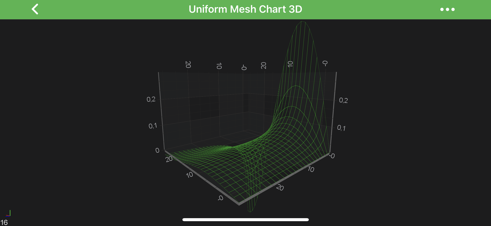 | 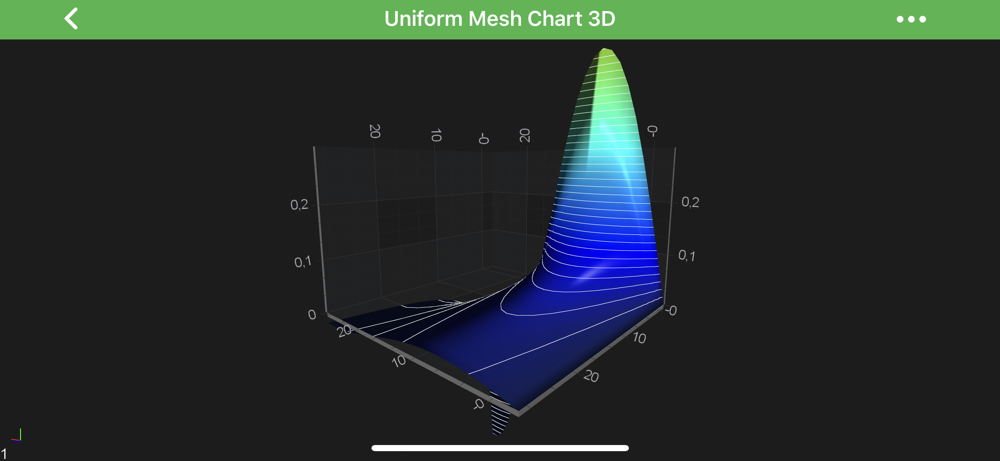

### Overriding Surface Mesh 3D Specific Cell Colors
In addition to the [custom palettes](#applying-palettes-to-the-3d-surface-meshes), [heightmaps](#gradient-color-palette), [textures](#brush-color-palette) - you can **override a specific cell** or cells in the <xref:com.scichart.charting3d.visuals.renderableSeries.surfaceMesh.SurfaceMeshRenderableSeries3D> by using the [MetadataProvider API](xref:chart3d.MetadataProvider3DAPI).

For example it can be used for one of the following:
- **remove specific cells** or mark them as NULL by overriding the cell color to be **Transparent**.
- **mark regions** of interest, say certain **cells** in a value range, or with index must be **colored differently**.
- with higher resolution meshes, you can **change the shape** of the mesh to **circular** (approx) by removing cells outside of a region.

It is showcased in our **Surface mesh 3D with Metadata provider** example. Let's see a code snippet from it, which shows how to implement the custom [MetadataProvider](xref:chart3d.MetadataProvider3DAPI):

# [Java](#tab/java)
[!code-java[CreateSurfaceMeshMetaDataProvider3D](../../../samples/sandbox/app/src/main/java/com/scichart/docsandbox/examples/java/series3d/SurfaceMeshSeries3D.java#CreateSurfaceMeshMetaDataProvider3D)]
# [Java with Builders API](#tab/javaBuilder)
[!code-java[CreateSurfaceMeshMetaDataProvider3D](../../../samples/sandbox/app/src/main/java/com/scichart/docsandbox/examples/javaBuilder/series3d/SurfaceMeshSeries3D.java#CreateSurfaceMeshMetaDataProvider3D)]
# [Kotlin](#tab/kotlin)
[!code-swift[CreateSurfaceMeshMetaDataProvider3D](../../../samples/sandbox/app/src/main/java/com/scichart/docsandbox/examples/kotlin/series3d/SurfaceMeshSeries3D.kt#CreateSurfaceMeshMetaDataProvider3D)]
***

> [!NOTE]
> For more information about custom **MetadataProviders** - please refer to the [MetadataProvider API](xref:chart3d.MetadataProvider3DAPI) article.

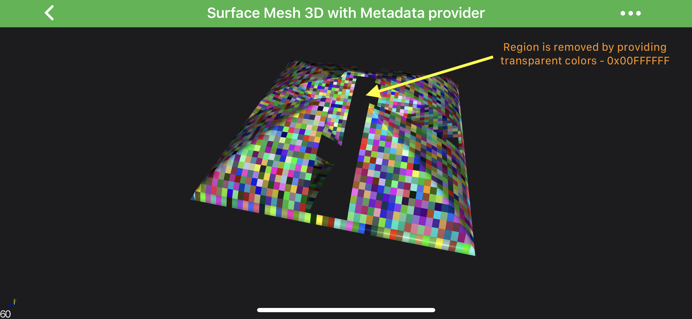

> [!NOTE]
> Examples of using **MetadataProvider API** can be found in the [SciChart Android Examples Suite](https://www.scichart.com/examples/android-chart/) as well as on [GitHub](https://github.com/ABTSoftware/SciChart.Android.Examples):
> - [Native Example](https://www.scichart.com/example/android-chart/android-3d-chart-example-surface-mesh-palette-provider/)
> - [Xamarin Example](https://www.scichart.com/example/xamarin-chart/xamarin-3d-chart-example-surface-mesh-palette-provider/)
