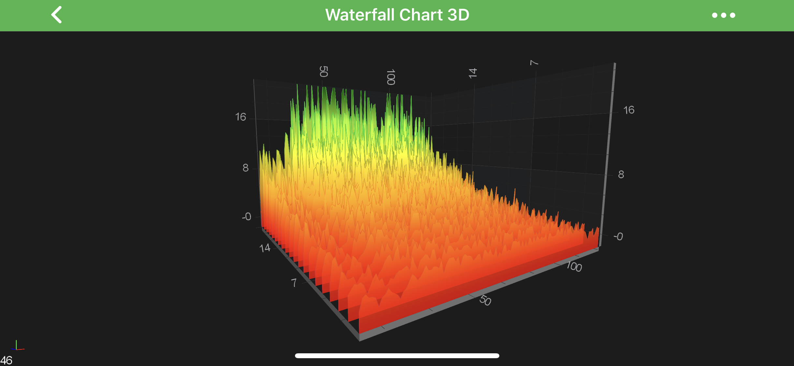
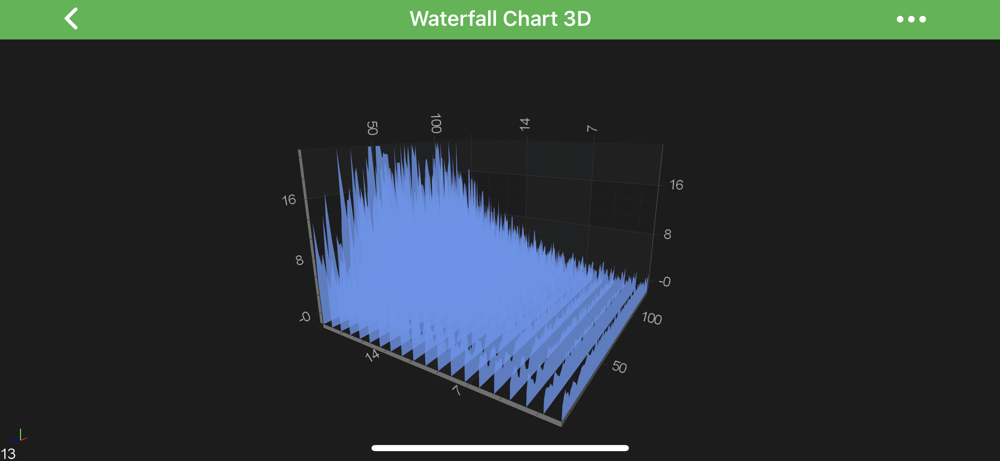
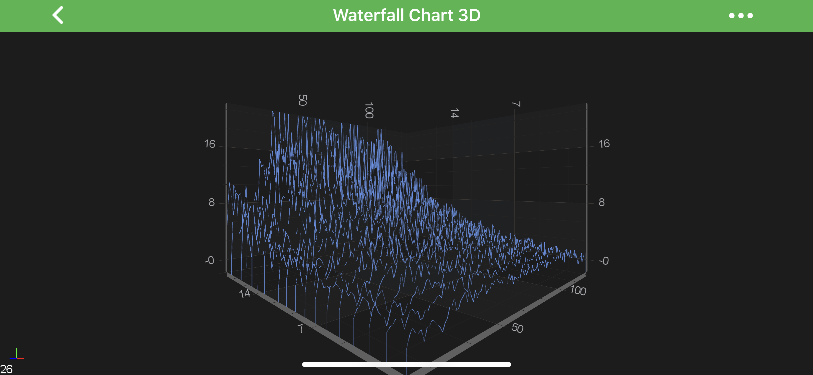
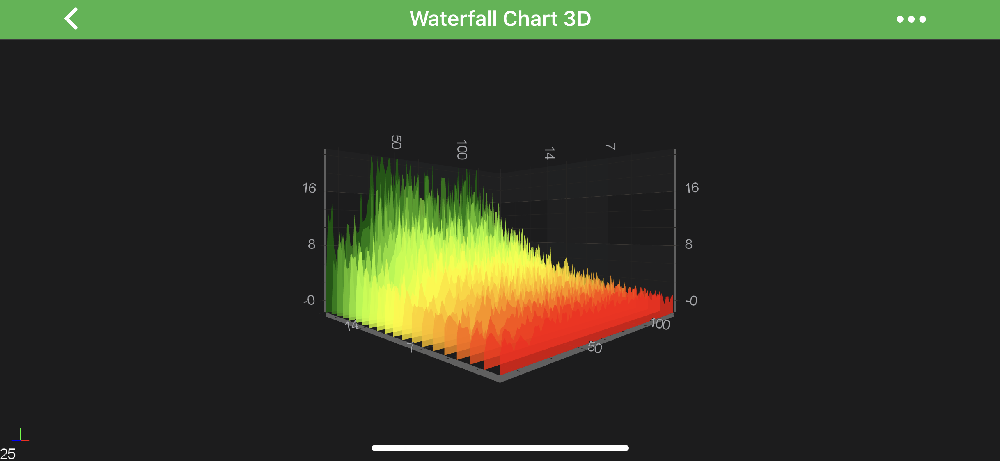
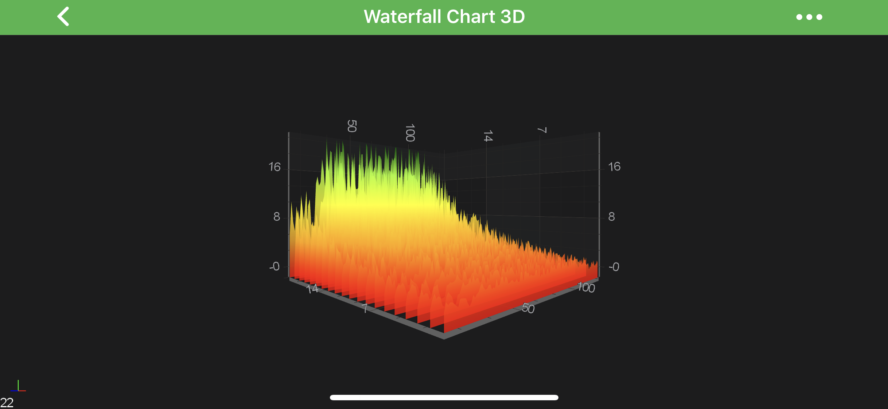
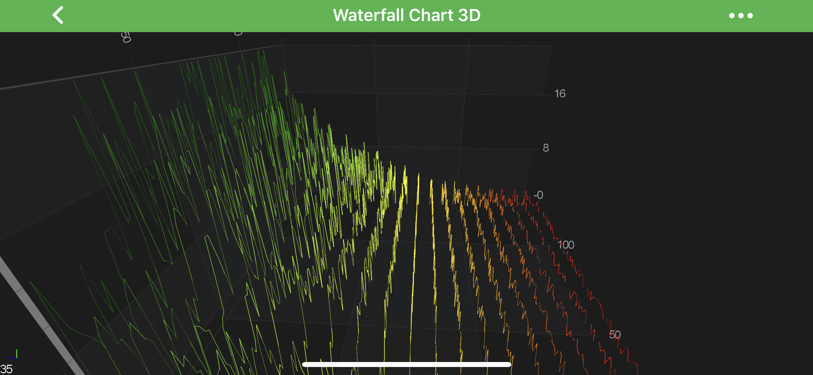
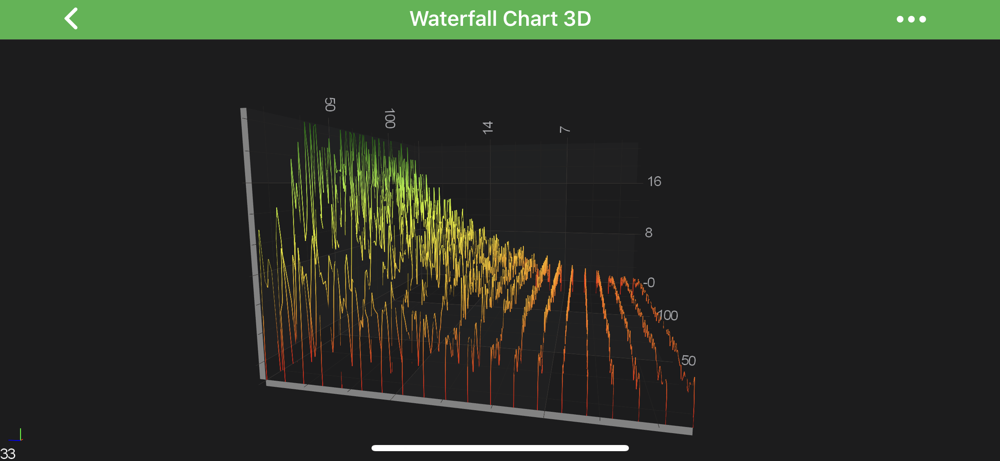
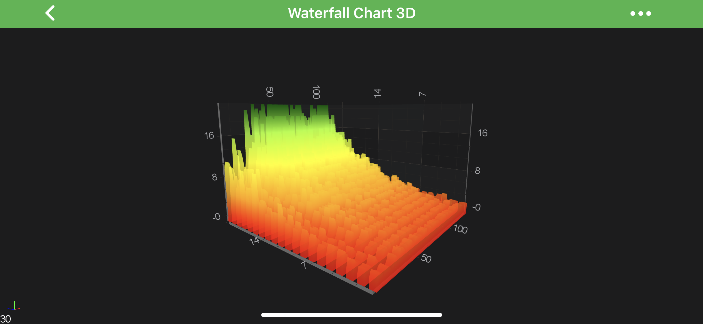
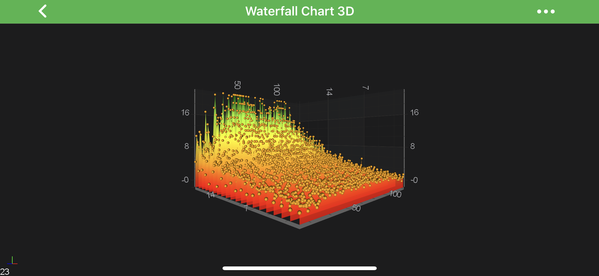

# The Waterfall 3D Chart Type
The **Waterfall Chart** renders a two-dimensional array as a series of slices.
In SciChart it's defined by the <xref:com.scichart.charting3d.visuals.renderableSeries.waterfall.WaterfallRenderableSeries3D> class and provides a number of configurable chart types in SciChart 3D.
As an example, it can be used for the following:
- **dynamic** updating slices for **visualizing** spectra (Acoustic or radio frequency domain data)
- **volumetric** slices
- optional **PointMarkers** at data-points.
- and more...

> [!NOTE]
> Examples of the **Waterfall 3D Series** can be found in the [SciChart Android Examples Suite](https://www.scichart.com/examples/android-chart/) as well as on [GitHub](https://github.com/ABTSoftware/SciChart.Android.Examples):
> - [Native Example](https://www.scichart.com/example/android-3d-chart-example-simple-waterfall/)
> - [Xamarin Example](https://www.scichart.com/example/xamarin-3d-chart-example-simple-waterfall/)

In the Surface Mesh 3D Series, the data is stored in the <xref:com.scichart.charting3d.model.dataSeries.waterfall.WaterfallDataSeries3D>.
This represents a ***2-dimensional grid***, typically of type `double`.

Some important points which is must to know while configuring the **Waterfall Series**:
- The **double values** which are stored in the <xref:com.scichart.charting3d.model.dataSeries.waterfall.WaterfallDataSeries3D> correspond to the **heights** on the chart [`Y-Axis`]. They are transformed into chart [World Coordinates](xref:axis3DAPIs.SciChart3DBasicsCoordinatesIn3DSpace#world-coordinates) via the [yAxis](xref:com.scichart.charting3d.visuals.ISciChartSurface3D.getYAxis()).
- The `Z` and `X` **Data-Value** are defined by the [startX](xref:com.scichart.charting3d.model.dataSeries.grid.UniformGridDataSeries3D.setStartX(TX)), [stepX](xref:com.scichart.charting3d.model.dataSeries.grid.UniformGridDataSeries3D.setStepX(TX)), [startZ](xref:com.scichart.charting3d.model.dataSeries.grid.UniformGridDataSeries3D.setStartZ(TZ)) and [stepZ](xref:com.scichart.charting3d.model.dataSeries.grid.UniformGridDataSeries3D.setStepZ(TZ)) properties on <xref:com.scichart.charting3d.model.dataSeries.grid.UniformGridDataSeries3D>. These are transformed into [World Coordinates](xref:axis3DAPIs.SciChart3DBasicsCoordinatesIn3DSpace#world-coordinates) via the [xAxis](xref:com.scichart.charting3d.visuals.ISciChartSurface3D.getXAxis()) and [zAxis](xref:com.scichart.charting3d.visuals.ISciChartSurface3D.getZAxis()) respectively.
- The **Color** of each ***slice*** and ***outlines*** are define by the <xref:com.scichart.charting3d.visuals.renderableSeries.data.MeshColorPalette> via the following properties:
    - [selectedColorMapping](xref:com.scichart.charting3d.visuals.renderableSeries.waterfall.WaterfallRenderableSeries3D.setSelectedColorMapping(com.scichart.charting3d.visuals.renderableSeries.data.MeshColorPalette))
    - [yColorMapping](xref:com.scichart.charting3d.visuals.renderableSeries.waterfall.WaterfallRenderableSeries3D.setYColorMapping(com.scichart.charting3d.visuals.renderableSeries.data.MeshColorPalette))
    - [zColorMapping](xref:com.scichart.charting3d.visuals.renderableSeries.waterfall.WaterfallRenderableSeries3D.setZColorMapping(com.scichart.charting3d.visuals.renderableSeries.data.MeshColorPalette))
    - [yStrokeColorMapping](xref:com.scichart.charting3d.visuals.renderableSeries.waterfall.WaterfallRenderableSeries3D.setYStrokeColorMapping(com.scichart.charting3d.visuals.renderableSeries.data.MeshColorPalette))
    - [zStrokeColorMapping](xref:com.scichart.charting3d.visuals.renderableSeries.waterfall.WaterfallRenderableSeries3D.setZStrokeColorMapping(com.scichart.charting3d.visuals.renderableSeries.data.MeshColorPalette))

Read on to learn more about [Applying Palettes to the Waterfall](#applying-palettes-to-the-waterfall)

## Create a Surface Mesh Series 3D
In order to create **Waterfall Series** - you will need to provide the <xref:com.scichart.charting3d.model.dataSeries.waterfall.WaterfallDataSeries3D> with `N x M` array of points, which is an array of slices.

See the code below, which shows how to create the above chart:

# [Java](#tab/java)
[!code-java[CreateSurfaceMeshSeries3D](../../../samples/sandbox/app/src/main/java/com/scichart/docsandbox/examples/java/series3d/WaterfallSeries3D.java#CreateSurfaceMeshSeries3D)]
# [Java with Builders API](#tab/javaBuilder)
[!code-java[CreateSurfaceMeshSeries3D](../../../samples/sandbox/app/src/main/java/com/scichart/docsandbox/examples/javaBuilder/series3d/WaterfallSeries3D.java#CreateSurfaceMeshSeries3D)]
# [Kotlin](#tab/kotlin)
[!code-swift[CreateSurfaceMeshSeries3D](../../../samples/sandbox/app/src/main/java/com/scichart/docsandbox/examples/kotlin/series3d/WaterfallSeries3D.kt#CreateSurfaceMeshSeries3D)]
***

#### Applying Palettes to the Waterfall
The ***Waterfall*** chart obeys Palette rules similar to that of the [3D SurfaceMesh Chart](xref:chart3d.SurfaceMeshSeries3D).
To learn more about the types of palette available and how to declare them - please see the [Applying Palettes](xref:chart3d.SurfaceMeshSeries3D#applying-palettes-to-the-3d-surface-meshes) section of the [3D SurfaceMesh Chart](xref:chart3d.SurfaceMeshSeries3D) article.

Palettes which may be applied to the <xref:com.scichart.charting3d.visuals.renderableSeries.waterfall.WaterfallRenderableSeries3D> chart include:
- <xref:com.scichart.charting3d.visuals.renderableSeries.data.SolidColorBrushPalette> - applies a ***solid color*** the waterfall slice or stroke.
- <xref:com.scichart.charting3d.visuals.renderableSeries.data.GradientColorPalette> - maps a ***linear gradient*** to the slice or stroke, where heights map to successive colors.

The properties which allow colouring the Waterfall **slices** and **outlines** are available for the `Z-Direction` and `Y-Direction`.
Those are mutually exclusive, and you should choose one direction at a time.

Read on to see some examples of applying Palettes to <xref:com.scichart.charting3d.visuals.renderableSeries.waterfall.WaterfallRenderableSeries3D>.

##### Applying Solid Palettes to Waterfall Slices
To apply **Solid color** to the Waterfall Slices, please use the following code:

# [Java](#tab/java)
[!code-java[ApplyingSolidPalettes](../../../samples/sandbox/app/src/main/java/com/scichart/docsandbox/examples/java/series3d/WaterfallSeries3D.java#ApplyingSolidPalettes)]
# [Java with Builders API](#tab/javaBuilder)
[!code-java[ApplyingSolidPalettes](../../../samples/sandbox/app/src/main/java/com/scichart/docsandbox/examples/javaBuilder/series3d/WaterfallSeries3D.java#ApplyingSolidPalettes)]
# [Kotlin](#tab/kotlin)
[!code-swift[ApplyingSolidPalettes](../../../samples/sandbox/app/src/main/java/com/scichart/docsandbox/examples/kotlin/series3d/WaterfallSeries3D.kt#ApplyingSolidPalettes)]
***

| **Solid Fill**         | **Solid Outline**                         |
| ------------------------- | ----------------------------------------- |
|  |  |

##### Applying Linear Gradient Palettes to Waterfall Slice Fill
To apply **Linear Gradient** to the Waterfall Slices, first prepare the <xref:com.scichart.charting3d.visuals.renderableSeries.data.GradientColorPalette> for the upcoming steps:

# [Java](#tab/java)
[!code-java[ApplyingLinearGradientPalettes](../../../samples/sandbox/app/src/main/java/com/scichart/docsandbox/examples/java/series3d/WaterfallSeries3D.java#ApplyingLinearGradientPalettes)]
# [Java with Builders API](#tab/javaBuilder)
[!code-java[ApplyingLinearGradientPalettes](../../../samples/sandbox/app/src/main/java/com/scichart/docsandbox/examples/javaBuilder/series3d/WaterfallSeries3D.java#ApplyingLinearGradientPalettes)]
# [Kotlin](#tab/kotlin)
[!code-swift[ApplyingLinearGradientPalettes](../../../samples/sandbox/app/src/main/java/com/scichart/docsandbox/examples/kotlin/series3d/WaterfallSeries3D.kt#ApplyingLinearGradientPalettes)]
***

From here, we can apply it to the Slice ***Fill***, ***Outline*** or ***Both***.

Applying a **Color Palette** onto Slice ***Fill*** in a `Y` or `Z` direction:

# [Java](#tab/java)
[!code-java[ApplyingColorPaletteOntoSliceFill](../../../samples/sandbox/app/src/main/java/com/scichart/docsandbox/examples/java/series3d/WaterfallSeries3D.java#ApplyingColorPaletteOntoSliceFill)]
# [Java with Builders API](#tab/javaBuilder)
[!code-java[ApplyingColorPaletteOntoSliceFill](../../../samples/sandbox/app/src/main/java/com/scichart/docsandbox/examples/javaBuilder/series3d/WaterfallSeries3D.java#ApplyingColorPaletteOntoSliceFill)]
# [Kotlin](#tab/kotlin)
[!code-swift[ApplyingColorPaletteOntoSliceFill](../../../samples/sandbox/app/src/main/java/com/scichart/docsandbox/examples/kotlin/series3d/WaterfallSeries3D.kt#ApplyingColorPaletteOntoSliceFill)]
***

| **Z-Direction Fill**      | **Y-Direction Fill**                      |
| ------------------------- | ----------------------------------------- |
|  |  |

Applying a **Color Palette** onto Slice ***Stroke*** in a `Y` or `Z` direction:

# [Java](#tab/java)
[!code-java[ApplyingColorPaletteOntoSliceStroke](../../../samples/sandbox/app/src/main/java/com/scichart/docsandbox/examples/java/series3d/WaterfallSeries3D.java#ApplyingColorPaletteOntoSliceStroke)]
# [Java with Builders API](#tab/javaBuilder)
[!code-java[ApplyingColorPaletteOntoSliceStroke](../../../samples/sandbox/app/src/main/java/com/scichart/docsandbox/examples/javaBuilder/series3d/WaterfallSeries3D.java#ApplyingColorPaletteOntoSliceStroke)]
# [Kotlin](#tab/kotlin)
[!code-swift[ApplyingColorPaletteOntoSliceStroke](../../../samples/sandbox/app/src/main/java/com/scichart/docsandbox/examples/kotlin/series3d/WaterfallSeries3D.kt#ApplyingColorPaletteOntoSliceStroke)]
***

| **Z-Direction Stroke**    | **Y-Direction Stroke**                    |
| ------------------------- | ----------------------------------------- |
|  |  |

#### Volumetric Waterfall 3D
A Waterfall Chart can be made volumetric by setting the property [sliceThickness](xref:com.scichart.charting3d.visuals.renderableSeries.waterfall.WaterfallRenderableSeries3D.setSliceThickness(float)) (default value = 0), e.g.:

# [Java](#tab/java)
[!code-java[ApplySliceThickness](../../../samples/sandbox/app/src/main/java/com/scichart/docsandbox/examples/java/series3d/WaterfallSeries3D.java#ApplySliceThickness)]
# [Java with Builders API](#tab/javaBuilder)
[!code-java[ApplySliceThickness](../../../samples/sandbox/app/src/main/java/com/scichart/docsandbox/examples/javaBuilder/series3d/WaterfallSeries3D.java#ApplySliceThickness)]
# [Kotlin](#tab/kotlin)
[!code-swift[ApplySliceThickness](../../../samples/sandbox/app/src/main/java/com/scichart/docsandbox/examples/kotlin/series3d/WaterfallSeries3D.kt#ApplySliceThickness)]
***

#### PointMarkers on Waterfall 3D
A Waterfall Chart Slice data-points can be marked with a [Point Markers](xref:chart3d.PointMarker3DAPI).
That's achieved by providing the **Point Marker 3D** for the <xref:com.scichart.charting3d.visuals.renderableSeries.waterfall.WaterfallRenderableSeries3D>.
See the code snipped below:

# [Java](#tab/java)
[!code-java[PointMarkersOnWaterfall3D](../../../samples/sandbox/app/src/main/java/com/scichart/docsandbox/examples/java/series3d/WaterfallSeries3D.java#PointMarkersOnWaterfall3D)]
# [Java with Builders API](#tab/javaBuilder)
[!code-java[PointMarkersOnWaterfall3D](../../../samples/sandbox/app/src/main/java/com/scichart/docsandbox/examples/javaBuilder/series3d/WaterfallSeries3D.java#PointMarkersOnWaterfall3D)]
# [Kotlin](#tab/kotlin)
[!code-swift[PointMarkersOnWaterfall3D](../../../samples/sandbox/app/src/main/java/com/scichart/docsandbox/examples/kotlin/series3d/WaterfallSeries3D.kt#PointMarkersOnWaterfall3D)]
***

> [!NOTE]
> For more information - please refer to the [PointMarker API](xref:chart3d.PointMarker3DAPI) article.

## Real-time Waterfall 3D Example
In SciChart, it's possible to create real-time **Waterfall 3D Charts** which is shown below:

<video autoplay loop muted playsinline src="images/waterfall-series-3d-realtime-example.mp4"></video>

> [!NOTE]
> Examples of the **Real-Time Waterfall 3D Series** can be found in the [SciChart Android Examples Suite](https://www.scichart.com/examples/android-chart/) as well as on [GitHub](https://github.com/ABTSoftware/SciChart.Android.Examples):
> - [Native Example](https://www.scichart.com/example/xamarin-3d-chart-example-realtime-waterfall/)
> - [Xamarin Example](https://www.scichart.com/example/android-chart/android-3d-chart-example-add-remove-series/)
