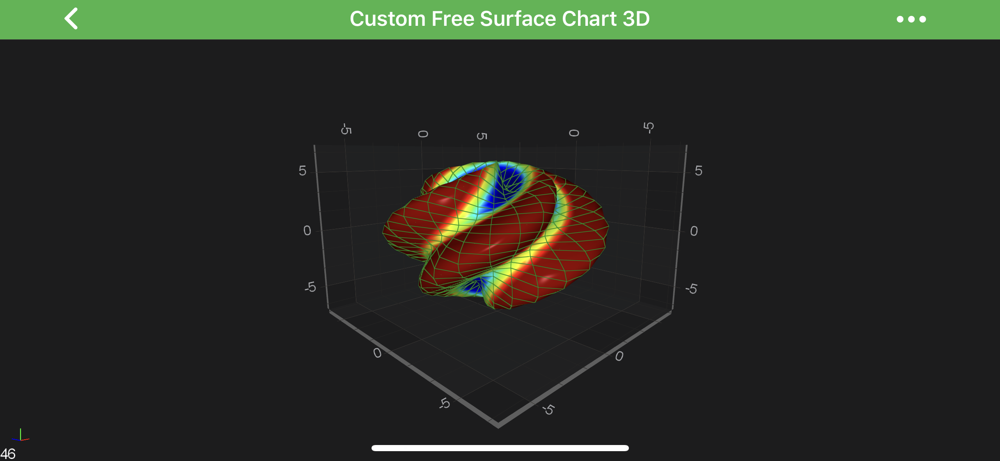
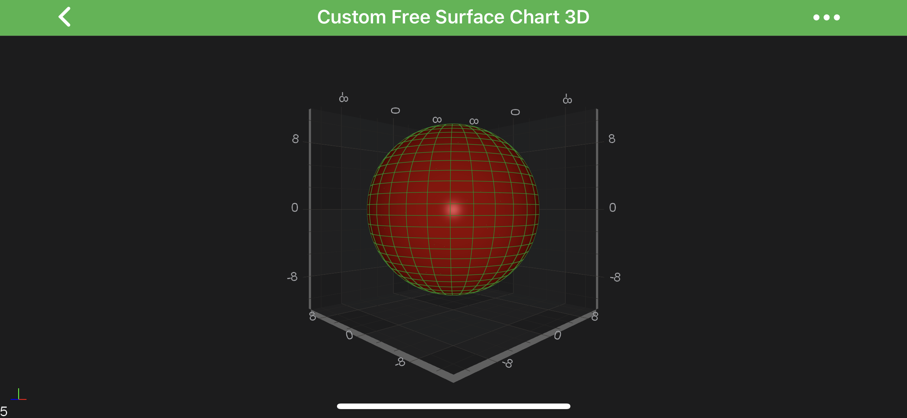
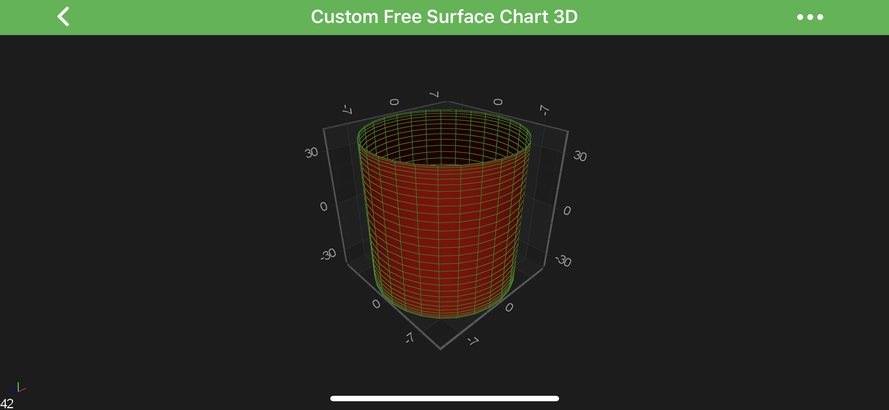

# The Custom Free Surface 3D Chart Type
In SciChart, **Custom Free Surface 3D Charts** are provided by the combination of the [Free Surface 3D Series](xref:chart3d.FreeSurfaceSeries3D) and <xref:com.scichart.charting3d.model.dataSeries.freeSurface.CustomSurfaceDataSeries3D> underlying DataSeries.

The ***location*** of the <xref:com.scichart.charting3d.model.dataSeries.freeSurface.CustomSurfaceDataSeries3D> is defined by following properties:
- [offsetX](xref:com.scichart.charting3d.model.dataSeries.freeSurface.IFreeSurfaceDataSeries3DValues.getOffsetX()) – a location of the Custom Free Surface by the `X-Axis`;
- [offsetY](xref:com.scichart.charting3d.model.dataSeries.freeSurface.IFreeSurfaceDataSeries3DValues.getOffsetX()) – a location of the Custom Free Surface by the `Y-Axis`;
- [offsetZ](xref:com.scichart.charting3d.model.dataSeries.freeSurface.IFreeSurfaceDataSeries3DValues.getOffsetX()) – a location of the Custom Free Surface by the `Z-Axis`;

The ***shape*** of its surface is defined by a set of ***user-defined functions***, injected in the **[Constructor](xref:com.scichart.charting3d.model.dataSeries.freeSurface.CustomSurfaceDataSeries3D.CustomSurfaceDataSeries3D(java.lang.Class<TX>,java.lang.Class<TY>,java.lang.Class<TZ>,int,int,com.scichart.charting3d.model.dataSeries.freeSurface.CustomSurfaceDataSeries3D.UVFunc,com.scichart.charting3d.model.dataSeries.freeSurface.CustomSurfaceDataSeries3D.UVFunc,com.scichart.charting3d.model.dataSeries.freeSurface.CustomSurfaceDataSeries3D.UVFunc,com.scichart.charting3d.model.dataSeries.freeSurface.CustomSurfaceDataSeries3D.ValueFunc<TX>,com.scichart.charting3d.model.dataSeries.freeSurface.CustomSurfaceDataSeries3D.ValueFunc<TY>,com.scichart.charting3d.model.dataSeries.freeSurface.CustomSurfaceDataSeries3D.ValueFunc<TZ>,double,double,double,double))** during the instantiation.
This approach allows the surface to obtain **any possible** shape.

Some of the <xref:com.scichart.charting3d.model.dataSeries.freeSurface.CustomSurfaceDataSeries3D> **[Constructor](xref:com.scichart.charting3d.model.dataSeries.freeSurface.CustomSurfaceDataSeries3D.CustomSurfaceDataSeries3D(java.lang.Class<TX>,java.lang.Class<TY>,java.lang.Class<TZ>,int,int,com.scichart.charting3d.model.dataSeries.freeSurface.CustomSurfaceDataSeries3D.UVFunc,com.scichart.charting3d.model.dataSeries.freeSurface.CustomSurfaceDataSeries3D.UVFunc,com.scichart.charting3d.model.dataSeries.freeSurface.CustomSurfaceDataSeries3D.UVFunc,com.scichart.charting3d.model.dataSeries.freeSurface.CustomSurfaceDataSeries3D.ValueFunc<TX>,com.scichart.charting3d.model.dataSeries.freeSurface.CustomSurfaceDataSeries3D.ValueFunc<TY>,com.scichart.charting3d.model.dataSeries.freeSurface.CustomSurfaceDataSeries3D.ValueFunc<TZ>,double,double,double,double))** are described below:

- ***Radial Distance Function*** – function that determines how **distance** from the **origin** to the **particular point** on the surface differs.
- ***Azimuthal Angle Function*** – function that determines the **azimuthal angle** between the **particular point** and the unit vector of the X-Axis, projected on the [XZ plane](xref:axis3DAPIs.Axis3DLabelsLabelsConfiguration#axis-cube-planes).
- ***Polar Angle Function*** – is a user-defined function that determines **inclination** (or polar angle) between the particular point and the unit vector of the `Y-Axis` - ***Zenith***.

> [!NOTE]
> The `U` and `V` coordinates in intervals `[uMin...uMax]` and `[vMin...vMax]` respectively are passed as the arguments to each of the three functions above.

- ***X Function*** - function that determines the **position** of the particular point on the surface by the `X-Axis`.
- ***Y Function*** - function that determines the **position** of the particular point on the surface by the `Y-Axis`.
- ***Z Function*** - function that determines the **position** of the particular point on the surface by the `Z-Axis`.

> [!NOTE]
> The `Radial Distance`, `Radial Distance` and `Azimuthal Angle` are passed as the arguments to each of the three functions above.
> More information about the ***radial distance***, ***azimuthal*** and ***polar angle*** can be found here: [Spherical coordinate system](https://en.wikipedia.org/wiki/Spherical_coordinate_system).

> [!NOTE]
> Examples for the **Custom Free Surface 3D** can be found in the [SciChart Android Examples Suite](https://www.scichart.com/examples/Android-chart/) as well as on [GitHub](https://github.com/ABTSoftware/SciChart.Android.Examples):
> - [Native Example](https://www.scichart.com/example/android-3d-chart-example-create-custom-free-surface/)
> - [Xamarin Example](https://www.scichart.com/example/xamarin-3d-chart-example-create-custom-free-surface/)

Let's see some examples of declaring some **3D Free Surfaces**:
- [Custom Free Surface 3D](#create-a-custom-free-surface-3d-chart)
- [Simple Sphere](#create-a-simple-sphere)
- [Simple Cylinder](#create-a-simple-cylinder)

## Create a Custom Free Surface 3D Chart
To create a **Custom Free Surface 3D Chart** like the above - use the following code:

# [Java](#tab/java)
[!code-java[CreateCustomFreeSurface](../../../../samples/sandbox/app/src/main/java/com/scichart/docsandbox/examples/java/series3d/FreeSurfaceSeries3DCustomSurface.java#CreateCustomFreeSurface)]
# [Java with Builders API](#tab/javaBuilder)
[!code-java[CreateCustomFreeSurface](../../../../samples/sandbox/app/src/main/java/com/scichart/docsandbox/examples/javaBuilder/series3d/FreeSurfaceSeries3DCustomSurface.java#CreateCustomFreeSurface)]
# [Kotlin](#tab/kotlin)
[!code-swift[CreateCustomFreeSurface](../../../../samples/sandbox/app/src/main/java/com/scichart/docsandbox/examples/kotlin/series3d/FreeSurfaceSeries3DCustomSurface.kt#CreateCustomFreeSurface)]
***

> [!NOTE]
> See other [constrained](xref:chart3d.FreeSurfaceSeries3D#constrained-free-surface-3d-types) and [unconstrained](xref:chart3d.FreeSurfaceSeries3D#unconstrained-free-surface-3d-type) **Free Surface Series** types in the corresponding articles.

## Create a Simple Sphere
Let's create a simple Sphere with a `Radius = 10`. 
See the **user-defined** functions which is used in the <xref:com.scichart.charting3d.model.dataSeries.freeSurface.CustomSurfaceDataSeries3D> in the code below:

# [Java](#tab/java)
[!code-java[CreateSimpleSphere](../../../../samples/sandbox/app/src/main/java/com/scichart/docsandbox/examples/java/series3d/FreeSurfaceSeries3DCustomSurface.java#CreateSimpleSphere)]
# [Java with Builders API](#tab/javaBuilder)
[!code-java[CreateSimpleSphere](../../../../samples/sandbox/app/src/main/java/com/scichart/docsandbox/examples/javaBuilder/series3d/FreeSurfaceSeries3DCustomSurface.java#CreateSimpleSphere)]
# [Kotlin](#tab/kotlin)
[!code-swift[CreateSimpleSphere](../../../../samples/sandbox/app/src/main/java/com/scichart/docsandbox/examples/kotlin/series3d/FreeSurfaceSeries3DCustomSurface.kt#CreateSimpleSphere)]
***

## Create a Simple Cylinder
Let's create a simple Cylinder with a `Radius = 10` and `Height = 40`. See the code below:

# [Java](#tab/java)
[!code-java[CreateSimpleCylinder](../../../../samples/sandbox/app/src/main/java/com/scichart/docsandbox/examples/java/series3d/FreeSurfaceSeries3DCustomSurface.java#CreateSimpleCylinder)]
# [Java with Builders API](#tab/javaBuilder)
[!code-java[CreateSimpleCylinder](../../../../samples/sandbox/app/src/main/java/com/scichart/docsandbox/examples/javaBuilder/series3d/FreeSurfaceSeries3DCustomSurface.java#CreateSimpleCylinder)]
# [Kotlin](#tab/kotlin)
[!code-swift[CreateSimpleCylinder](../../../../samples/sandbox/app/src/main/java/com/scichart/docsandbox/examples/kotlin/series3d/FreeSurfaceSeries3DCustomSurface.kt#CreateSimpleCylinder)]
***

