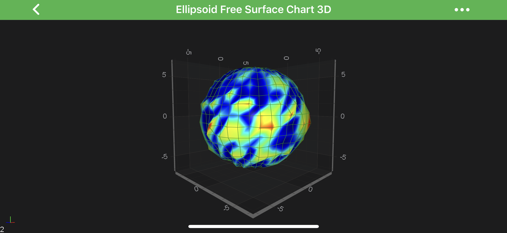

# The Ellipsoid 3D Chart Type
In SciChart, **Ellipsoid 3D Charts** are provided by the combination of the [Free Surface 3D Series](xref:chart3d.FreeSurfaceSeries3D) and <xref:com.scichart.charting3d.model.dataSeries.freeSurface.EllipsoidDataSeries3D> underlying DataSeries.

The ***location*** of the <xref:com.scichart.charting3d.model.dataSeries.freeSurface.EllipsoidDataSeries3D> is defined by following properties:
- [offsetX](xref:com.scichart.charting3d.model.dataSeries.freeSurface.FreeSurfaceDataSeries3D.setOffsetX(TX)) – a location of the Ellipsoid by the `X-Axis`;
- [offsetY](xref:com.scichart.charting3d.model.dataSeries.freeSurface.FreeSurfaceDataSeries3D.setOffsetY(TY)) – a location of the Ellipsoid by the `Y-Axis`;
- [offsetZ](xref:com.scichart.charting3d.model.dataSeries.freeSurface.FreeSurfaceDataSeries3D.setOffsetZ(TZ)) – a location of the Ellipsoid by the `Z-Axis`;

The ***size*** of the <xref:com.scichart.charting3d.model.dataSeries.freeSurface.EllipsoidDataSeries3D> is defined by following properties:
- [a](xref:com.scichart.charting3d.model.dataSeries.freeSurface.EllipsoidDataSeries3D.getA()) – a radius of the Ellipsoid along the `X-Axis`;
- [b](xref:com.scichart.charting3d.model.dataSeries.freeSurface.EllipsoidDataSeries3D.getB()) – a radius of the Ellipsoid along the `Y-Axis`;
- [c](xref:com.scichart.charting3d.model.dataSeries.freeSurface.EllipsoidDataSeries3D.getC()) – a radius of the Ellipsoid along the `Z-Axis`;

> [!NOTE]
> Examples for the **Ellipsoid Series 3D** can be found in the [SciChart Android Examples Suite](https://www.scichart.com/examples/android-chart/) as well as on [GitHub](https://github.com/ABTSoftware/SciChart.Android.Examples):
> - [Native Example](https://www.scichart.com/example/android-3d-chart-example-simple-ellipsoid/)
> - [Xamarin Example](https://www.scichart.com/example/xamarin-3d-chart-example-simple-ellipsoid/)

## Create a Ellipsoid 3D Chart
To create a **Ellipsoid 3D Chart**, use the following code:

# [Java](#tab/java)
[!code-java[CreateEllipsoid3DChart](../../../../samples/sandbox/app/src/main/java/com/scichart/docsandbox/examples/java/series3d/FreeSurfaceSeries3DEllipsoid.java#CreateEllipsoid3DChart)]
# [Java with Builders API](#tab/javaBuilder)
[!code-java[CreateEllipsoid3DChart](../../../../samples/sandbox/app/src/main/java/com/scichart/docsandbox/examples/javaBuilder/series3d/FreeSurfaceSeries3DEllipsoid.java#CreateEllipsoid3DChart)]
# [Kotlin](#tab/kotlin)
[!code-swift[CreateEllipsoid3DChart](../../../../samples/sandbox/app/src/main/java/com/scichart/docsandbox/examples/kotlin/series3d/FreeSurfaceSeries3DEllipsoid.kt#CreateEllipsoid3DChart)]
***

> [!NOTE]
> See other [constrained](xref:chart3d.FreeSurfaceSeries3D#constrained-free-surface-3d-types) and [unconstrained](xref:chart3d.FreeSurfaceSeries3D#unconstrained-free-surface-3d-type) **Free Surface Series** types in the corresponding articles.
