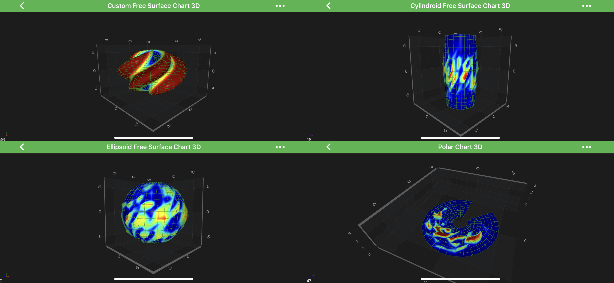
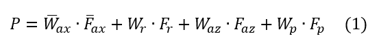
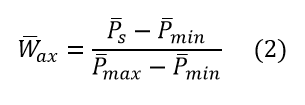
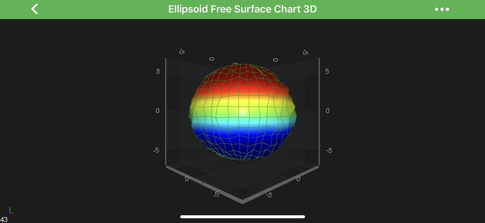
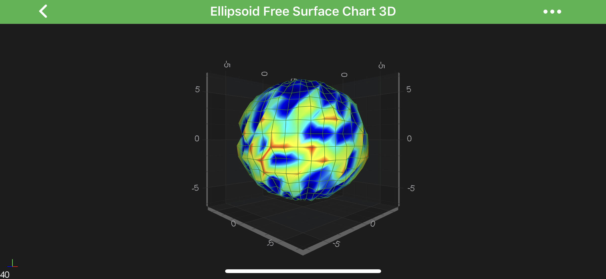
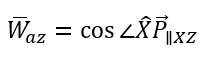
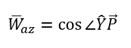
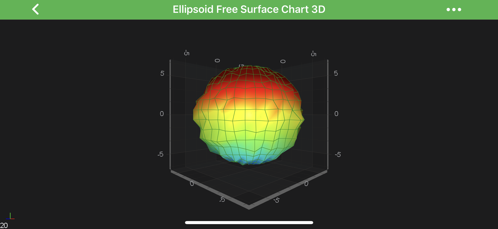

# The Free Surface 3D Chart Type
The Free Surface 3D Chart types are a set of 3D Charts that represent the data by plotting the surface in a **custom shape in 3D space**.

It's represented by the <xref:com.scichart.charting3d.visuals.renderableSeries.freeSurface.FreeSurfaceRenderableSeries3D> in SciChart, and can be configured with different <xref:com.scichart.charting3d.model.dataSeries.freeSurface.FreeSurfaceDataSeries3D>.

The **Free Surface 3D** Chart Types can be divided into a two groups:
- [constrained](#constrained-free-surface-3d-types) to its ***basic 3D primitive***
- [unconstrained](#unconstrained-free-surface-3d-type) - ***free surface***.

You can find more information about individual Free Surface types in the corresponding sections of this article.

## Constrained Free Surface 3D Types
Each of constrained chart type represents its basic primitive. 
There is a 3 constrained free-surface types available out of the box in SciChart: a **sphere**, a **cylinder**, or a **disk**.

The ***Surface*** of such charts can be modified by the `2D offset array`. 
Each particular type of the constrained 3D chart specifies how the surface can be offset:
- [The Ellipsoid Chart](xref:chart3d.FreeSurfaceSeries3D-Ellipsoid) - **offsets** its points on the surface in each of `XYZ axes` **proportionality**, based on the location of its origin.
- [The Cylindroid Chart](xref:chart3d.FreeSurfaceSeries3D-Cylindroid) - **offsets** the surface in `XZ axes`, **based** on its **Y-axis** aligned origin line.
- [The Polar 3D Chart](xref:chart3d.FreeSurfaceSeries3D-Polar) - offsets its surface in `Y-axis`, **based** on **XZ axes** origin plane.

## Unconstrained Free Surface 3D Type
In contrast to the [constrained](#constrained-free-surface-3d-types) chart types, [The Custom Free Surface 3D Chart](xref:chart3d.FreeSurfaceSeries3D-CustomSurface) isn’t based on any geometric primitive.
The shape of its surface is defined by a set of **user-defined functions**, injected in the constructor during the instantiation.
This approach allows the surface to obtain ***any possible shape***.

## Configuring Free Surface 3D Series
Most of the configuration options follow the same approach as it is in [The SurfaceMesh 3D Chart Type](xref:chart3d.SurfaceMeshSeries3D) so all of the following are also applicable to ***Free Surface Meshes***:
- [Applying Palettes to the Surface Meshes](xref:chart3d.SurfaceMeshSeries3D#applying-palettes-to-the-3d-surface-meshes)
- [Configuring Wireframe and Contours](xref:chart3d.SurfaceMeshSeries3D#surface-mesh-3d-wireframe-and-contours)
- [Overriding Specific Cell Colors](xref:chart3d.SurfaceMeshSeries3D#overriding-surface-mesh-3d-specific-cell-colors)

Despite the similarity of configuration to other 3D charts, Free Surface 3D Charts have some unique options.
One of them is the **Palette Mode**, determining which color is picked from the Palette based on its four components:
- [The Axial Palette Component](#the-axial-palette-component)
- [The Radial Palette Component](#the-radial-palette-component)
- [The Azimuthal Palette Component](#the-azimuthal-palette-component)
- [The Polar Palette Component](#the-polar-palette-component)

Each of components can be used separately or blended together, based on values of corresponding **Factor** properties.
Below is the formula that determines the color of the Palette:

- P - is the coordinate that determines ***color*** being picked from the Palette by its value in the ange `[0..1]`;
- Wax - the **axial** weight `3D vector`;
- Fax - the ***axial factor*** specified by the [paletteAxialFactor](xref:com.scichart.charting3d.visuals.renderableSeries.freeSurface.FreeSurfaceRenderableSeries3D.setPaletteAxialFactor(com.scichart.charting3d.common.math.Vector3)) **3D vector**.
- Wr - the **radial** weight;
- Fr - the ***radial factor*** specified by the [paletteRadialFactor](xref:com.scichart.charting3d.visuals.renderableSeries.freeSurface.FreeSurfaceRenderableSeries3D.setPaletteRadialFactor(float)) property.
- Waz - the **azimuthal** weight;
- Faz - the ***azimuthal factor*** specified by the [paletteAzimuthalFactor](xref:com.scichart.charting3d.visuals.renderableSeries.freeSurface.FreeSurfaceRenderableSeries3D.setPaletteAzimuthalFactor(float)) property.
- Wp - the **polar** weight;
- Fp - the ***polar factor*** specified by the [palettePolarFactor](xref:com.scichart.charting3d.visuals.renderableSeries.freeSurface.FreeSurfaceRenderableSeries3D.setPalettePolarFactor(float)) property.

All of the components are `0` by default, except **Radial** which is equal to `1`.

To learn more about each of the component - read on the following section of this article.

#### The Axial Palette Component
In this mode, **palette color** is determined by the position of a particular point on the surface that ***linearly interpolates*** between the user-specified ***minimum*** and ***maximum*** values. The ***axial*** component is controlled by the [paletteAxialFactor](xref:com.scichart.charting3d.visuals.renderableSeries.freeSurface.FreeSurfaceRenderableSeries3D.setPaletteAxialFactor(com.scichart.charting3d.common.math.Vector3)) vector.

The weight of the **Axial Palette Component** is calculated by following formula:

- Ps - is the **position** of a particular point on the surface;
- Pmin - is specified by the [paletteMinimum](xref:com.scichart.charting3d.visuals.renderableSeries.freeSurface.FreeSurfaceRenderableSeries3D.setPaletteMinimum(com.scichart.charting3d.common.math.Vector3)) property;
- Pmax - is specified by the [paletteMaximum](xref:com.scichart.charting3d.visuals.renderableSeries.freeSurface.FreeSurfaceRenderableSeries3D.setPaletteMaximum(com.scichart.charting3d.common.math.Vector3)) property;

See how it works in the code below:

# [Java](#tab/java)
[!code-java[CreateAxialPaletteComponent](../../../../samples/sandbox/app/src/main/java/com/scichart/docsandbox/examples/java/series3d/FreeSurfaceSeries3D.java#CreateAxialPaletteComponent)]
# [Java with Builders API](#tab/javaBuilder)
[!code-java[CreateAxialPaletteComponent](../../../../samples/sandbox/app/src/main/java/com/scichart/docsandbox/examples/javaBuilder/series3d/FreeSurfaceSeries3D.java#CreateAxialPaletteComponent)]
# [Kotlin](#tab/kotlin)
[!code-swift[CreateAxialPaletteComponent](../../../../samples/sandbox/app/src/main/java/com/scichart/docsandbox/examples/kotlin/series3d/FreeSurfaceSeries3D.kt#CreateAxialPaletteComponent)]
***

#### The Radial Palette Component
The ***Radial*** component is controlled by the [paletteRadialFactor](xref:com.scichart.charting3d.visuals.renderableSeries.freeSurface.FreeSurfaceRenderableSeries3D.setPaletteRadialFactor(float)) property.
It is quite simple, similar to the 2d heatmaps, see the example below:

# [Java](#tab/java)
[!code-java[CreateRadialPaletteComponent](../../../../samples/sandbox/app/src/main/java/com/scichart/docsandbox/examples/java/series3d/FreeSurfaceSeries3D.java#CreateRadialPaletteComponent)]
# [Java with Builders API](#tab/javaBuilder)
[!code-java[CreateRadialPaletteComponent](../../../../samples/sandbox/app/src/main/java/com/scichart/docsandbox/examples/javaBuilder/series3d/FreeSurfaceSeries3D.java#CreateRadialPaletteComponent)]
# [Kotlin](#tab/kotlin)
[!code-swift[CreateRadialPaletteComponent](../../../../samples/sandbox/app/src/main/java/com/scichart/docsandbox/examples/kotlin/series3d/FreeSurfaceSeries3D.kt#CreateRadialPaletteComponent)]
***

#### The Azimuthal Palette Component
In this mode palette color is determined by **cos angle** between the unit vector of the `X-Axis` and vector from the origin point to the particular point on the surface, projected onto the [XZ plane](xref:axis3DAPIs.Axis3DLabelsLabelsConfiguration#axis-cube-planes). The ***azimuthal*** component is controlled by the [paletteAzimuthalFactor](xref:com.scichart.charting3d.visuals.renderableSeries.freeSurface.FreeSurfaceRenderableSeries3D.setPaletteAzimuthalFactor(float)) property.

The weight of the **Azimuthal Palette Component** is calculated by the following formula:

- X - is the **unit vector** of the `X-Axis`;
- Pxz - is a **particular point** on the surface, ***projected*** onto the [XZ plane](xref:axis3DAPIs.Axis3DLabelsLabelsConfiguration#axis-cube-planes);

See how it works in the code below:

# [Java](#tab/java)
[!code-java[CreateAzimuthalPaletteComponent](../../../../samples/sandbox/app/src/main/java/com/scichart/docsandbox/examples/java/series3d/FreeSurfaceSeries3D.java#CreateAzimuthalPaletteComponent)]
# [Java with Builders API](#tab/javaBuilder)
[!code-java[CreateAzimuthalPaletteComponent](../../../../samples/sandbox/app/src/main/java/com/scichart/docsandbox/examples/javaBuilder/series3d/FreeSurfaceSeries3D.java#CreateAzimuthalPaletteComponent)]
# [Kotlin](#tab/kotlin)
[!code-swift[CreateAzimuthalPaletteComponent](../../../../samples/sandbox/app/src/main/java/com/scichart/docsandbox/examples/kotlin/series3d/FreeSurfaceSeries3D.kt#CreateAzimuthalPaletteComponent)]
***

) property.

The weight of the ***Polar Palette Component*** is calculated by following formula:

- Y - is the **unit vector** of the `Y-Axis`;
- P - is a **particular point** on the surface.

See how it works in the code below:

# [Java](#tab/java)
[!code-java[CreatePolarPaletteComponent](../../../../samples/sandbox/app/src/main/java/com/scichart/docsandbox/examples/java/series3d/FreeSurfaceSeries3D.java#CreatePolarPaletteComponent)]
# [Java with Builders API](#tab/javaBuilder)
[!code-java[CreatePolarPaletteComponent](../../../../samples/sandbox/app/src/main/java/com/scichart/docsandbox/examples/javaBuilder/series3d/FreeSurfaceSeries3D.java#CreatePolarPaletteComponent)]
# [Kotlin](#tab/kotlin)
[!code-swift[CreatePolarPaletteComponent](../../../../samples/sandbox/app/src/main/java/com/scichart/docsandbox/examples/kotlin/series3d/FreeSurfaceSeries3D.kt#CreatePolarPaletteComponent)]
***

