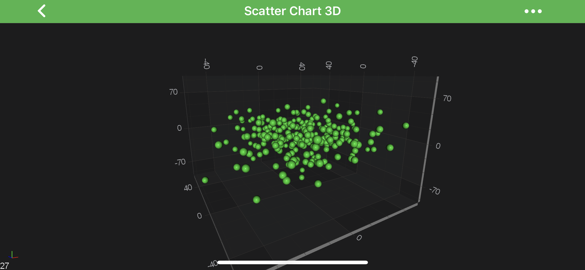
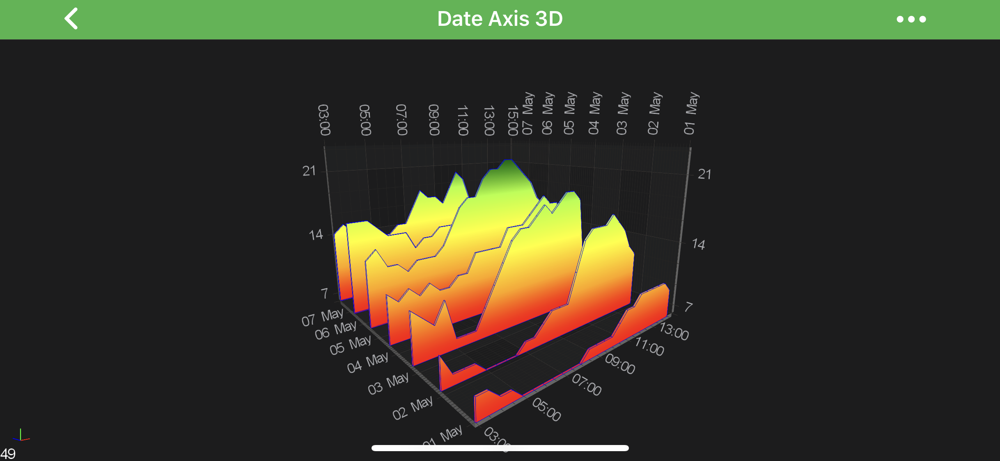

# Axis 3D APIs - Convert World to Data coordinates

SciChart Android 3D provides a clean and simple API to transform 3D **world coordinates** to **data-values** and vice versa via the <xref:com.scichart.charting.visuals.axes.IAxisCore.getCurrentCoordinateCalculator()> API. The <xref:com.scichart.charting.numerics.coordinateCalculators.ICoordinateCalculator> has the following methods suitable for conversions:
- [getCoordinate](xref:com.scichart.charting.numerics.coordinateCalculators.ICoordinateCalculator.getCoordinate(double)) - expects a **double** representation of `data-value` and returns the corresponding **pixel coordinate**.
- [getDataValue](xref:com.scichart.charting.numerics.coordinateCalculators.ICoordinateCalculator.getDataValue(float)) - expects a `coordinate in pixels` and returns the closest **data value** to that coordinate (represented in **double**).

> [!NOTE]
> For more information about <xref:com.scichart.charting.numerics.coordinateCalculators.ICoordinateCalculator> - please read the [Axis APIs - Convert Pixel to Data coordinates](xref:axisAPIs.AxisAPIsConvertPixelToDataCoordinates##icoordinatecalculator-api) article.

All **Axes** are responsible for converting between **data-values** and **world-coordinates**: 
- `X-Axis` converts X data-values to X-World coordinates.
- `Y-Axis` converts Y data-values to Y-world coordinates.
- `Z-Axis` converts Z-data values to Z-world coordinates.

> [!NOTE]
> For more information about the [World Coordinates](xref:axis3DAPIs.SciChart3DBasicsCoordinatesIn3DSpace#world-coordinates) and [Data Coordinates](xref:axis3DAPIs.SciChart3DBasicsCoordinatesIn3DSpace#data-coordinates) - please see the corresponding sections in the **[Coordinates in 3D Space](xref:axis3DAPIs.SciChart3DBasicsCoordinatesIn3DSpace)** article.

## Getting a CoordinateCalculator instance
There is a <xref:com.scichart.charting.visuals.axes.IAxisCore.getCurrentCoordinateCalculator()> property, which is `readonly`, and which provides a coordinate calculator instance which is **only** valid for the **current render pass**.

> [!NOTE]
> If the [visibleRange](xref:com.scichart.charting.visuals.axes.IAxisCore.setVisibleRange(com.scichart.data.model.IRange)) changes, the [worldDimensions](xref:com.scichart.charting3d.visuals.ISciChartSurface3D.getWorldDimensions()) changes or the data changes - then the <xref:com.scichart.charting.numerics.coordinateCalculators.ICoordinateCalculator> will be recreated under the hood, so it might give incorrect results. Hence, it's advisable not to cache **CoordinateCalculator** instance, or cache it only for a short period of time, e.g. when using inside a loop.

## Converting between World to Data Coordinates
As mentioned [above](#axis-3d-apis---convert-world-to-data-coordinates) - **data-values** are converted to **world coordinates** via the [getCoordinate](xref:com.scichart.charting.numerics.coordinateCalculators.ICoordinateCalculator.getCoordinate(double)) method. Also, Coordinates in pixels are converted back to chart data-values via the [getDataValue](xref:com.scichart.charting.numerics.coordinateCalculators.ICoordinateCalculator.getDataValue(float)) method. 

Also, you might guess, converting World to Data-Coordinates and vice versa slightly differs for different axis types due to difference in underlying **data-types**. In particular the following ones:
- [NumericAxis3D](#numericaxis3d-conversions)
- [DateAxis3D](#dateaxis3d-conversions)

Read on to get better understanding of such conversions.

### NumericAxis3D conversions
The simplest case is the <xref:com.scichart.charting3d.visuals.axes.NumericAxis3D>. <xref:com.scichart.charting.numerics.coordinateCalculators.ICoordinateCalculator> for NumericAxis 3D works the **data-value** as **double**. So let's take our [Android 3D Simple Scatter Chart](https://www.scichart.com/example/android-chart/android-3d-chart-example-simple-scatter/) example, and try do some conversions

# [Java](#tab/java)
[!code-java[NumericAxis3DConversions](../../../samples/sandbox/app/src/main/java/com/scichart/docsandbox/examples/java/axis3DAPIs/Axis3DAPIsConvertWorldToDataCoordinates.java#NumericAxis3DConversions)]
# [Java with Builders API](#tab/javaBuilder)
[!code-java[NumericAxis3DConversions](../../../samples/sandbox/app/src/main/java/com/scichart/docsandbox/examples/javaBuilder/axis3DAPIs/Axis3DAPIsConvertWorldToDataCoordinates.java#NumericAxis3DConversions)]
# [Kotlin](#tab/kotlin)
[!code-swift[NumericAxis3DConversions](../../../samples/sandbox/app/src/main/java/com/scichart/docsandbox/examples/kotlin/axis3DAPIs/Axis3DAPIsConvertWorldToDataCoordinates.kt#NumericAxis3DConversions)]
***

Y-Axis: VisibleRange = [-100, 100], Data-Value = 50, Pixel(World)-Coordinate = 149.25

> [!NOTE]
> The exact **data-values** and **coordinates** might differ depending on your **visibleRange, viewport** etc...

### DateAxis3D conversions
Similarly to <xref:com.scichart.charting3d.visuals.axes.NumericAxis3D> - the <xref:com.scichart.charting3d.visuals.axes.DateAxis3D> is quite simple with one difference - it's <xref:com.scichart.charting.numerics.coordinateCalculators.ICoordinateCalculator> works with **long representation** of **Date**, which is **[getTime()](https://developer.android.com/reference/java/util/Date#getTime())**. So let's take our [Android 3D Date Axis3D](https://www.scichart.com/example/android-chart/android-3d-chart-example-date-axis/) as an example, and try do some conversions. 

> [!NOTE]
> Since the <xref:com.scichart.charting.numerics.coordinateCalculators.ICoordinateCalculator> works with long representation of Date in [getTime()](https://developer.android.com/reference/java/util/Date#getTime()), you will need to do all the needed conversions on your own. See the code below:

# [Java](#tab/java)
[!code-java[DateAxis3DConversions](../../../samples/sandbox/app/src/main/java/com/scichart/docsandbox/examples/java/axis3DAPIs/Axis3DAPIsConvertWorldToDataCoordinates.java#DateAxis3DConversions)]
# [Java with Builders API](#tab/javaBuilder)
[!code-java[DateAxis3DConversions](../../../samples/sandbox/app/src/main/java/com/scichart/docsandbox/examples/javaBuilder/axis3DAPIs/Axis3DAPIsConvertWorldToDataCoordinates.java#DateAxis3DConversions)]
# [Kotlin](#tab/kotlin)
[!code-swift[DateAxis3DConversions](../../../samples/sandbox/app/src/main/java/com/scichart/docsandbox/examples/kotlin/axis3DAPIs/Axis3DAPIsConvertWorldToDataCoordinates.kt#DateAxis3DConversions)]
***

Z-Axis: VisibleRange = [2019-05-01, 2019-05-08], Data-Value = "2019-05-05", Pixel(World)-Coordinate = 170.857132

> [!NOTE]
> The exact **data-values** and **coordinates** might differ depending on your **visibleRange, viewport** etc...
