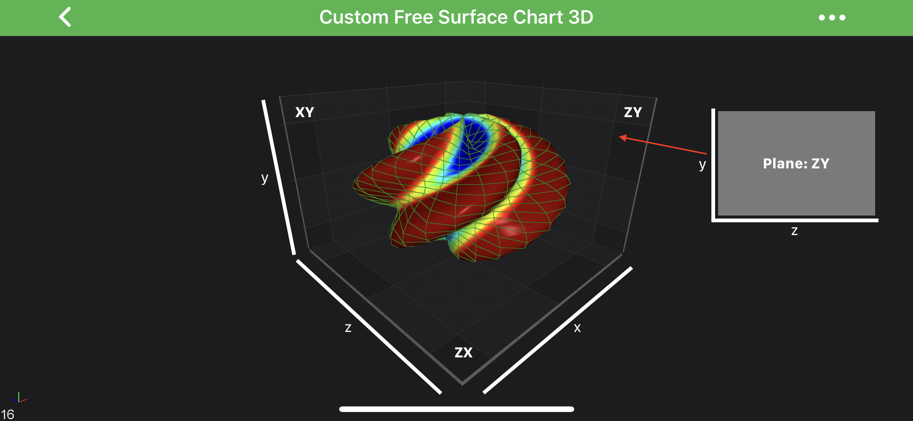
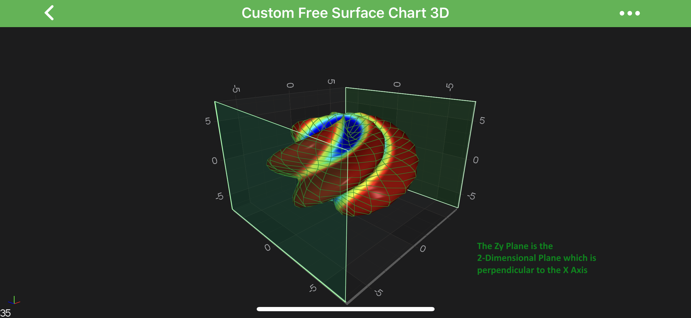
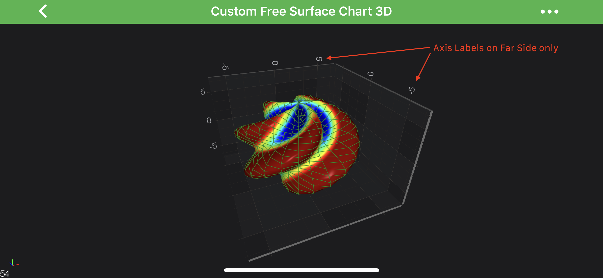

# Axis 3D Labels - Labels Configuration
In SciChart 3D you can configure showing the **Axis Labels** differently on the **Axis Cube** Planes. 
Possible options are defined by the <xref:com.scichart.charting3d.visuals.axes.AxisPlaneDrawLabelsMode> enumeration.

But first, let's explain **Axis Cube** planes properly.

#### Axis Cube Planes

As you might guess, there are three possible planes in axis cube, and those are defined as follows:

| **AxisCube Plane** | **Description**                                     |
| ------------------ | --------------------------------------------------- |
| **XY** Plane       | perpendicular to the **Z-Axis** (Left by default).  |
| **ZY** Plane       | perpendicular to the **X-Axis** (Right by default). |
| **ZX** Plane       | perpendicular to the **Y-Axis** (up).               |

Let's see the ZY Plane on the image below:

#### Axis Cube Labels Configuration
As mentioned [above](#axis-3d-labels---labels-configuration), drawing labels are controlled by the <xref:com.scichart.charting3d.visuals.axes.AxisPlaneDrawLabelsMode> enumeration, which has the following options:

| <xref:com.scichart.charting3d.visuals.axes.AxisPlaneDrawLabelsMode>    | **Description**                                                                                                                    |
| ------------------------------- | ---------------------------------------------------------------------------------------------------------------------------------- |
| Both                            | axis labels are drawn on both sides of the axis cube. This is the **default** mode.                                                |
| Hidden                          | hides the axis labels for this plane, for example, when applied to the XyAxisPlane, the labels drawn by this plane will be hidden. |
| LocalX                          | draws the labels on one side - the ***local X*** - of the plane.                                                                   |
| LocalY                          | draws the labels on the other side - the ***local Y*** - of the plane.                                                             |

The above modes can be applied to one of the AxisCube's planes which are accessible through the following properties on the <xref:com.scichart.charting3d.visuals.SciChartSurface3D>:
- [xyAxisPlaneDrawLabelsMode](xref:com.scichart.charting3d.visuals.SciChartSurface3D.setXyAxisPlaneDrawLabelsMode(com.scichart.charting3d.visuals.axes.AxisPlaneDrawLabelsMode))
- [zyAxisPlaneDrawLabelsMode](xref:com.scichart.charting3d.visuals.SciChartSurface3D.setZyAxisPlaneDrawLabelsMode(com.scichart.charting3d.visuals.axes.AxisPlaneDrawLabelsMode))
- [zxAxisPlaneDrawLabelsMode](xref:com.scichart.charting3d.visuals.SciChartSurface3D.setZxAxisPlaneDrawLabelsMode(com.scichart.charting3d.visuals.axes.AxisPlaneDrawLabelsMode))

See how it works in the code snippet below:

# [Java](#tab/java)
[!code-java[AxisCubeLabelsConfiguration](../../../samples/sandbox/app/src/main/java/com/scichart/docsandbox/examples/java/axis3DAPIs/Axis3DLabelsLabelsConfiguration.java#AxisCubeLabelsConfiguration)]
# [Java with Builders API](#tab/javaBuilder)
[!code-java[AxisCubeLabelsConfiguration](../../../samples/sandbox/app/src/main/java/com/scichart/docsandbox/examples/javaBuilder/axis3DAPIs/Axis3DLabelsLabelsConfiguration.java#AxisCubeLabelsConfiguration)]
# [Kotlin](#tab/kotlin)
[!code-swift[AxisCubeLabelsConfiguration](../../../samples/sandbox/app/src/main/java/com/scichart/docsandbox/examples/kotlin/axis3DAPIs/Axis3DLabelsLabelsConfiguration.kt#AxisCubeLabelsConfiguration)]
***

Which results with the following:

