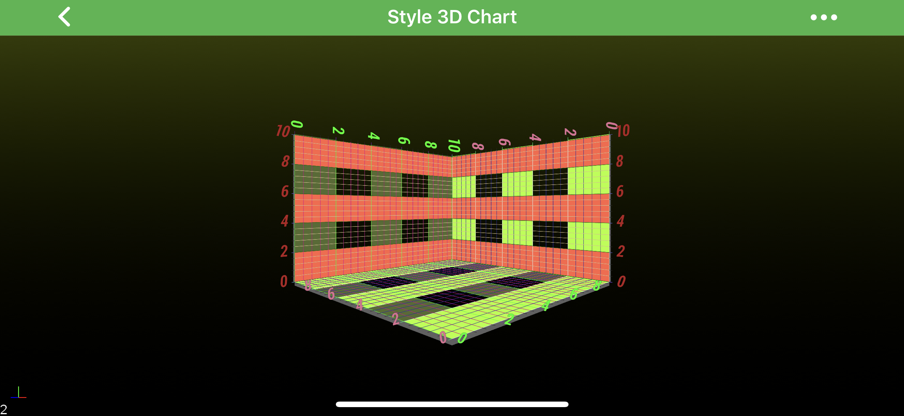

# Axis 3D Styling - Labels and GridLines
Many aspects of the axis 3D can be styled. Same way, like in SciChart 2D the Axis 3D is responsible for drawing the following parts, most of which is same as in 2D and shared through <xref:com.scichart.charting.visuals.axes.IAxisCore>:

| **Axis Parts**    | **Description**                                          | **Related 2D Article**                                                                  |
| ----------------- | -------------------------------------------------------- | --------------------------------------------------------------------------------------- |
| Labels and Titles | all 3D labels are styled via the [textColor](xref:com.scichart.charting3d.visuals.axes.IAxis3D.setTextColor(int)), [textSize](xref:com.scichart.charting3d.visuals.axes.IAxis3D.setTextSize(float)) and [textFont](xref:com.scichart.charting3d.visuals.axes.IAxis3D.setTextFont(java.lang.String)) properties | ----------------------------- |
| Tick Lines        | small marks on the outside of an axis **next to labels** | [2D Tick Lines Styling](xref:axisAPIs.AxisStylingGridLinesTicksAndAxisBands#axis-ticks) |
| Grid Lines        | **major** and **minor** grid lines                       | [2D Grid Lines Styling](xref:axisAPIs.AxisStylingGridLinesTicksAndAxisBands#grid-lines) |
| Axis Bands        | shading between the **major** grid-lines                 | [2D Axis Bands Styling](xref:axisAPIs.AxisStylingGridLinesTicksAndAxisBands#axis-bands) |

> [!NOTE]
>  In SciChart, almost all styling methods expect an instance of either <xref:com.scichart.drawing.common.PenStyle> or <xref:com.scichart.drawing.common.BrushStyle> to be passed in. Those that deals with text styling, expect an instance of a <xref:com.scichart.drawing.common.FontStyle>. To learn more about how to utilize them, please refer to the [PenStyle, BrushStyle and FontStyle](xref:stylingAndTheming.PenStyleBrushStyleAndFontStyle) article.

> [!NOTE]
>  The **Style 3D Chart** example can be found in the [SciChart Android Examples Suite](https://www.scichart.com/examples/Android-chart/) as well as on [GitHub](https://github.com/ABTSoftware/SciChart.Android.Examples):
> - [Native Example](https://www.scichart.com/example/android-3d-chart-example-style/)
> - [Xamarin Example](https://www.scichart.com/example/xamarin-3d-chart-example-style-chart/)

Please take a look at the code snippet from the [Android Style 3D Chart](https://www.scichart.com/example/android-3d-chart-example-style/) example which showcase some <xref:com.scichart.charting3d.visuals.axes.IAxis3D> styling:

# [Java](#tab/java)
[!code-java[StyleNumericAxis3D](../../../samples/sandbox/app/src/main/java/com/scichart/docsandbox/examples/java/axis3DAPIs/Axis3DStylingLabelsAndGridLines.java#StyleNumericAxis3D)]
# [Java with Builders API](#tab/javaBuilder)
[!code-java[StyleNumericAxis3D](../../../samples/sandbox/app/src/main/java/com/scichart/docsandbox/examples/javaBuilder/axis3DAPIs/Axis3DStylingLabelsAndGridLines.java#StyleNumericAxis3D)]
# [Kotlin](#tab/kotlin)
[!code-swift[StyleNumericAxis3D](../../../samples/sandbox/app/src/main/java/com/scichart/docsandbox/examples/kotlin/axis3DAPIs/Axis3DStylingLabelsAndGridLines.kt#StyleNumericAxis3D)]
***

> [!NOTE]
>  For more information on Styling, please refer to the [Styling and Theming](xref:stylingAndTheming.StylingAndTheming) article.
