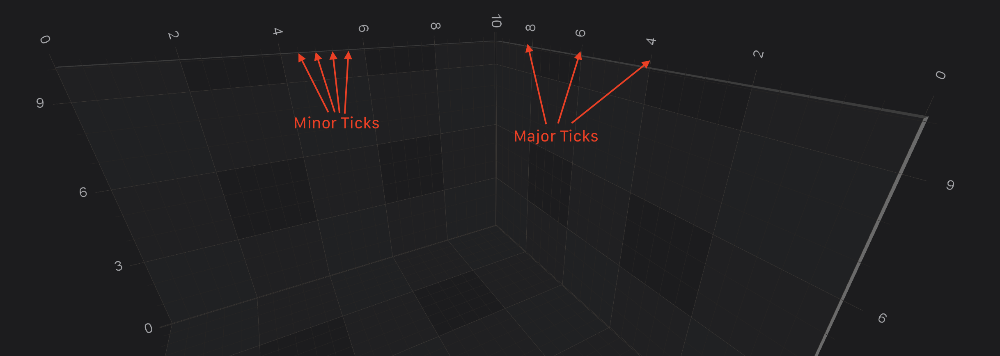

# Axis 3D Ticks - TickProvider, DeltaCalculator and TickCoordinatesProvider APIs
**[Axes in SciChart 3D](xref:axis3DAPIs.Axis3DAPIs)** shares the same <xref:com.scichart.charting.visuals.axes.AxisCore> base class with **[SciChart 2D Axes](xref:axis.AxisAPIs)**.
Many of the **AxisCore** features are shared. 
For your convenience, some of the documentation has been duplicated here, with some references to other sections of the user manual.

## Axis 3D Ticks, Labels and Grid Lines
In SciChart, the **Ticks** are small marks around the chart on an axis. There are **Minor** and **Major** Ticks, where Minor Ticks are placed in between Major ones. By default, Major Ticks are longer and thicker than Minor Ticks.

**Axis Labels** appears for every Major Tick, if there is enough space around.

**Grid Lines** correspond to **Ticks** on an axis. Likewise, there are Minor and Major Grid lines. In SciChart, **axes are responsible** not only for drawing **[Ticks](xref:axisAPIs.AxisStylingGridLinesTicksAndAxisBands#axis-ticks)** and **[Labels](xref:axisAPIs.AxisStylingTitleAndLabels#axis-labels)**, but also for the **[Chart Grid](xref:axisAPIs.AxisStylingGridLinesTicksAndAxisBands#grid-lines)** as well as **[Axis Bands](xref:axisAPIs.AxisStylingGridLinesTicksAndAxisBands#axis-bands)**.

majorDelta = 2; minorDelta = 0.4; autoTicks = NO

> [!NOTE]
> The **Axis Ticks** configuration is shared between SciChart 2D and SciChart 3D. For a full walk-through, including code-samples, please see the **[Axis Ticks - MajorDelta, MinorDelta and AutoTicks](xref:axisAPIs.AxisTicksMajorDeltaMinorDeltaAndAutoTicks)** article.

## Axis 3D TickProvider and DeltaCalculator
The [TickProvider](xref:axisAPIs.AxisTicksTickProviderAndDeltaCalculatorAPI#creating-your-own-tickprovider) and [DeltaCalculator](xref:axisAPIs.AxisTicksTickProviderAndDeltaCalculatorAPI#creating-your-own-deltacalculator) APIs allows to further customize [Axis Ticks, Labels and GridLines](#axis-3d-ticks-labels-and-grid-lines) the [MajorDelta, MinorDelta], above and beyond of what you can achieve by setting [majorDelta](xref:com.scichart.charting.visuals.axes.IAxisCore.setMajorDelta(java.lang.Comparable)) and [minorDelta](xref:com.scichart.charting.visuals.axes.IAxisCore.setMinorDelta(java.lang.Comparable)). That allows you to have a **totally custom** set of axis ticks (grid-lines, label intervals) on the chart. 

> [!NOTE]
> This is a shared API between SciChart 2D and SciChart 3D. For a full walk-through of the <xref:com.scichart.charting.numerics.tickProviders.ITickProvider> and <xref:com.scichart.charting.numerics.deltaCalculators.IDeltaCalculator> APIs, including code-samples, please see the **[Axis Ticks - TickProvider and DeltaCalculator API](xref:axisAPIs.AxisTicksTickProviderAndDeltaCalculatorAPI)** article.

In addition to the above, you can also provide custom [tickCoordinatesProvider](xref:com.scichart.charting.visuals.axes.IAxisCore.setTickCoordinatesProvider(com.scichart.charting.numerics.tickCoordinatesProviders.ITickCoordinatesProvider)), which is also described in SciChart 2D Documentation. Please refer to the - **[Axis Ticks - TickCoordinatesProvider API](xref:axisAPIs.AxisTicksTickCoordinatesProviderAPI)** - for more information on that topic.
