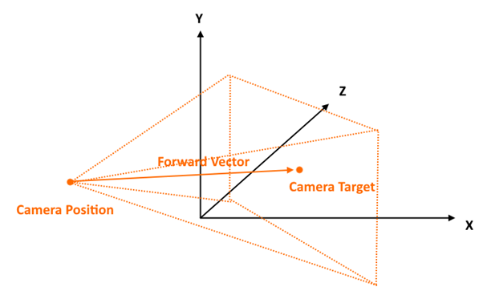

# The ChartSurface3D Camera 3D API
In SciChart, the Camera 3D is defined by the <xref:com.scichart.charting3d.visuals.camera.ICameraController> instance. It's accessible through [camera](xref:com.scichart.charting3d.visuals.SciChartSurface3D.setCamera(com.scichart.charting3d.visuals.camera.ICameraController)) property. 
This interface is implemented in <xref:com.scichart.charting3d.visuals.camera.Camera3D> class which instance is used by <xref:com.scichart.charting3d.visuals.SciChartSurface3D> by default.

> [!NOTE]
> The Above is the representation of a Camera in 3D Space. The camera is attached to the [camera](xref:com.scichart.charting3d.visuals.SciChartSurface3D.setCamera(com.scichart.charting3d.visuals.camera.ICameraController)) property and is defined by a **position**, **target** and other properties which defines the properties of the viewport.

## Camera3D Position, Target
The camera is defined by the [position](xref:com.scichart.charting3d.visuals.camera.ICameraController.setPosition(com.scichart.charting3d.common.math.Vector3)) and [target](xref:com.scichart.charting3d.visuals.camera.ICameraController.setTarget(com.scichart.charting3d.common.math.Vector3)) properties, which are `XYZ vectors` in World Coordinates, as well as [projectionMode](xref:com.scichart.charting3d.visuals.camera.ICameraController.setProjectionMode(com.scichart.charting3d.visuals.camera.CameraProjectionMode)) which is defined by <xref:com.scichart.charting3d.visuals.camera.CameraProjectionMode> enumeration.

<xref:com.scichart.charting3d.visuals.camera.Camera3D> properties which define the viewport as seen by the camera are listed below:

| **Property**                          | **Description**                                                                                          |
| ------------------------------------- | -------------------------------------------------------------------------------------------------------- |
| [position](xref:com.scichart.charting3d.visuals.camera.ICameraController.setPosition(com.scichart.charting3d.common.math.Vector3))       | Defines the **position** of the camera as an `XYZ Vector` in the World Coordinates.                          |
| [target](xref:com.scichart.charting3d.visuals.camera.ICameraController.setTarget(com.scichart.charting3d.common.math.Vector3))           | Defines the **target** of the camera as an `XYZ Vector` in the World Coordinates.                            |
| [orbitalPitch](xref:com.scichart.charting3d.visuals.camera.ICameraController.setOrbitalPitch(float))                                     | Defines the **Pitch** angle of the camera position relative to the target. Expects **degrees**.              |
| [orbitalYaw](xref:com.scichart.charting3d.visuals.camera.ICameraController.setOrbitalYaw(float))                                         | Defines the **Yaw** angle of the camera position relative to the target. Expects **degrees**.                |
| [radius](xref:com.scichart.charting3d.visuals.camera.ICameraController.setRadius(float))                                                 | The **distance** of the Camera Position to the Camera Target.                                                |
| [aspectRatio](xref:com.scichart.charting3d.visuals.camera.ICameraController.setAspectRatio(float))                                       | Defines the viewport aspect ratio.                                                                           |
| [projectionMode](xref:com.scichart.charting3d.visuals.camera.ICameraController.setProjectionMode(com.scichart.charting3d.visuals.camera.CameraProjectionMode)) | Defines whether the camera is **Perspective** or **Orthogonal** which is <xref:com.scichart.charting3d.visuals.camera.CameraProjectionMode> enum. |
| [orthoWidth](xref:com.scichart.charting3d.visuals.camera.ICameraController.setOrthoWidth(float))                                         | Defines the **width** of the projected viewport when `projectionMode` is **Orthogonal**.                     |
| [orthoHeight](xref:com.scichart.charting3d.visuals.camera.ICameraController.setOrthoHeight(float))                                       | Defines the **height** of the projected viewport when `projectionMode` is **Orthogonal**.                    |
| [fieldOfView](xref:com.scichart.charting3d.visuals.camera.ICameraController.setFieldOfView(float))                                       | Defines the **Field of View** Angle of the Camera in **Degrees**.                                            |
| [nearClip](xref:com.scichart.charting3d.visuals.camera.ICameraController.setNearClip(float))                                             | Defines the **Near** Clipping distance of the camera.                                                        |
| [farClip](xref:com.scichart.charting3d.visuals.camera.ICameraController.setFarClip(float))                                               | Defines the **Far** Clipping distance of the camera.                                                         |

The **Modify Camera3D Properties** example shows how to manipulate the camera, and how to switch between perspective and orthogonal modes.

<video autoplay loop muted playsinline src="images/modify-camera3d-properties-example.mp4" style="width: 50%; height: 50%"></video>​

> [!NOTE]
> The **Modify Camera3D Properties** example can be found in the [SciChart Android Examples Suite](https://www.scichart.com/examples/Android-chart/) as well as on [GitHub](https://github.com/ABTSoftware/SciChart.Android.Examples):
> - [Native Example](https://www.scichart.com/example/android-3d-chart-example-modify-camera3d-properties/)
> - [Xamarin Example](https://www.scichart.com/example/xamarin-3d-chart-example-modify-camera-3d-properties/)
