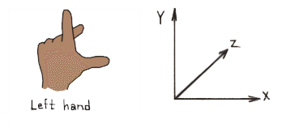
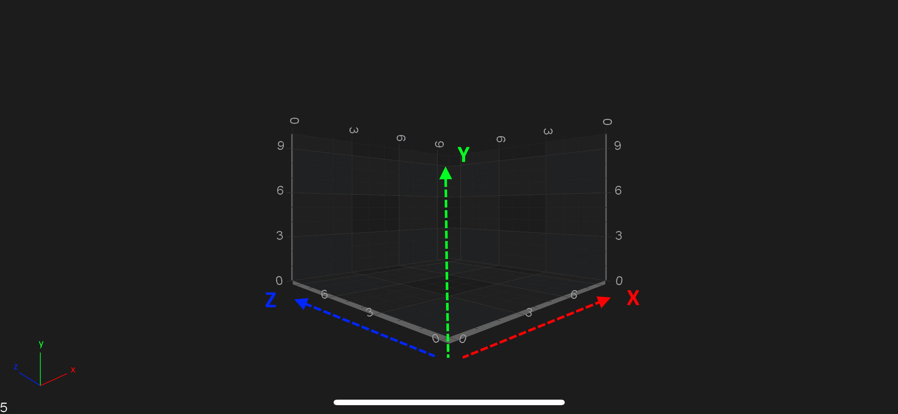
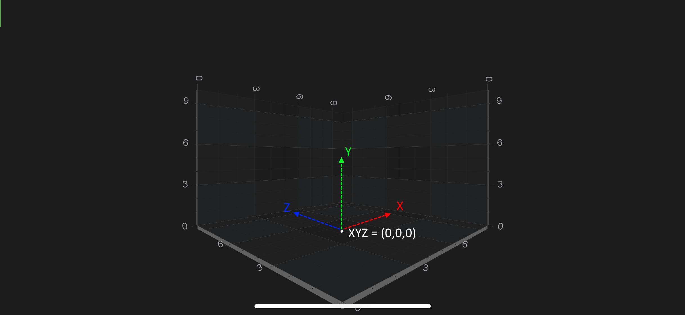
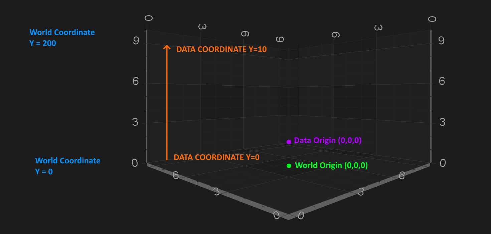

# Coordinates in 3D Space
In SciChart, there is a possibility to configure the **coordinate system** which will be used by renderers. Could be one of the following;
- Left Handed Coordinate System
- Right Handed Coordinate System

Be default <xref:com.scichart.charting3d.visuals.SciChartSurface3D> renders 3D world using the **Left-Handed** coordinate system - **LHS**. 
In the Left-Handed coordinates **X and Z Axes** form the horizontal plane, and **Y Axis** is always up - `YDirection = [0, 1, 0]`. 
It is helpful to think of the 3D world as a 2D Chart with `X and Y axes` plus addition of **Z-Axis** which goes ***"into the screen"***.

SciChart also allows you to render <xref:com.scichart.charting3d.visuals.SciChartSurface3D> world in **Right-Handed** coordinate system - **RHS**. 
It is easily switchable via the [isLeftHandedCoordinateSystem](xref:com.scichart.charting3d.visuals.rendering.IViewport3D.setIsLeftHandedCoordinateSystem(boolean)) property:

# [Java](#tab/java)
[!code-java[SetIsLeftHandedCoordinateSystem](../../../samples/sandbox/app/src/main/java/com/scichart/docsandbox/examples/java/axis3DAPIs/SciChart3DBasicsCoordinatesIn3DSpace.java#SetIsLeftHandedCoordinateSystem)]
# [Java with Builders API](#tab/javaBuilder)
[!code-java[SetIsLeftHandedCoordinateSystem](../../../samples/sandbox/app/src/main/java/com/scichart/docsandbox/examples/javaBuilder/axis3DAPIs/SciChart3DBasicsCoordinatesIn3DSpace.java#SetIsLeftHandedCoordinateSystem)]
# [Kotlin](#tab/kotlin)
[!code-swift[SetIsLeftHandedCoordinateSystem](../../../samples/sandbox/app/src/main/java/com/scichart/docsandbox/examples/kotlin/axis3DAPIs/SciChart3DBasicsCoordinatesIn3DSpace.kt#SetIsLeftHandedCoordinateSystem)]
***

## World Coordinates
World Coordinates is the term used to describe coordinates in the 3D World. These are the raw `[X, Y, Z]` coordinates of a vertex.
By default, the origin `[0, 0, 0]` is in the center of the bottom plane of the chart.

The box in the chart is called the **AxisCube**. The AxisCube size is defined by the [worldDimensions](xref:com.scichart.charting3d.visuals.SciChartSurface3D.getWorldDimensions()) property, 
which is a single <xref:com.scichart.charting3d.common.math.Vector3> with `[X, Y, Z]` sizes and defines the size of a cube as follows:

Therefore, size of the ***AxisCube*** in `[X, Y, Z]` is extends like below:

| **Direction** | **Extends like**                                  |
| ------------- | ------------------------------------------------- |
| `X-Direction` | `[-worldDimensions.getX() / 2; worldDimensions.getX() / 2]` |
| `Y-Direction` | `[0; worldDimensions.getY()]`                          |
| `Z-Direction` | `[-worldDimensions.getZ() / 2; worldDimensions.getZ() / 2]` |

> [!NOTE]
> By **default** the [worldDimensions](xref:com.scichart.charting3d.visuals.SciChartSurface3D.getWorldDimensions()) is initialized with `[X = 300, Y = 200, Z = 300]`

To change the [worldDimensions](xref:com.scichart.charting3d.visuals.SciChartSurface3D.getWorldDimensions()) property, simply provide it with the <xref:com.scichart.charting3d.common.math.Vector3> (3-component vector) like below:

# [Java](#tab/java)
[!code-java[SetWorldCoordinates](../../../samples/sandbox/app/src/main/java/com/scichart/docsandbox/examples/java/axis3DAPIs/SciChart3DBasicsCoordinatesIn3DSpace.java#SetWorldCoordinates)]
# [Java with Builders API](#tab/javaBuilder)
[!code-java[SetWorldCoordinates](../../../samples/sandbox/app/src/main/java/com/scichart/docsandbox/examples/javaBuilder/axis3DAPIs/SciChart3DBasicsCoordinatesIn3DSpace.java#SetWorldCoordinates)]
# [Kotlin](#tab/kotlin)
[!code-swift[SetWorldCoordinates](../../../samples/sandbox/app/src/main/java/com/scichart/docsandbox/examples/kotlin/axis3DAPIs/SciChart3DBasicsCoordinatesIn3DSpace.kt#SetWorldCoordinates)]
***

## Data Coordinates
By contrast to the [WorldCoordinates](#world-coordinates), which are **absolute** coordinates in the 3D World, in SciChart 3D there is the concept of **Data Coordinates**.

Data Coordinates are measured on an <xref:com.scichart.charting3d.visuals.axes.IAxis3D> instance, for example, the `Y-Axis` (which is UP) might have a size of 200 in the World Coordinates, but might display a VisibleRange of `[0...10]`. 
Therefore, Data which falls int he range `[0...10]` will be spaced on this axis from `[0...200]` World Coordinates.

The difference between ***World*** and ***Data*** Coordinates is shown in the following example:

## Converting from World to Data Coordinates
The conversion between ***Data Coordinates*** and ***World Coordinates*** is done by the <xref:com.scichart.charting3d.visuals.axes.IAxis3D>. 
It's no different to 2D conversions which is described in the [Axis APIs - Convert Pixel to Data coordinates](xref:axisAPIs.AxisAPIsConvertPixelToDataCoordinates) article.

You can find simple example how to do the conversions for <xref:com.scichart.charting3d.visuals.axes.NumericAxis3D> below.

# [Java](#tab/java)
[!code-java[ConvertingFromWorldToDataCoordinates](../../../samples/sandbox/app/src/main/java/com/scichart/docsandbox/examples/java/axis3DAPIs/SciChart3DBasicsCoordinatesIn3DSpace.java#ConvertingFromWorldToDataCoordinates)]
# [Java with Builders API](#tab/javaBuilder)
[!code-java[ConvertingFromWorldToDataCoordinates](../../../samples/sandbox/app/src/main/java/com/scichart/docsandbox/examples/javaBuilder/axis3DAPIs/SciChart3DBasicsCoordinatesIn3DSpace.java#ConvertingFromWorldToDataCoordinates)]
# [Kotlin](#tab/kotlin)
[!code-swift[ConvertingFromWorldToDataCoordinates](../../../samples/sandbox/app/src/main/java/com/scichart/docsandbox/examples/kotlin/axis3DAPIs/SciChart3DBasicsCoordinatesIn3DSpace.kt#ConvertingFromWorldToDataCoordinates)]
***
