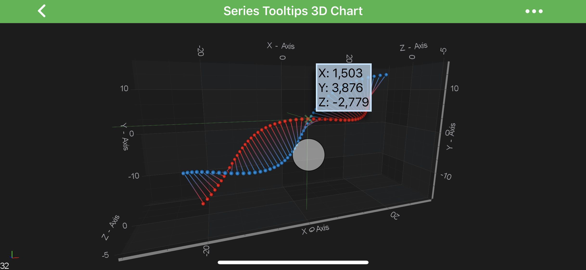
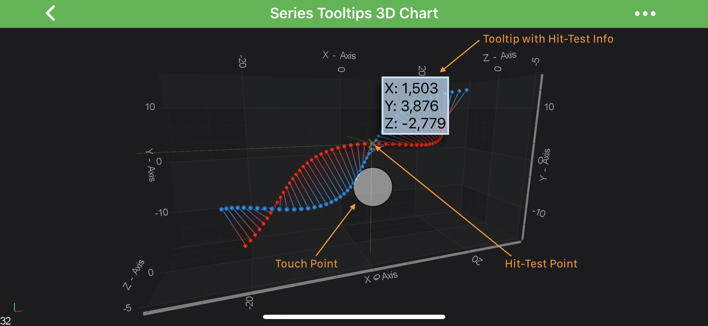
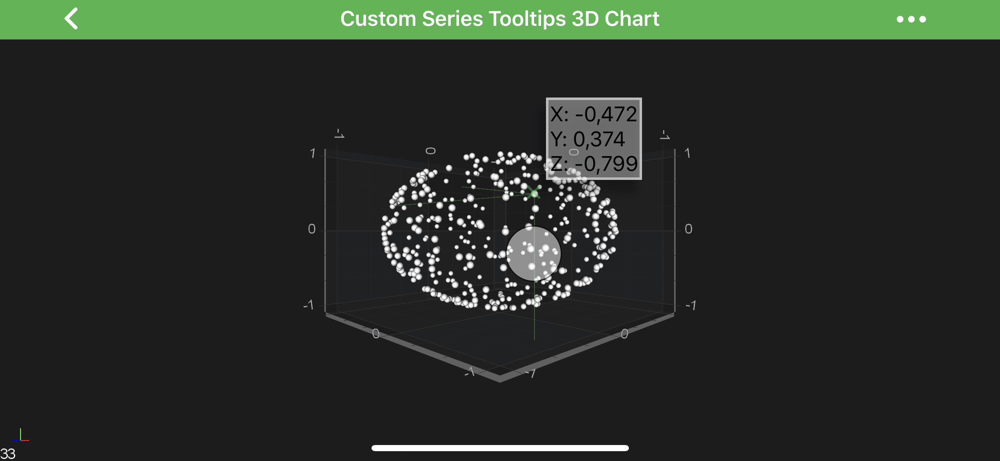
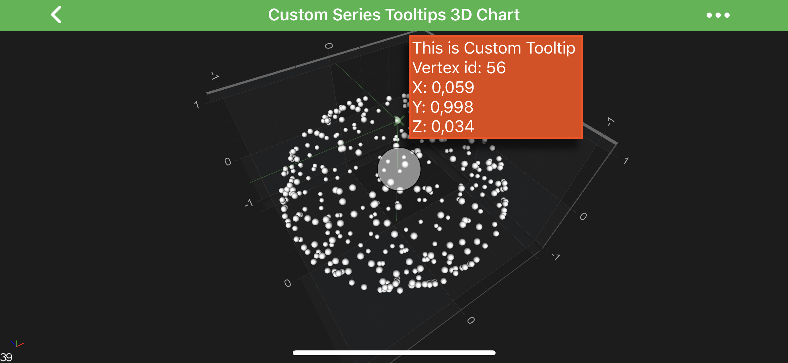

# Tooltip Modifier 3D
In SciChart Android 3D you can add Tooltips onto <xref:com.scichart.charting3d.visuals.SciChartSurface3D> using the <xref:com.scichart.charting3d.modifiers.TooltipModifier3D>.
It's derived from the <xref:com.scichart.charting3d.modifiers.ChartModifierBase3D> and executes on touch over the ***data-point*** and shows tooltips under the pointer.

> [!NOTE]
> Examples of the **TooltipModifier3D usage** can be found in the [SciChart Android Examples Suite](https://www.scichart.com/examples/android-chart/) as well as on [GitHub](https://github.com/ABTSoftware/SciChart.Android.Examples):
> - [Native Example](https://www.scichart.com/example/android-3d-chart-example-series-tooltips/)
> - [Xamarin Example](https://www.scichart.com/example/xamarin-3d-chart-example-series-tooltips/)

## TooltipModifier3D Usage
The <xref:com.scichart.charting3d.modifiers.TooltipModifier3D> allows inspecting [RenderableSeries 3D](xref:chart3d.3DChartTypes) at a touch point.
For convenience, the actual **hit-test point** is located a bit above the actual touch point. It is marked with a small "X" sign. 
Tooltips will appear to the side of it, showing the ***hit-test*** result of the topmost <xref:com.scichart.charting3d.visuals.renderableSeries.IRenderableSeries3D> at the "X" location:

For hit-testing series parts that are close to the chart boundaries, a multi-touch finger drag can be used, which makes ***hit-test*** point appear in between of two finger touches, same way as it works with [2D TooltipModifier](xref:chartModifierAPIs.InteractivityTooltipModifier#tooltipmodifier-usage). 

## TooltipModifier3D Features
The <xref:com.scichart.charting3d.modifiers.TooltipModifier3D> has a bunch of the configuration properties listed in the table below, some of them are inherited from its base class - <xref:com.scichart.charting.modifiers.TooltipModifierBase>:

| **Feature**                                 | **Description**                                                                                                                                                                     |
| ------------------------------------------- | ----------------------------------------------------------------------------------------------------------------------------------------------------------------------------------- |
| <xref:com.scichart.charting3d.modifiers.TooltipModifierBase3D.setShowTooltip(boolean)>      | Allows to **hide or show** modifier's Tooltips.                                                                                                                                     |
| <xref:com.scichart.charting3d.modifiers.TooltipModifierBase3D.setSourceMode(com.scichart.charting.modifiers.SourceMode)>       | Allows to specify which <xref:com.scichart.charting.visuals.renderableSeries.IRenderableSeries> are to be inspected by a modifier, e.g. **Visible**, **Selected**, etc. Other will be ignored by the modifier. Expects a member of the <xref:com.scichart.charting.modifiers.SourceMode> enumeration. |
| <xref:com.scichart.charting3d.modifiers.TooltipModifier3D.setShowAxisLabels(boolean)>       | Allows to **hide or show** Tooltips **axis labels**                                                                                                                                 |
| <xref:com.scichart.charting3d.modifiers.TooltipModifier3D.setOffset(float)>               | Specifies **how far** the hit-test point is **from** the actual **touch point**. This value will be used for either `X` or `Y` coordinate, or both, depending on `markerPlacement`. |
| <xref:com.scichart.charting3d.modifiers.TooltipModifier3D.setCustomPointOffset(android.graphics.PointF)>    | Specifies **how far** the hit-test point is **from** the actual **touch point**. As opposed to `offset`, both `X` and `Y` coordinate will always be applied.                        |
| <xref:com.scichart.charting3d.modifiers.TooltipModifier3D.setMarkerPlacement(com.scichart.charting.modifiers.Placement)>      | Allows to specify the **position** of the hit-test point relative to the **touch point**, e.g. Left, Top, etc... Expects a member of the <xref:com.scichart.charting.modifiers.Placement> enumeration.                |                                                                                                  |
| <xref:com.scichart.charting3d.modifiers.TooltipModifier3D.setCrosshairStrokeStyle(com.scichart.drawing.common.SolidPenStyle)> | Allows to specify the <xref:com.scichart.drawing.common.PenStyle> which will be used to draw ***Crosshair*** strokes                                                                                              |
| <xref:com.scichart.charting3d.modifiers.TooltipModifier3D.setCrosshairPlanesFill(int)>  | Allows to specify the color to draw Crosshair planes with, if the <xref:com.scichart.charting3d.modifiers.CrosshairMode>.Planes is selected.                                                           |
| <xref:com.scichart.charting3d.modifiers.TooltipModifier3D.setCrosshairMode(com.scichart.charting3d.modifiers.CrosshairMode)>        | Allows to specify the **crosshair mode**, could be **Planes** or **Lines**. Expects <xref:com.scichart.charting3d.modifiers.CrosshairMode> enumeration.                                                                 |
| <xref:com.scichart.charting3d.modifiers.TooltipModifier3D.setProjectionMode(com.scichart.charting3d.modifiers.ProjectionMode)>       | Defines the projection mode used to draw Crosshair. Expects the <xref:com.scichart.charting3d.modifiers.ProjectionMode> enumeration.                                                                                     |
| <xref:com.scichart.charting3d.modifiers.TooltipModifier3D.setLineProjectionMode(int)>   | Allows to specify the planes, onto which the crosshair will be projected - **XY**, **XZ**, **YZ** or any combination of planes. Expects <xref:com.scichart.charting3d.modifiers.LineProjectionMode> enumeration.        |

## Adding a TooltipModifier3D to a Chart
Any [Chart Modifier 3D](xref:chartModifier3DAPIs.ChartModifier3DAPIs) can be [added to a <xref:com.scichart.charting3d.visuals.SciChartSurface3D>](xref:chartModifier3DAPIs.ChartModifier3DAPIs#adding-a-chart-modifier-3d) via the [chartModifiers](xref:com.scichart.charting3d.visuals.ISciChartSurface3D.getChartModifiers()) property and <xref:com.scichart.charting3d.modifiers.TooltipModifier3D> is no difference:

# [Java](#tab/java)
[!code-java[AddTooltipModifier3D](../../../../samples/sandbox/app/src/main/java/com/scichart/docsandbox/examples/java/chartModifier3D/InteractivityTooltipModifier3D.java#AddTooltipModifier3D)]
# [Java with Builders API](#tab/javaBuilder)
[!code-java[AddTooltipModifier3D](../../../../samples/sandbox/app/src/main/java/com/scichart/docsandbox/examples/javaBuilder/chartModifier3D/InteractivityTooltipModifier3D.java#AddTooltipModifier3D)]
# [Kotlin](#tab/kotlin)
[!code-swift[AddTooltipModifier3D](../../../../samples/sandbox/app/src/main/java/com/scichart/docsandbox/examples/kotlin/chartModifier3D/InteractivityTooltipModifier3D.kt#AddTooltipModifier3D)]
***

> [!NOTE]
> To learn more about features available, please visit the [Chart Modifier 3D APIs](xref:chartModifier3DAPIs.ChartModifier3DAPIs#common-chart-modifier-3d-features) article.

## Customizing Tooltip Modifier 3D Tooltips
In SciChart, you can ***fully customize*** tooltips for <xref:com.scichart.charting3d.modifiers.TooltipModifier3D>.
This customization is achieved via the <xref:com.scichart.charting3d.visuals.renderableSeries.hitTest.ISeriesInfo3DProvider> and <xref:com.scichart.charting3d.visuals.renderableSeries.tooltips.ISeriesTooltip3D> protocols.
Moreover - tooltips can be made **unique** per a **RenderableSeries** instance via the <xref:com.scichart.charting3d.visuals.renderableSeries.IRenderableSeries3D.setSeriesInfoProvider(com.scichart.charting3d.visuals.renderableSeries.hitTest.ISeriesInfo3DProvider)> property.

> [!NOTE]
> Examples of the **TooltipModifier3D customization** can be found in the [SciChart Android Examples Suite](https://www.scichart.com/examples/android-chart/) as well as on [GitHub](https://github.com/ABTSoftware/SciChart.Android.Examples):
> - [Xamarin Example](https://www.scichart.com/example/xamarin-3d-chart-example-custom-series-tooltips/)
<!-- TODO: Add SeriesCustomTooltips3DChartFragment to the website -->

To have ***fully custom*** tooltip for your modifier, you will need to provide **custom** <xref:com.scichart.charting3d.visuals.renderableSeries.hitTest.ISeriesInfo3DProvider> for your **RenderableSeries** via inheriting from <xref:com.scichart.charting3d.visuals.renderableSeries.hitTest.Seriesinfo3DProviderBase> which contains some base functionality.
From there - you might want to override one of the following (or both):

- <xref:com.scichart.charting3d.visuals.renderableSeries.hitTest.Seriesinfo3DProviderBase.getSeriesInfoInternal()> - allows to provide custom implementation of <xref:com.scichart.charting3d.visuals.renderableSeries.hitTest.SeriesInfo3D>, which simply contains information about a **RenderableSeries** and should be created based on it
- <xref:com.scichart.charting.visuals.renderableSeries.hitTest.SeriesInfoProviderBase.getSeriesTooltipInternal(android.content.Context,TSeriesInfo,java.lang.Class&lt;%3F&gt;)> - allows to provide **custom tooltip** for your series, based on `seriesInfo` and `modifierType`

### Customization TooltipModifier3D Example
First thing, we will need to create custom <xref:com.scichart.charting3d.visuals.renderableSeries.tooltips.ISeriesTooltip3D> and implement <xref:com.scichart.charting3d.visuals.renderableSeries.tooltips.SeriesTooltip3DBase.internalUpdate(T)> method in which we update tooltip instance based on passed in <xref:com.scichart.charting3d.visuals.renderableSeries.hitTest.SeriesInfo3D> instance. 
Then, in custom <xref:com.scichart.charting3d.visuals.renderableSeries.hitTest.ISeriesInfo3DProvider> we override <xref:com.scichart.charting.visuals.renderableSeries.hitTest.SeriesInfoProviderBase.getSeriesTooltipInternal(android.content.Context,TSeriesInfo,java.lang.Class&lt;%3F&gt;)> and provide our custom tooltip there.
Finally, we provide our **custom** SeriesInfo3DProvider to our <xref:com.scichart.charting3d.visuals.renderableSeries.IRenderableSeries3D> instance via the corresponding property.

Let's see the code below:

# [Java](#tab/java)
[!code-java[CreateCustomSeriesTooltip](../../../../samples/sandbox/app/src/main/java/com/scichart/docsandbox/examples/java/chartModifier3D/InteractivityTooltipModifier3D.java#CreateCustomSeriesTooltip)]
[!code-java[CreateCustomSeriesInfoProvider](../../../../samples/sandbox/app/src/main/java/com/scichart/docsandbox/examples/java/chartModifier3D/InteractivityTooltipModifier3D.java#CreateCustomSeriesInfoProvider)]
[!code-java[UseCustomSeriesInfoProvider](../../../../samples/sandbox/app/src/main/java/com/scichart/docsandbox/examples/java/chartModifier3D/InteractivityTooltipModifier3D.java#UseCustomSeriesInfoProvider)]
# [Java with Builders API](#tab/javaBuilder)
[!code-java[CreateCustomSeriesTooltip](../../../../samples/sandbox/app/src/main/java/com/scichart/docsandbox/examples/javaBuilder/chartModifier3D/InteractivityTooltipModifier3D.java#CreateCustomSeriesTooltip)]
[!code-java[CreateCustomSeriesInfoProvider](../../../../samples/sandbox/app/src/main/java/com/scichart/docsandbox/examples/javaBuilder/chartModifier3D/InteractivityTooltipModifier3D.java#CreateCustomSeriesInfoProvider)]
[!code-java[UseCustomSeriesInfoProvider](../../../../samples/sandbox/app/src/main/java/com/scichart/docsandbox/examples/javaBuilder/chartModifier3D/InteractivityTooltipModifier3D.java#UseCustomSeriesInfoProvider)]
# [Kotlin](#tab/kotlin)
[!code-swift[CreateCustomSeriesTooltip](../../../../samples/sandbox/app/src/main/java/com/scichart/docsandbox/examples/kotlin/chartModifier3D/InteractivityTooltipModifier3D.kt#CreateCustomSeriesTooltip)]
[!code-swift[CreateCustomSeriesInfoProvider](../../../../samples/sandbox/app/src/main/java/com/scichart/docsandbox/examples/kotlin/chartModifier3D/InteractivityTooltipModifier3D.kt#CreateCustomSeriesInfoProvider)]
[!code-swift[UseCustomSeriesInfoProvider](../../../../samples/sandbox/app/src/main/java/com/scichart/docsandbox/examples/kotlin/chartModifier3D/InteractivityTooltipModifier3D.kt#UseCustomSeriesInfoProvider)]
***

> [!NOTE]
> Full example sources are available in [3D Charts -> Tooltips and HitTest 3D Charts -> Custom Series Tooltips 3D Charts](https://www.scichart.com/example/android-3d-chart-example-custom-series-tooltips/)

This will result in the following:

> [!NOTE]
> A custom Tooltip has to implement the <xref:com.scichart.charting3d.visuals.renderableSeries.tooltips.ISeriesTooltip3D> or extend the <xref:com.scichart.charting3d.visuals.renderableSeries.tooltips.SeriesTooltip3DBase> class, which is derived from [TextView](https://developer.android.com/reference/android/widget/TextView).
