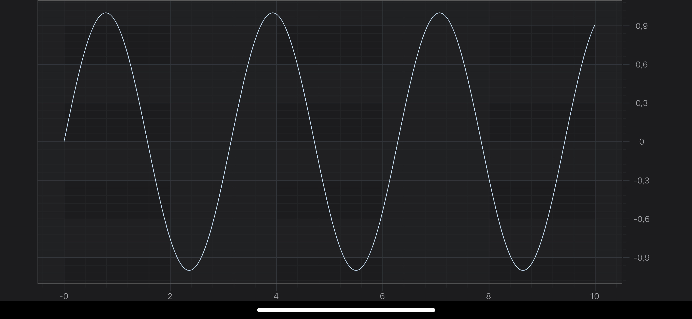
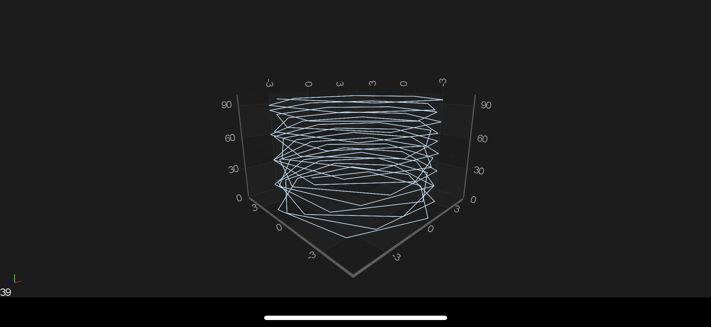

# Creating your first SciChart Android App

Playing around with [SciChart Android Examples Suite](xref:quickStartGuide.SciChartAndroidExamplesSuite) is great, but you are probably interested in creating your own application by adding some charts! Let's get started and create our first SciChart Android App using Kotlin.

## Setting up a new Android Application
Assuming you've [created an Android project](https://developer.android.com/training/basics/firstapp/creating-project) in either `Java`, `Kotlin` or even `Xamarin.Android` - next step should be [integrating SciChart.framework](xref:userManual.IntegratingSciChartLibraries). The easiest way of doing so is by using [Maven](xref:userManual.IntegratingSciChartLibraries#integrating-scichart-using-maven). 

- Open the "build.gradle" file for the project and declare a new Maven repository in the "repositories" node. Use the URL from above:
[!code-gradle[MavenRepositories](../../samples/sandbox/settings.gradle#AddSciChartMavenRepositories)]

- Open the "build.gradle" file for a module which SciChart is intended to be used within. Add SciChart Android libraries as module dependencies:
[!code-gradle[MavenDependencies](../../samples/sandbox/app/build.gradle#DeclareSciChartLibariesAsMavenDependencies)]

> [!NOTE]
> You can also get the extensive sample app downloading the [SciChart Android Trial](https://www.scichart.com/downloads) package, which can be used for manual integration of SciChart.framework.

## Set the License Key
Before you build and run the application, you will need to apply a trial or purchased license key. You can find full instructions on the page [Licensing SciChart Android](https://www.scichart.com/licensing-scichart-android/).

You can fetch a Trial License Key directly from the [Downloads](https://www.scichart.com/downloads/) page following instructions from Licensing SciChart Android. Or, if you have purchased SciChart Android, you can find the full purchased license keys at your SciChart Account Page.

When you have your key, you should apply it via <xref:com.scichart.charting.visuals.SciChartSurface.setRuntimeLicenseKey(java.lang.String)> like below:

[!code-swift[SetRuntimeLicenseKey](../../samples/first-app/2D/src/main/java/com/example/firstscichartapp/MainActivity.kt#SetRuntimeLicenseKey)]

> [!NOTE]
> The License Key must be set in your app once, and once only before any <xref:com.scichart.charting.visuals.SciChartSurface> instance is initialized.

From here, you can create **2D or 3D chart**. Please refer to the following sections for more information:
- [The SciChartSurface Type](#the-scichartsurface-type)
- [The SciChartSurface3D Type](#the-scichartsurface3d-type)

## The SciChartSurface Type
The root **2D chart** view is called the <xref:com.scichart.charting.visuals.SciChartSurface>. This is the [Android View](https://developer.android.com/reference/android/view/View) you will be adding to your applications wherever you need a **chart**. You can add more than one <xref:com.scichart.charting.visuals.SciChartSurface>, you can configure them independently, and you can link them together.

Since this is a ***Quick Start Example***, we will use the one instance of <xref:com.scichart.charting.visuals.SciChartSurface>, so let’s start by declaring one!

### Declaring a SciChartSurface Instance
There few ways of adding <xref:com.scichart.charting.visuals.SciChartSurface> to your application. We will look more closely into the following:
- [Using XML](#adding-scichartsurface-using-xml)
- [Purely from code](#adding-scichartsurface-purely-from-code)
- [Jetpack Compose](#adding-scichartsurface-using-jetpack-compose) 

#### Adding SciChartSurface using XML
Open up your **activity_main.xml** file and add <xref:com.scichart.charting.visuals.SciChartSurface>, like this:

[!code-xml[AddingChartSurfaceUsingXML](../../samples/first-app/2D/src/main/res/layout/activity_main.xml#AddingChartSurfaceUsingXML)]

#### Adding SciChartSurface purely from code
In your Activity you will need to instantiate the <xref:com.scichart.charting.visuals.SciChartSurface> and add it as a subview.
See the code below:

[!code-swift[AddingSciChartSurfaceFromCode](../../samples/first-app/2D/src/main/java/com/example/firstscichartapp/MainActivity.kt#AddingSciChartSurfaceFromCode)]

#### Adding SciChartSurface using Jetpack Compose
Since <xref:com.scichart.charting.visuals.SciChartSurface> is an [Android View](https://developer.android.com/reference/android/view/View) under the hood, you can use the [AndroidView composable](https://developer.android.com/reference/kotlin/androidx/compose/ui/viewinterop/package-summary#AndroidView(kotlin.Function1,androidx.compose.ui.Modifier,kotlin.Function1)) to include your <xref:com.scichart.charting.visuals.SciChartSurface>, like this:

[!code-swift[AddingChartSurfaceUsingCompose](../../samples/first-app/JetpackCompose/src/main/java/com/example/firstscichartapp/MainActivity.kt#AddingChartSurfaceUsingCompose)]

> [!NOTE]
> Please, follow the [official Android documentation](https://developer.android.com/jetpack/compose/interop/interop-apis#views-in-compose) article for more details on how to include Android Views in a Compose UI.

#### Adding Axes to the SciChartSurface
Once you have added a <xref:com.scichart.charting.visuals.SciChartSurface> into your Activity, you will not see anything drawn because you need to add axes. 
This is an important thing here - **two axes X and Y** has to be added to your surface. This is a bare minimum to see a drawn grid on your device.

[!code-swift[AddingAxesToTheSciChartSurface](../../samples/first-app/2D/src/main/java/com/example/firstscichartapp/MainActivity.kt#AddingAxesToTheSciChartSurface)]

#### Adding Renderable Series
Now, we would like to see something more than just an empty grid, e.g. Line Chart. 
So let's add some **RenderableSeries** with appropriate DataSeries to our surface:

[!code-swift[AddingRenderableSeries](../../samples/first-app/2D/src/main/java/com/example/firstscichartapp/MainActivity.kt#AddingRenderableSeries)]

> [!NOTE]
> You might have noticed, that we used <xref:com.scichart.core.model.DoubleValues> while appending points to <xref:com.scichart.charting.model.dataSeries.IXyDataSeries>. That's the recommended way of appending data, due to better performance, comparing to adding points one by one. You can use <xref:com.scichart.charting.model.dataSeries.IXyDataSeries.append(TX[],TY[])> if you want though.

#### Final example code
So let's see what we've managed to get. Let's see the listing from the MainActivity below:

[!code-swift[FinalExampleCode](../../samples/first-app/2D/src/main/java/com/example/firstscichartapp/MainActivity.kt#FinalExampleCode)]

> [!NOTE]
> Please note that we've added axes and renderableSeries to <xref:com.scichart.charting.visuals.SciChartSurface> inside <xref:com.scichart.core.framework.UpdateSuspender.using(com.scichart.core.framework.ISuspendable,java.lang.Runnable)> block. This allows you to suspend surface instance, and refresh it only one time after you finished all needed operations. That's **highly recommended** technique if you want to omit performance decrease due to triggering refreshes on every operation which could be performed in one batch.

## The SciChartSurface3D Type
The root **3D chart** view is called the <xref:com.scichart.charting3d.visuals.SciChartSurface3D>. This is the [Android View](https://developer.android.com/reference/android/view/View) which you will be adding to your applications wherever you need a 3D chart. You can add more than one <xref:com.scichart.charting3d.visuals.SciChartSurface3D>, you can configure them independently and you can link them together.

Since this is a ***Quick Start Example***, we will use the one instance of <xref:com.scichart.charting3d.visuals.SciChartSurface3D>, so let’s start by declaring one!

#### Declaring a ChartSurface3D Instance
Declaring <xref:com.scichart.charting3d.visuals.SciChartSurface3D> to your application is no different than the regular [SciChartSurface](#declaring-a-scichartsurface-instance), so please refer to the [corresponding section](#declaring-a-scichartsurface-instance) in this article.

#### Adding 3D Axes to the SciChartSurface3D
Once you have added a <xref:com.scichart.charting3d.visuals.SciChartSurface3D> into your Activity, you will not see anything drawn because you need to add axes. 
This is an important thing here - **three axes X, Y, and Z** has to be added to your surface. This is a bare minimum to see a drawn grid on your device.

[!code-swift[AddingAxesToTheSciChartSurface3D](../../samples/first-app/3D/src/main/java/com/example/firstscichartapp/MainActivity.kt#AddingAxesToTheSciChartSurface3D)]

#### Adding 3D Renderable Series
Now, we would like to see something more than just an empty grid, e.g. Scatter 3D Chart. 
So let’s add some **RenderableSeries3D** with appropriate DataSeries 3D to our surface:

[!code-swift[Adding3DRenderableSeries](../../samples/first-app/3D/src/main/java/com/example/firstscichartapp/MainActivity.kt#Adding3DRenderableSeries)]

#### Final example 3D code
So let's see what we've managed to get. Let's see the listing from the Activity below:

[!code-swift[FinalExampleCode](../../samples/first-app/3D/src/main/java/com/example/firstscichartapp/MainActivity.kt#FinalExampleCode)]

> [!NOTE]
> Please note that we've added axes and renderableSeries to <xref:com.scichart.charting3d.visuals.SciChartSurface3D> inside <xref:com.scichart.core.framework.UpdateSuspender.using(com.scichart.core.framework.ISuspendable,java.lang.Runnable)> block. This allows you to suspend surface instance, and refresh it only one time after you finished all needed operations. That's **highly recommended** technique if you want to omit performance decrease due to triggering refreshes on every operation which could be performed in one batch.

