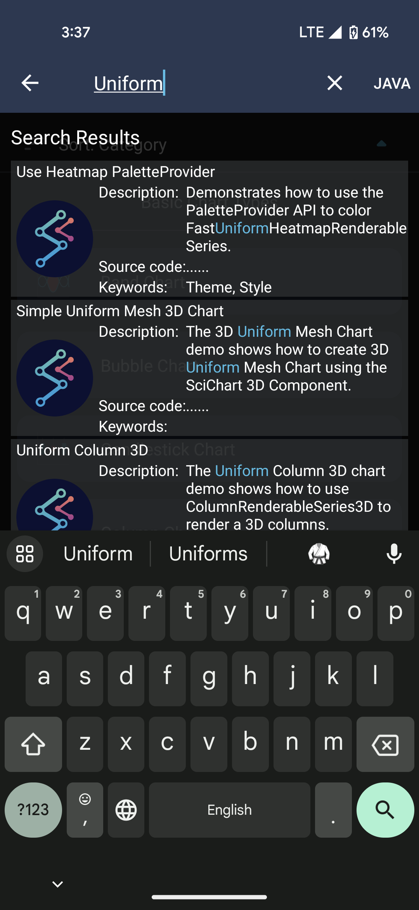
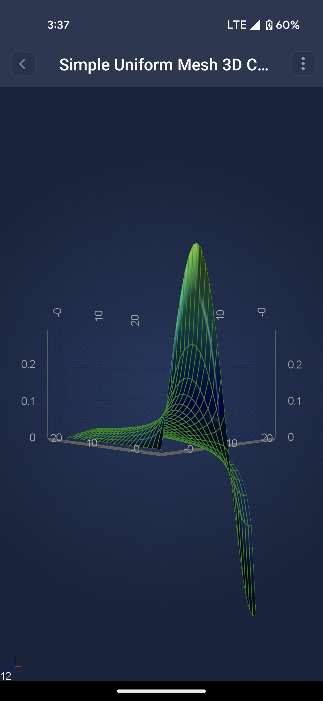

# SciChart Android examples Suite

## Are you new to SciChart?
We have created a rich **interactive examples application demo** to showcase the SciChart Android features and as well as the flexibility of our API. SciChart provides both **Android native examples** application and **Android.Xamarin examples** demo. 
We also believe this application will be a good learning tool, where each little simple example will teach you piece by piece how to use the library to achieve what you need to do. 

### The Demo application contains: 
- Approximately 80+ Rich of Android native examples showcasing the features of [SciChart Android Charts](https://www.scichart.com/Android-chart-features/);
- Search keying on a tag, example title, description, and source code;
- View source in the example application and links to GitHub.

### How to get the demo app 
Simply download it to your phone from the [Google Play Store](https://play.google.com/store/apps/details?id=com.scichart.examples) and you are ready to go, view, search, and browse through examples. 

If you want to run it yourself and play around with code right away you can 
- Download zipped archive from our web resource at [downloads](https://www.scichart.com/downloads/) 
- Clone the SciChart Android Examples from our [Github repository](https://github.com/ABTSoftware/SciChart.Android.Examples/tree/SciChart_v4_Release) or [Android.Xamarin examples](https://github.com/ABTSoftware/SciChart.Xamarin.Examples).

### Build and Run the Demo 
To run the demo yourself you will need to do a couple of simple steps: 
1. Setup the Android project and integrate SciChart Framework, please see the first paragraphs in ["Creating your First App"](xref:quickStartGuide.CreatingYourFirstSciChartAndroidApp) if you need help.
2. Set the (trial) [licenses key](xref:quickStartGuide.CreatingYourFirstSciChartAndroidApp) and your key can be found at your [profile page](https://www.scichart.com/profile/). 
3. Run the project. 

If everything is ok this is what you should see the following:

​

Now you can navigate through the Examples Suite! The application itself has a lot of useful features for you. You can not only take a look at each particular example, but also see its code, and configure the example.

## Navigating the SciChart Android Examples Suite
The SciChart Android Examples Suite showcases the features of SciChart's Android Chart Control in an easy to navigate application that runs on your phone and tablet. 

All examples are grouped into three main categories. Those are **2D charts**, **3D charts**, and **Featured Apps**.
Each of these is further divided into categories by features or actions you might want to implement. For example:

| **Category**            | **Example**                                             | **Description**                                                         |
| ----------------------- | ------------------------------------------------------- | ----------------------------------------------------------------------- |
| 2D -> Basic Chart Types | Line Chart, Column Charts, Mountain Charts, etc.        | Really simple examples, showing how to create the different chart types |
| 3D -> Axes              | Date Axis 3D, Logarithmic Axis 3D                       | Shows how to add a specific axis to the 3D view of the chart.           |
| Extra Features          | Real-time Oscilloscope, Multiple Axes, Multiple Surfaces| Shows a bit more complex combinations of features and functionality.    |

## What else is in the Demo App
The menu at the top allows you to go back home if you wish to **choose a different category**.
You may also **search** for an example by the keywords throughout the whole application.

Once at the example list, the right top corner allows you to **switch the language** from Java to Kotlin in runtime.
When you are at the example itself, you may also click on the three dots to get **a link to the example GitHub page**.

​

Here we have opened the **Uniform Surface mesh 3D chart** for example. And there are many more examples in the demo application. Have a look for yourself!

​

Our website also has the full list of [Android Examples](https://www.scichart.com/examples/Android-chart/) for your convenience.

Wish you have a great experience! We are always looking for your [feedback](https://www.scichart.com/contact-us/)!

## See Also
- [Creating your first SciChart Android App](xref:quickStartGuide.CreatingYourFirstSciChartAndroidApp)
