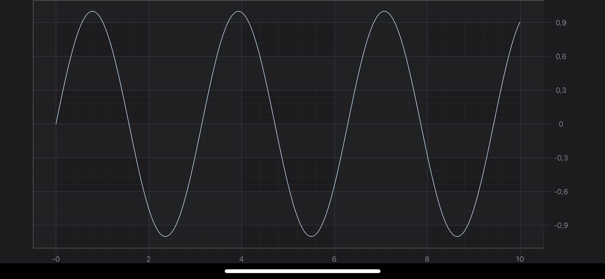
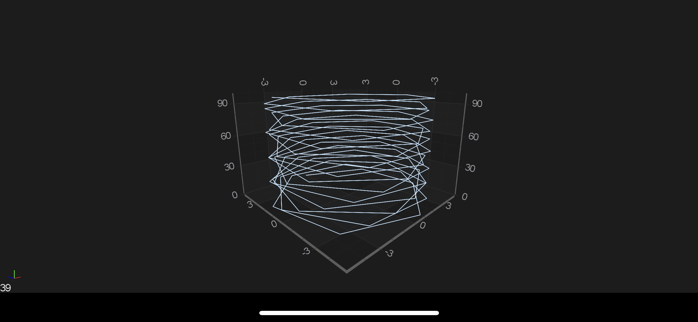

# Adding SciChartSurface using XML
Open up your **activity_main.xml** file and add <xref:com.scichart.charting.visuals.SciChartSurface>, like this:

[!code-xml[AddingChartSurfaceUsingXML](../../../samples/first-app/2D/src/main/res/layout/activity_main_using_xml.xml#AddingChartSurfaceUsingXML)]

#### Adding Axes to the SciChartSurface
Once you have added a <xref:com.scichart.charting.visuals.SciChartSurface> into your Activity, you will not see anything drawn because you need to add axes. 
This is an important thing here - **two axes X and Y** has to be added to your surface. This is a bare minimum to see a drawn grid on your device.

[!code-swift[AddingAxesToTheSciChartSurface](../../../samples/first-app/2D/src/main/java/com/example/firstscichartapp/MainActivityUsingXml.kt#AddingAxesToTheSciChartSurface)]

#### Adding Renderable Series
Now, we would like to see something more than just an empty grid, e.g. Line Chart. 
So let's add some **RenderableSeries** with appropriate DataSeries to our surface:

[!code-swift[AddingRenderableSeries](../../../samples/first-app/2D/src/main/java/com/example/firstscichartapp/MainActivityUsingXml.kt#AddingRenderableSeries)]

> [!NOTE]
> You might have noticed, that we used <xref:com.scichart.core.model.DoubleValues> while appending points to <xref:com.scichart.charting.model.dataSeries.IXyDataSeries>. That's the recommended way of appending data, due to better performance, comparing to adding points one by one. You can use <xref:com.scichart.charting.model.dataSeries.IXyDataSeries.append(TX[],TY[])> if you want though.

#### Final example code
So let's see what we've managed to get. Let's see the listing from the MainActivity below:

[!code-swift[FinalExampleCode](../../../samples/first-app/2D/src/main/java/com/example/firstscichartapp/MainActivityUsingXml.kt#FinalExampleCode)]

> [!NOTE]
> Please note that we've added axes and renderableSeries to <xref:com.scichart.charting.visuals.SciChartSurface> inside <xref:com.scichart.core.framework.UpdateSuspender.using(com.scichart.core.framework.ISuspendable,java.lang.Runnable)> block. This allows you to suspend surface instance, and refresh it only one time after you finished all needed operations. That's **highly recommended** technique if you want to omit performance decrease due to triggering refreshes on every operation which could be performed in one batch.

## The SciChartSurface3D Type
The root **3D chart** view is called the <xref:com.scichart.charting3d.visuals.SciChartSurface3D>. This is the [Android View](https://developer.android.com/reference/android/view/View) which you will be adding to your applications wherever you need a 3D chart. You can add more than one <xref:com.scichart.charting3d.visuals.SciChartSurface3D>, you can configure them independently and you can link them together.

Since this is a ***Quick Start Example***, we will use the one instance of <xref:com.scichart.charting3d.visuals.SciChartSurface3D>, so let’s start by declaring one!

#### Declaring a ChartSurface3D Instance
Declaring <xref:com.scichart.charting3d.visuals.SciChartSurface3D> to your application is no different than the regular [SciChartSurface](xref:quickStartGuide.projectSetup.ProjectSetup#declaring-a-scichartsurface-instance), so please refer to the [corresponding section](xref:quickStartGuide.projectSetup.ProjectSetup#declaring-a-scichartsurface-instance) in this article.

#### Adding 3D Axes to the SciChartSurface3D
Once you have added a <xref:com.scichart.charting3d.visuals.SciChartSurface3D> into your Activity, you will not see anything drawn because you need to add axes. 
This is an important thing here - **three axes X, Y, and Z** has to be added to your surface. This is a bare minimum to see a drawn grid on your device.

[!code-swift[AddingAxesToTheSciChartSurface3D](../../../samples/first-app/3D/src/main/java/com/example/firstscichartapp/MainActivityUsingXml.kt#AddingAxesToTheSciChartSurface3D)]

#### Adding 3D Renderable Series
Now, we would like to see something more than just an empty grid, e.g. Scatter 3D Chart. 
So let’s add some **RenderableSeries3D** with appropriate DataSeries 3D to our surface:

[!code-swift[Adding3DRenderableSeries](../../../samples/first-app/3D/src/main/java/com/example/firstscichartapp/MainActivityUsingXml.kt#Adding3DRenderableSeries)]

#### Final example 3D code
So let's see what we've managed to get. Let's see the listing from the Activity below:

[!code-swift[FinalExampleCode](../../../samples/first-app/3D/src/main/java/com/example/firstscichartapp/MainActivityUsingXml.kt#FinalExampleCode)]

> [!NOTE]
> Please note that we've added axes and renderableSeries to <xref:com.scichart.charting3d.visuals.SciChartSurface3D> inside <xref:com.scichart.core.framework.UpdateSuspender.using(com.scichart.core.framework.ISuspendable,java.lang.Runnable)> block. This allows you to suspend surface instance, and refresh it only one time after you finished all needed operations. That's **highly recommended** technique if you want to omit performance decrease due to triggering refreshes on every operation which could be performed in one batch.

