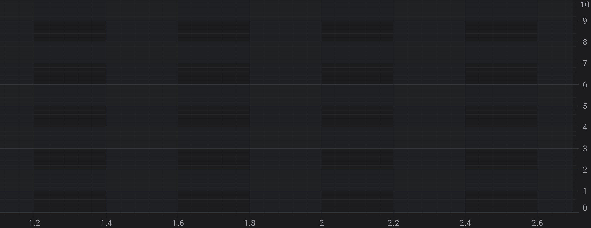
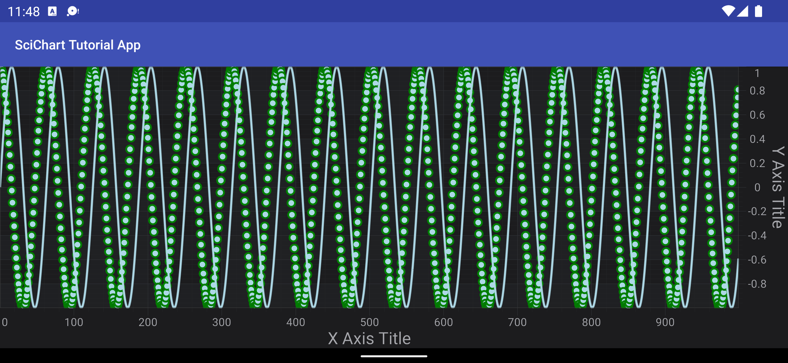

# SciChart Android Tutorial - Create a simple 2D Chart
In this SciChart Android 3D tutorial, you will learn to:
- create a **2D Chart**
- add `X and Y` [Axes](xref:axis.AxisAPIs) to a Chart;
- render a Simple [Line](xref:chart2d.renderableSeries.LineSeries) and [Scatter](xref:chart2d.renderableSeries.ScatterSeries) Series.

> [!NOTE]
> This ***tutorial*** assumes that you’ve already know how to [Link SciChart Android](xref:userManual.IntegratingSciChartLibraries) and [Add SciChartSurface instance](xref:quickStartGuide.projectSetup.ProjectSetup#declaring-a-scichartsurface-instance) into your Fragment. If you need more information - please read the following articles:
>
> - [Integrating SciChart libraries](xref:userManual.IntegratingSciChartLibraries)
> - [The SciChartSurface Type](xref:quickStartGuide.projectSetup.ProjectSetup#the-scichartsurface-type)

## Getting Started
This tutorial is suitable for **Java** and **Kotlin**.

> [!NOTE]
> Source code for this tutorial can be found at our Github Repository: [!include[Java and Kotlin Tutorials Repository](JavaKotlinTutorialsLink.md)]

## Adding Axes to the SciChartSurface
Once you have added a <xref:com.scichart.charting.visuals.SciChartSurface> into your Fragment, you will not see anything drawn because you need to add axes. 
This is important thing here - **two axes X and Y** has to be added to your surface. This is a bare minimum to see drawn grid on your device.

# [Java](#tab/java)
[!code-java[AddingAxesToTheSciChartSurface](../../../samples/tutorials-native/tutorials-2d/tutorial-1/java/src/main/java/com/scichart/tutorial/MainActivity.java#AddingAxesToTheSciChartSurface)]
# [Java with Builders API](#tab/javaBuilder)
[!code-java[AddingAxesToTheSciChartSurface](../../../samples/tutorials-native/tutorials-2d/tutorial-1/javaBuilder/src/main/java/com/scichart/tutorial/MainActivity.java#AddingAxesToTheSciChartSurface)]
# [Kotlin](#tab/kotlin)
[!code-swift[AddingAxesToTheSciChartSurface](../../../samples/tutorials-native/tutorials-2d/tutorial-1/kotlin/src/main/java/com/scichart/tutorial/MainActivity.kt#AddingAxesToTheSciChartSurface)]
# [Xamarin.Android](#tab/xamarin)
[!code-cs[AddingAxesToTheSciChartSurface](../../../samples/tutorials-xamarin/tutorials-2d/tutorial-01/MainActivity.cs#AddingAxesToTheSciChartSurface)]
***

# 

## Adding Series to the Chart
Now, we would like to see something more than just empty grid, e.g. Some **Scatter Chart** or a **Line Chart**.
To draw some data in chart we need to create 3D DataSeries and [RenderableSeries](xref:chart2d.2DChartTypes).

The **DataSeries** is a class which is responsible for storing data which should be displayed.
For more information about the DataSeries types available in SciChart - refer to the [DataSeries Types](xref:chart2d.DataSeriesAPIs) article.

The **RenderableSeries** on the other hand are the special classes in SciChart, that determine how data should be visualized by chart. 
You can find more information about RenderableSeries in the [2D Chart Types](xref:chart2d.2DChartTypes).

In this tutorial, we are going to add a [Line](xref:chart2d.renderableSeries.LineSeries) and a [Scatter](xref:chart2d.renderableSeries.ScatterSeries) series onto the chart.
First, let's declare the DataSeries for both and generate some data for them below:

# [Java](#tab/java)
[!code-java[DeclareDataSeries](../../../samples/tutorials-native/tutorials-2d/tutorial-1/java/src/main/java/com/scichart/tutorial/MainActivity.java#DeclareDataSeries)]
# [Java with Builders API](#tab/javaBuilder)
[!code-java[DeclareDataSeries](../../../samples/tutorials-native/tutorials-2d/tutorial-1/javaBuilder/src/main/java/com/scichart/tutorial/MainActivity.java#DeclareDataSeries)]
# [Kotlin](#tab/kotlin)
[!code-swift[DeclareDataSeries](../../../samples/tutorials-native/tutorials-2d/tutorial-1/kotlin/src/main/java/com/scichart/tutorial/MainActivity.kt#DeclareDataSeries)]
# [Xamarin.Android](#tab/xamarin)
[!code-cs[DeclareDataSeries](../../../samples/tutorials-xamarin/tutorials-2d/tutorial-01/MainActivity.cs#DeclareDataSeries)]
***

The next step is to create **Line** and **Scatter** [RenderableSeries](xref:chart2d.2DChartTypes) and provide previously created DataSeries to it.
Please note, that [Scatter Series](xref:chart2d.renderableSeries.ScatterSeries) requires a [PointMarker](xref:chart2d.PointMarkerAPI) to be drawn.

# [Java](#tab/java)
[!code-java[CreateRenderableSeries](../../../samples/tutorials-native/tutorials-2d/tutorial-1/java/src/main/java/com/scichart/tutorial/MainActivity.java#CreateRenderableSeries)]
# [Java with Builders API](#tab/javaBuilder)
[!code-java[CreateRenderableSeries](../../../samples/tutorials-native/tutorials-2d/tutorial-1/javaBuilder/src/main/java/com/scichart/tutorial/MainActivity.java#CreateRenderableSeries)]
# [Kotlin](#tab/kotlin)
[!code-swift[CreateRenderableSeries](../../../samples/tutorials-native/tutorials-2d/tutorial-1/kotlin/src/main/java/com/scichart/tutorial/MainActivity.kt#CreateRenderableSeries)]
# [Xamarin.Android](#tab/xamarin)
[!code-cs[CreateRenderableSeries](../../../samples/tutorials-xamarin/tutorials-2d/tutorial-01/MainActivity.cs#CreateRenderableSeries)]
***

Finally, we need to add newly created series into the [renderableSeries](xref:com.scichart.charting.visuals.ISciChartSurface.getRenderableSeries()) collection, like so:

# [Java](#tab/java)
[!code-java[AddRenderableSeries](../../../samples/tutorials-native/tutorials-2d/tutorial-1/java/src/main/java/com/scichart/tutorial/MainActivity.java#AddRenderableSeries)]
# [Java with Builders API](#tab/javaBuilder)
[!code-java[AddRenderableSeries](../../../samples/tutorials-native/tutorials-2d/tutorial-1/javaBuilder/src/main/java/com/scichart/tutorial/MainActivity.java#AddRenderableSeries)]
# [Kotlin](#tab/kotlin)
[!code-swift[AddRenderableSeries](../../../samples/tutorials-native/tutorials-2d/tutorial-1/kotlin/src/main/java/com/scichart/tutorial/MainActivity.kt#AddRenderableSeries)]
# [Xamarin.Android](#tab/xamarin)
[!code-cs[AddRenderableSeries](../../../samples/tutorials-xamarin/tutorials-2d/tutorial-01/MainActivity.cs#AddRenderableSeries)]
***

Which will render the following Chart:

> [!NOTE]  
> Please note that we've added axes and renderableSeries to <xref:com.scichart.charting.visuals.SciChartSurface> inside [IUpdateSuspender.using(ISuspendable, Runnable)](xref:com.scichart.core.framework.UpdateSuspender.using(com.scichart.core.framework.ISuspendable,java.lang.Runnable)) block. This allows to suspend surface instance and refresh it only one time after you finished all needed operations. That's **highly recommended** technique, if you want to omit performance decrease due to triggering refreshes on every operation which could be performed in one batch.

## Where to Go From Here?
You can download the final project from our [!include[Java and Kotlin Tutorials Repository](JavaKotlinTutorialsLink.md)].

Also, you can find **next tutorial** from this series here - [SciChart Android Tutorial - Zooming and Panning Behavior](xref:tutorials2d.SciChartAndroidTutorial-ZoomingAndPanningBehavior).

Of course, this is not the limit of what you can achieve with the SciChart Android.
Our documentation contains lots of useful information, some of the articles you might want to read are listed below:
- [Axis Types](xref:axis.AxisAPIs)
- [2D Chart Types](xref:chart2d.2DChartTypes)
- [Chart Modifiers](xref:chartModifierAPIs.ChartModifierAPIs)

Finally, start exploring. The SciChart Android library and functionality is quite extensive. 
You can look into our [SciChart Android Examples Suite](https://www.scichart.com/examples/android-chart/) which are full of 2D and 3D examples, which are also available on our [GitHub](https://github.com/ABTSoftware/SciChart.Android.Examples)