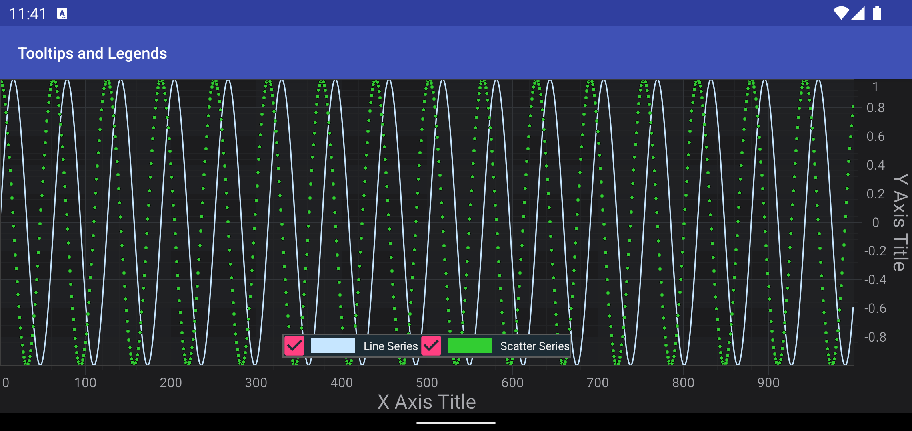
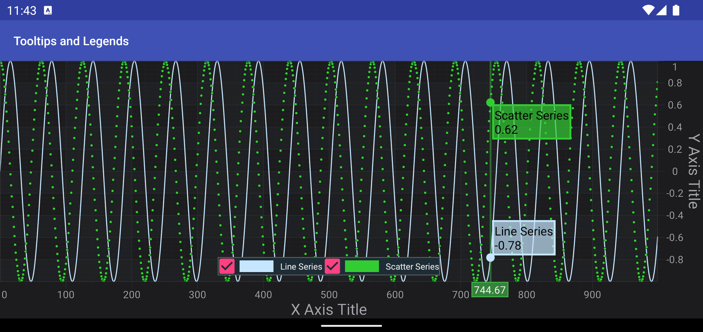

# SciChart Android Tutorial - Tooltips and Legends
In the previous tutorials we've showed how to [Create a Simple Chart](xref:tutorials2d.SciChartAndroidTutorial-CreateSimple2DChart) and add some [Zoom and Pan](xref:tutorials2d.SciChartAndroidTutorial-ZoomingAndPanningBehavior) interaction via the [Chart Modifiers API](xref:chartModifierAPIs.ChartModifierAPIs).

In this SciChart Android tutorial we're going show how to add a **Legend** and **Tooltip** to the chart.

## Getting Started
This tutorial is suitable for **Java** and **Kotlin**.

> [!NOTE]
> Source code for this tutorial can be found at our Github Repository: [!include[Java and Kotlin Tutorials Repository](JavaKotlinTutorialsLink.md)]

## Add a Legend
In SciChart, a chart legend can be created and configured via the <xref:com.scichart.charting.modifiers.LegendModifier>:

# [Java](#tab/java)
[!code-java[CreateLegend](../../../samples/tutorials-native/tutorials-2d/tutorial-3/java/src/main/java/com/scichart/tutorial/MainActivity.java#CreateLegend)] 
[!code-java[AddLegend](../../../samples/tutorials-native/tutorials-2d/tutorial-3/java/src/main/java/com/scichart/tutorial/MainActivity.java#AddLegend)]

# [Java with Builders API](#tab/javaBuilder)
[!code-java[CreateLegend](../../../samples/tutorials-native/tutorials-2d/tutorial-3/javaBuilder/src/main/java/com/scichart/tutorial/MainActivity.java#CreateLegend)]
[!code-java[AddLegend](../../../samples/tutorials-native/tutorials-2d/tutorial-3/javaBuilder/src/main/java/com/scichart/tutorial/MainActivity.java#AddLegend)]

# [Kotlin](#tab/kotlin)
[!code-swift[CreateLegend](../../../samples/tutorials-native/tutorials-2d/tutorial-3/kotlin/src/main/java/com/scichart/tutorial/MainActivity.kt#CreateLegend)]
[!code-swift[AddLegend](../../../samples/tutorials-native/tutorials-2d/tutorial-3/kotlin/src/main/java/com/scichart/tutorial/MainActivity.kt#AddLegend)]

# [Xamarin.Android](#tab/xamarin)
[!code-cs[CreateLegend](../../../samples/tutorials-xamarin/tutorials-2d/tutorial-03/MainActivity.cs#CreateLegend)]
[!code-swift[AddLegend](../../../samples/tutorials-xamarin/tutorials-2d/tutorial-03/MainActivity.cs#AddLegend)]
***

Also, if you want to have your series properly named inside the **Legend**, you will need to provide **Series Names** for your DataSeries instances, like showed below:

# [Java](#tab/java)
[!code-java[AddSeriesName](../../../samples/tutorials-native/tutorials-2d/tutorial-3/java/src/main/java/com/scichart/tutorial/MainActivity.java#AddSeriesName)]
# [Java with Builders API](#tab/javaBuilder)
[!code-java[AddSeriesName](../../../samples/tutorials-native/tutorials-2d/tutorial-3/javaBuilder/src/main/java/com/scichart/tutorial/MainActivity.java#AddSeriesName)]
# [Kotlin](#tab/kotlin)
[!code-swift[AddSeriesName](../../../samples/tutorials-native/tutorials-2d/tutorial-3/kotlin/src/main/java/com/scichart/tutorial/MainActivity.kt#AddSeriesName)]
# [Xamarin.Android](#tab/xamarin)
[!code-cs[AddSeriesName](../../../samples/tutorials-xamarin/tutorials-2d/tutorial-03/MainActivity.cs#AddSeriesName)]
***

> [!NOTE]
> You can find more information about legends in SciChart in the [Legend Modifier](xref:chartModifierAPIs.LegendModifier) article.

## Adding tooltips using RolloverModifier
[Rollover Modifier](xref:chartModifierAPIs.InteractivityRolloverModifier) adds a vertical section onto a <xref:com.scichart.charting.visuals.SciChartSurface>.
When you put your finger on the screen - it shows all series values at the X-Coordinate of that point.

Adding the <xref:com.scichart.charting.modifiers.RolloverModifier> is fairly simple with just creation new instance and adding to the [chartModifiers](xref:com.scichart.charting.visuals.ISciChartSurface.getChartModifiers()), like below:

# [Java](#tab/java)
[!code-java[AddRollover](../../../samples/tutorials-native/tutorials-2d/tutorial-3/java/src/main/java/com/scichart/tutorial/MainActivity.java#AddRollover)]
# [Java with Builders API](#tab/javaBuilder)
[!code-java[AddRollover](../../../samples/tutorials-native/tutorials-2d/tutorial-3/javaBuilder/src/main/java/com/scichart/tutorial/MainActivity.java#AddRollover)]
# [Kotlin](#tab/kotlin)
[!code-swift[AddRollover](../../../samples/tutorials-native/tutorials-2d/tutorial-3/kotlin/src/main/java/com/scichart/tutorial/MainActivity.kt#AddRollover)]
# [Xamarin.Android](#tab/xamarin)
[!code-cs[AddRollover](../../../samples/tutorials-xamarin/tutorials-2d/tutorial-03/MainActivity.cs#AddRollover)]
***

> [!NOTE]
> You can find more information about **RolloverModifier** in the corresponding [Rollover Modifier](xref:chartModifierAPIs.InteractivityRolloverModifier) article.

## Where to Go From Here?
In SciChart there are a bunch of modifiers, which are able to provide information about series (inspect series), such as:
- [TooltipModifier](xref:chartModifierAPIs.InteractivityTooltipModifier)
- [RolloverModifier](xref:chartModifierAPIs.InteractivityRolloverModifier)
- [CursorModifier](xref:chartModifierAPIs.InteractivityCursorModifier)

Also, all of the modifiers is highly customizable, and you can find more information in the [Tooltips Customization](xref:chartModifierAPIs.InteractivityTooltipsCustomization) article.

You can download the final project from our [!include[Java and Kotlin Tutorials Repository](JavaKotlinTutorialsLink.md)].

Also, you can found **next tutorial** from this series here - [SciChart Android Tutorial - Adding Realtime Updates](xref:tutorials2d.SciChartAndroidTutorial-AddingRealtimeUpdates)

Of course, this is not the maximum limit of what you can achieve with the SciChart Android.
You can find more information about modifiers which are used in this tutorial in the articles below:
- [Zoom Extents Modifier](xref:chartModifierAPIs.ZoomAndPanZoomExtentsModifier)
- [Pinch Zoom Modifier](xref:chartModifierAPIs.ZoomAndPanPinchZoomModifier)
- [Zoom Pan Modifier](xref:chartModifierAPIs.ZoomAndPanZoomPanModifier)
- [Rollover Modifier](xref:chartModifierAPIs.InteractivityRolloverModifier)

Finally, start exploring. The SciChart Android library and functionality is quite extensive. 
You can look into our [SciChart Android Examples Suite](https://www.scichart.com/examples/android-chart/) which are full of 2D and 3D examples, which are also available on our [GitHub](https://github.com/ABTSoftware/SciChart.Android.Examples)
