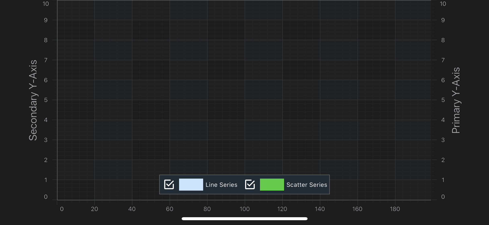

# SciChart Android Tutorial - Multiple Axis
So far, in our series of tutorials, all the charts have had one `X-Axis` and one `Y-Axis`.

SciChart supports unlimited, multiple X, and Y Axis on the left, right, bottom and top of the chart.
You can change Axis alignment, **rotate charts**, **mix axis** (have both XAxis/YAxis on the left), horizontally or vertically **stack axes**.
The possibilities are literally ***endless***!

In this tutorial, we are going to:
- add a second `Y-Axis` to the chart.
- show how to register annotations and line series on **the second axis**.
- ensure Axis **drag behaviors** work on both axis.

## Getting Started
This tutorial is suitable for **Java** and **Kotlin**.

> [!NOTE]
> Source code for this tutorial can be found at our Github Repository: [!include[Java and Kotlin Tutorials Repository](JavaKotlinTutorialsLink.md)]

First of all, make sure, you've went through the previous the tutorials:
- [Tutorial 01 - Create a simple Chart 2D](xref:tutorials2d.SciChartAndroidTutorial-CreateSimple2DChart)
- [Tutorial 05 - Annotations](xref:tutorials2d.SciChartAndroidTutorial-Annotations)

And have at least basic understanding of how to use SciChart.

Also, you might want to read our documentation about [Axis APIs](xref:axis.AxisAPIs).

## Adding a Second Y-Axis
The procedure to add a second axis to a <xref:com.scichart.charting.visuals.SciChartSurface> is pretty much the same as with one axis with one difference.
You must assign a **unique string ID** to all axes if there is more than one.

To see the axis to appear to the either side of a chart, you set <xref:com.scichart.charting.visuals.axes.AxisAlignment> to e.g.:
- <xref:com.scichart.charting.visuals.axes.AxisAlignment>.Left
- <xref:com.scichart.charting.visuals.axes.AxisAlignment>.Right
- etc...

Let's add another axis and align it to the **left** side of the chart (assuming the original one is placed to the right).

To have a different scale on the secondary axis, we are going to **enlarge** its VisibleRange **by 40%** setting a [growBy](xref:com.scichart.charting.visuals.axes.IAxisCore.getGrowBy()) value:

# [Java](#tab/java)
[!code-java[CreateMultipleAxes](../../../samples/tutorials-native/tutorials-2d/tutorial-6/java/src/main/java/com/scichart/tutorial/MainActivity.java#CreateMultipleAxes)]

[!code-java[AddMultipleAxes](../../../samples/tutorials-native/tutorials-2d/tutorial-6/java/src/main/java/com/scichart/tutorial/MainActivity.java#AddMultipleAxes)]
# [Java with Builders API](#tab/javaBuilder)
[!code-java[CreateMultipleAxes](../../../samples/tutorials-native/tutorials-2d/tutorial-6/javaBuilder/src/main/java/com/scichart/tutorial/MainActivity.java#CreateMultipleAxes)]

[!code-java[AddMultipleAxes](../../../samples/tutorials-native/tutorials-2d/tutorial-6/java/src/main/java/com/scichart/tutorial/MainActivity.java#AddMultipleAxes)]
# [Kotlin](#tab/kotlin)
[!code-swift[CreateMultipleAxes](../../../samples/tutorials-native/tutorials-2d/tutorial-6/kotlin/src/main/java/com/scichart/tutorial/MainActivity.kt#CreateMultipleAxes)]

[!code-swift[AddMultipleAxes](../../../samples/tutorials-native/tutorials-2d/tutorial-6/kotlin/src/main/java/com/scichart/tutorial/MainActivity.kt#AddMultipleAxes)]
# [Xamarin.Android](#tab/xamarin)
[!code-cs[CreateMultipleAxes](../../../samples/tutorials-xamarin/tutorials-2d/tutorial-06/MainActivity.cs#CreateMultipleAxes)]

[!code-cs[AddMultipleAxes](../../../samples/tutorials-xamarin/tutorials-2d/tutorial-06/MainActivity.cs#AddMultipleAxes)]
***

Now we can see the second axis in our application:

> [!NOTE]
> **Annotations** and **RenderableSeries** don't get rendered now

## Registering RenderableSeries on the Second Y-Axis
If there are ***several Y or X axes***, you need to register other chart parts, like **RenderableSeries** and **Annotations**, on a particular axis to be measured against its scale.

From the tutorial, we are going to attach one series to the right axis and the other to the left axis, passing corresponding IDs to the **RenderableSeries**:

# [Java](#tab/java)
[!code-java[AttachSeriesToAxes1](../../../samples/tutorials-native/tutorials-2d/tutorial-6/java/src/main/java/com/scichart/tutorial/MainActivity.java#AttachSeriesToAxes1)]

[!code-java[AttachSeriesToAxes2](../../../samples/tutorials-native/tutorials-2d/tutorial-6/java/src/main/java/com/scichart/tutorial/MainActivity.java#AttachSeriesToAxes2)]

# [Java with Builders API](#tab/javaBuilder)
[!code-java[AttachSeriesToAxes1](../../../samples/tutorials-native/tutorials-2d/tutorial-6/javaBuilder/src/main/java/com/scichart/tutorial/MainActivity.java#AttachSeriesToAxes1)]

[!code-java[AttachSeriesToAxes2](../../../samples/tutorials-native/tutorials-2d/tutorial-6/javaBuilder/src/main/java/com/scichart/tutorial/MainActivity.java#AttachSeriesToAxes2)]

# [Kotlin](#tab/kotlin)
[!code-swift[AttachSeriesToAxes1](../../../samples/tutorials-native/tutorials-2d/tutorial-6/kotlin/src/main/java/com/scichart/tutorial/MainActivity.kt#AttachSeriesToAxes1)]

[!code-swift[AttachSeriesToAxes2](../../../samples/tutorials-native/tutorials-2d/tutorial-6/kotlin/src/main/java/com/scichart/tutorial/MainActivity.kt#AttachSeriesToAxes2)]

# [Xamarin.Android](#tab/xamarin)
[!code-cs[AttachSeriesToAxes1](../../../samples/tutorials-xamarin/tutorials-2d/tutorial-06/MainActivity.cs#AttachSeriesToAxes1)]

[!code-cs[AttachSeriesToAxes2](../../../samples/tutorials-xamarin/tutorials-2d/tutorial-06/MainActivity.cs#AttachSeriesToAxes2)]
***

Which results in the following:

<video autoplay loop muted playsinline src="images/tutorials-2d-two-axis-two-series.mp4"></video>

## Registering Annotations on the Second Y-Axis
Annotations also need to be registered on a certain axis in a **multi-axis** scenario.
So we are going to **alternate** the axis IDs to annotations in on our chart for the left or right axes in the following way:

# [Java](#tab/java)
[!code-java[AttachAnnotationsToAxes](../../../samples/tutorials-native/tutorials-2d/tutorial-6/java/src/main/java/com/scichart/tutorial/MainActivity.java#AttachAnnotationsToAxes)]
# [Java with Builders API](#tab/javaBuilder)
[!code-java[AttachAnnotationsToAxes](../../../samples/tutorials-native/tutorials-2d/tutorial-6/javaBuilder/src/main/java/com/scichart/tutorial/MainActivity.java#AttachAnnotationsToAxes)]
# [Kotlin](#tab/kotlin)
[!code-swift[AttachAnnotationsToAxes](../../../samples/tutorials-native/tutorials-2d/tutorial-6/kotlin/src/main/java/com/scichart/tutorial/MainActivity.kt#AttachAnnotationsToAxes)]
# [Xamarin.Android](#tab/xamarin)
[!code-cs[AttachAnnotationsToAxes](../../../samples/tutorials-xamarin/tutorials-2d/tutorial-06/MainActivity.cs#AttachAnnotationsToAxes)]
***

If you now add <xref:com.scichart.charting.modifiers.YAxisDragModifier> you can see which series and annotation are registered on which `Y-Axis`:

# [Java](#tab/java)
[!code-java[AddYAxisDragModifier](../../../samples/tutorials-native/tutorials-2d/tutorial-6/java/src/main/java/com/scichart/tutorial/MainActivity.java#AddYAxisDragModifier)]
# [Java with Builders API](#tab/javaBuilder)
[!code-java[AddYAxisDragModifier](../../../samples/tutorials-native/tutorials-2d/tutorial-6/javaBuilder/src/main/java/com/scichart/tutorial/MainActivity.java#AddYAxisDragModifier)]
# [Kotlin](#tab/kotlin)
[!code-swift[AddYAxisDragModifier](../../../samples/tutorials-native/tutorials-2d/tutorial-6/kotlin/src/main/java/com/scichart/tutorial/MainActivity.kt#AddYAxisDragModifier)]
# [Xamarin.Android](#tab/xamarin)
[!code-cs[AddYAxisDragModifier](../../../samples/tutorials-xamarin/tutorials-2d/tutorial-06/MainActivity.cs#AddYAxisDragModifier)]
***

<video autoplay loop muted playsinline src="images/tutorials-2d-two-axis-annotations.mp4"></video>

## Where to Go From Here?
You can download the final project from our [!include[Java and Kotlin Tutorials Repository](JavaKotlinTutorialsLink.md)].

Also, you can found **next tutorial** from this series here - [SciChart Android Tutorial - Linking Multiple Charts](xref:tutorials2d.SciChartAndroidTutorial-LinkingMultipleCharts)

Of course, this is not the limit of what you can achieve with the SciChart Android. You might want to read some of the following articles:
- [Axis APIs](xref:axis.AxisAPIs)
- [Annotations API](xref:annotationsAPIs.AnnotationsAPIs)
- [2D Chart Types](xref:chart2d.2DChartTypes)
- [Chart Modifiers](xref:chartModifierAPIs.ChartModifierAPIs)

Finally, start exploring. The SciChart Android library and functionality is quite extensive. 
You can look into our [SciChart Android Examples Suite](https://www.scichart.com/examples/android-chart/) which are full of 2D and 3D examples, which are also available on our [GitHub](https://github.com/ABTSoftware/SciChart.Android.Examples)