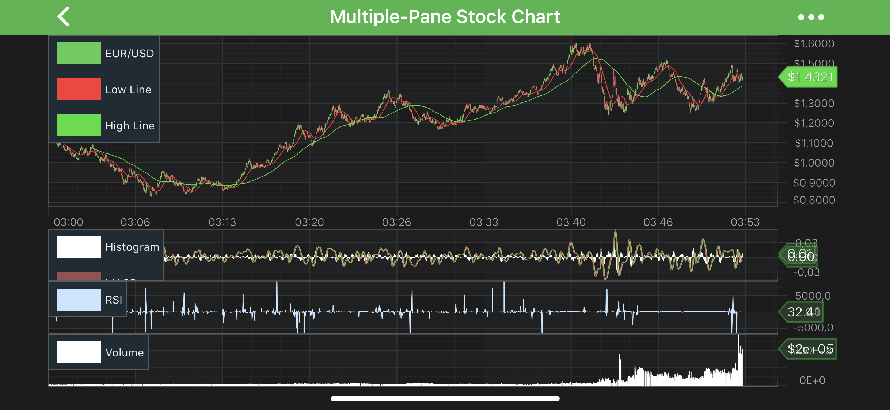

# SciChart Android Tutorial - Linking Multiple Charts
In our ***series of tutorials***, up until now we have added a chart with two `Y-Axis`, one `X-Axis`, two series, added tooltips, legends and zooming, panning behavior, and added some annotations. All of that was with the only <xref:com.scichart.charting.visuals.SciChartSurface>. 

In SciChart, there is **no restriction** on the number of <xref:com.scichart.charting.visuals.SciChartSurface> you can have in an application.

In the previous tutorial - [Multiple Axis](xref:tutorials2d.SciChartAndroidTutorial-MultipleAxis) - we've manipulated one <xref:com.scichart.charting.visuals.SciChartSurface> instance.
In this tutorial you will learn how to:
- add a **second** <xref:com.scichart.charting.visuals.SciChartSurface> (or potentially unlimited surfaces).
- **link** multiple **charts** and modifiers on them together

## Getting Started
This tutorial is suitable for **Java** and **Kotlin**.

> [!NOTE]
> Source code for this tutorial can be found at our Github Repository: [!include[Java and Kotlin Tutorials Repository](JavaKotlinTutorialsLink.md)]

First of all, make sure, you've went through the previous the tutorials, to have a better grasp of SciChart functionality, such as:
- [Tutorial 01 - Create a simple Chart 2D](xref:tutorials2d.SciChartAndroidTutorial-CreateSimple2DChart)
- [Tutorial 05 - Annotations](xref:tutorials2d.SciChartAndroidTutorial-Annotations)
- [Tutorial 06 - Multiple Axis](xref:tutorials2d.SciChartAndroidTutorial-MultipleAxis)

## Adding a Second Chart
Assuming, you've already know how to add one <xref:com.scichart.charting.visuals.SciChartSurface>, it should be fairly easy to add second surface.
Just repeat the same procedure to configure the second chart. We will leave off annotations and modifiers.
Everything else will be the same.

The code below shows how to add two <xref:com.scichart.charting.visuals.SciChartSurface> instance into one view:

# [Java](#tab/java)
[!code-java[AddTwoSurfaces](../../../samples/tutorials-native/tutorials-2d/tutorial-7/java/src/main/java/com/scichart/tutorial/MainActivity.java#AddTwoSurfaces)]
# [Java with Builders API](#tab/javaBuilder)
[!code-java[AddTwoSurfaces](../../../samples/tutorials-native/tutorials-2d/tutorial-7/javaBuilder/src/main/java/com/scichart/tutorial/MainActivity.java#AddTwoSurfaces)]
# [Kotlin](#tab/kotlin)
[!code-swift[AddTwoSurfaces](../../../samples/tutorials-native/tutorials-2d/tutorial-7/kotlin/src/main/java/com/scichart/tutorial/MainActivity.kt#AddTwoSurfaces)]
# [Xamarin.Android](#tab/xamarin)
[!code-cs[AddTwoSurfaces](../../../samples/tutorials-xamarin/tutorials-2d/tutorial-07/MainActivity.cs#AddTwoSurfaces)]
***

> [!NOTE]
> You might want to add your **Surfaces** from the `.xml` or whatever else. Setting layout parameters for both surfaces in code is just for the sake of simplicity.

Now, let's add Axes onto a Surfaces as we did before, the only difference - we extracted some code to omit duplications:

# [Java](#tab/java)
[!code-java[SetupSurfaces1](../../../samples/tutorials-native/tutorials-2d/tutorial-7/java/src/main/java/com/scichart/tutorial/MainActivity.java#SetupSurfaces1)]

[!code-java[SetupSurfaces2](../../../samples/tutorials-native/tutorials-2d/tutorial-7/java/src/main/java/com/scichart/tutorial/MainActivity.java#SetupSurfaces2)]
# [Java with Builders API](#tab/javaBuilder)
[!code-java[SetupSurfaces1](../../../samples/tutorials-native/tutorials-2d/tutorial-7/javaBuilder/src/main/java/com/scichart/tutorial/MainActivity.java#SetupSurfaces1)]

[!code-java[SetupSurfaces2](../../../samples/tutorials-native/tutorials-2d/tutorial-7/java/src/main/java/com/scichart/tutorial/MainActivity.java#SetupSurfaces2)]
# [Kotlin](#tab/kotlin)
[!code-swift[SetupSurfaces1](../../../samples/tutorials-native/tutorials-2d/tutorial-7/kotlin/src/main/java/com/scichart/tutorial/MainActivity.kt#SetupSurfaces1)]

[!code-swift[SetupSurfaces2](../../../samples/tutorials-native/tutorials-2d/tutorial-7/kotlin/src/main/java/com/scichart/tutorial/MainActivity.kt#SetupSurfaces2)]
# [Xamarin.Android](#tab/xamarin)
[!code-cs[SetupSurfaces1](../../../samples/tutorials-xamarin/tutorials-2d/tutorial-07/MainActivity.cs#SetupSurfaces1)]

[!code-cs[SetupSurfaces2](../../../samples/tutorials-xamarin/tutorials-2d/tutorial-07/MainActivity.cs#SetupSurfaces2)]
***

At this stage, you should have something similar to the shown below:

## Adding a Series to the Second Chart
Now we are ready to add a [RenderableSeries](xref:chart2d.2DChartTypes) to the second chart.
To try something new, let's add a [Mountain Series](xref:chart2d.renderableSeries.MountainSeries)

We are going to attach an **existing DataSeries** instance, so it scrolls just like the series on the first chart.
Also, we will attach the **RenderableSeries** to the right axis.

> [!NOTE]
> Remember, since there are two `Y-Axes`, they both must have **unique IDs** assigned to them. Those IDs can be used to register **RenderableSeries** and **Annotations** on a corresponding axis.

So just add these lines of code:

# [Java](#tab/java)
[!code-java[AddMountainSeries](../../../samples/tutorials-native/tutorials-2d/tutorial-7/java/src/main/java/com/scichart/tutorial/MainActivity.java#AddMountainSeries)]
# [Java with Builders API](#tab/javaBuilder)
[!code-java[AddMountainSeries](../../../samples/tutorials-native/tutorials-2d/tutorial-7/javaBuilder/src/main/java/com/scichart/tutorial/MainActivity.java#AddMountainSeries)]
# [Kotlin](#tab/kotlin)
[!code-swift[AddMountainSeries](../../../samples/tutorials-native/tutorials-2d/tutorial-7/kotlin/src/main/java/com/scichart/tutorial/MainActivity.kt#AddMountainSeries)]
# [Xamarin.Android](#tab/xamarin)
[!code-cs[AddMountainSeries](../../../samples/tutorials-xamarin/tutorials-2d/tutorial-07/MainActivity.cs#AddMountainSeries)]
***

Now you should see something like this:

[!code-java[SynchronizeVisibleRanges](../../../samples/tutorials-native/tutorials-2d/tutorial-7/java/src/main/java/com/scichart/tutorial/MainActivity.java#SynchronizeVisibleRanges)]
# [Java with Builders API](#tab/javaBuilder)
[!code-java[SynchronizeVisibleRanges](../../../samples/tutorials-native/tutorials-2d/tutorial-7/javaBuilder/src/main/java/com/scichart/tutorial/MainActivity.java#SynchronizeVisibleRanges)]
# [Kotlin](#tab/kotlin)
[!code-swift[SynchronizeVisibleRanges](../../../samples/tutorials-native/tutorials-2d/tutorial-7/kotlin/src/main/java/com/scichart/tutorial/MainActivity.kt#SynchronizeVisibleRanges)]
# [Xamarin.Android](#tab/xamarin)
[!code-cs[SynchronizeVisibleRanges](../../../samples/tutorials-xamarin/tutorials-2d/tutorial-07/MainActivity.cs#SynchronizeVisibleRanges)]
***

#### Synchronizing Chart Widths
Imagine a situation when you have a two charts with Y axes on opposite sides, or values on your Y-Axes differs, and width of them are different.
It will cause one of the chart areas stick out. There is a helper class called <xref:com.scichart.charting.visuals.synchronization.SciChartVerticalGroup> which is used in situations like this.
It's just line charts up. See the code below which showcases how to use it:

# [Java](#tab/java)
[!code-java[AddVerticalGroup](../../../samples/tutorials-native/tutorials-2d/tutorial-7/java/src/main/java/com/scichart/tutorial/MainActivity.java#AddVerticalGroup)]
# [Java with Builders API](#tab/javaBuilder)
[!code-java[AddVerticalGroup](../../../samples/tutorials-native/tutorials-2d/tutorial-7/javaBuilder/src/main/java/com/scichart/tutorial/MainActivity.java#AddVerticalGroup)]
# [Kotlin](#tab/kotlin)
[!code-swift[AddVerticalGroup](../../../samples/tutorials-native/tutorials-2d/tutorial-7/kotlin/src/main/java/com/scichart/tutorial/MainActivity.kt#AddVerticalGroup)]
# [Xamarin.Android](#tab/xamarin)
[!code-cs[AddVerticalGroup](../../../samples/tutorials-xamarin/tutorials-2d/tutorial-07/MainActivity.cs#AddVerticalGroup)]
***

We used this technique in our **Multi-Pane Stock Chart** example, which can be found in the [SciChart Android Examples Suite](https://www.scichart.com/examples/android-chart/) as well as on [GitHub](https://github.com/ABTSoftware/SciChart.Android.Examples):
> - [Native Example](https://www.scichart.com/example/android-chart-multi-pane-stock-charts-example/)
> - [Xamarin Example](https://www.scichart.com/example/xamarin-chart-multi-pane-stock-charts-example/)

[Multi Pane Stock Charts](https://www.scichart.com/example/android-chart-multi-pane-stock-charts-example/)

#### Linking Cursor and Other Modifiers
Next we are going to **link chart modifiers**.

The first chart has an array of ChartModifiers set up to handle zooming, panning and tooltips.
We are going to add some of these modifiers to the second chart.

To sync those modifier, you should add the modifiers through the <xref:com.scichart.charting.modifiers.ModifierGroup> collection, and share the **same group** via the [motionEventGroup](xref:com.scichart.charting.modifiers.ModifierGroup.setMotionEventGroup(java.lang.String)) property, like showcased below:

# [Java](#tab/java)
[!code-java[SetModifierGroup](../../../samples/tutorials-native/tutorials-2d/tutorial-7/java/src/main/java/com/scichart/tutorial/MainActivity.java#SetModifierGroup)]
# [Java with Builders API](#tab/javaBuilder)
[!code-java[SetModifierGroup](../../../samples/tutorials-native/tutorials-2d/tutorial-7/javaBuilder/src/main/java/com/scichart/tutorial/MainActivity.java#SetModifierGroup)]
# [Kotlin](#tab/kotlin)
[!code-swift[SetModifierGroup](../../../samples/tutorials-native/tutorials-2d/tutorial-7/kotlin/src/main/java/com/scichart/tutorial/MainActivity.kt#SetModifierGroup)]
# [Xamarin.Android](#tab/xamarin)
[!code-cs[SetModifierGroup](../../../samples/tutorials-xamarin/tutorials-2d/tutorial-07/MainActivity.cs#SetModifierGroup)]
***

> [!NOTE]
> You can use a **motionEventGroup** on more than two charts.

Run the application again. The Cursors and Tooltips are now **synchronized** across the charts:

<video autoplay loop muted playsinline src="images/tutorials-2d-multi-chart-sync.mp4"></video>

## Where to Go From Here?
You can download the final project from our [!include[Java and Kotlin Tutorials Repository](JavaKotlinTutorialsLink.md)].

Of course, this is not the limit of what you can achieve with the SciChart Android. You might want to read some of the following articles:
- [Axis APIs](xref:axis.AxisAPIs)
- [Annotations API](xref:annotationsAPIs.AnnotationsAPIs)
- [2D Chart Types](xref:chart2d.2DChartTypes)
- [Chart Modifiers](xref:chartModifierAPIs.ChartModifierAPIs)

Finally, start exploring. The SciChart Android library and functionality is quite extensive. 
You can look into our [SciChart Android Examples Suite](https://www.scichart.com/examples/android-chart/) which are full of 2D and 3D examples, which are also available on our [GitHub](https://github.com/ABTSoftware/SciChart.Android.Examples)

For instance - take a look at our **Sync Multi Chart** example, which can be found in the [SciChart Android Examples Suite](https://www.scichart.com/examples/android-chart/) as well as on [GitHub](https://github.com/ABTSoftware/SciChart.Android.Examples):
> - [Native Example](https://www.scichart.com/example/android-chart-example-sync-multi-chart/)

