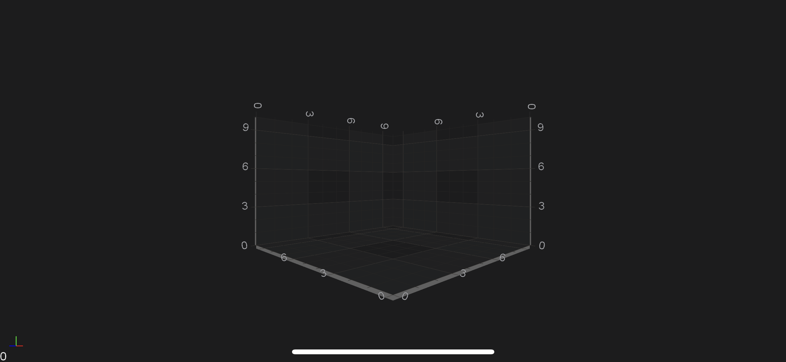

# SciChart Android 3D Tutorial - Create a simple Scatter Chart 3D
In this SciChart Android 3D tutorial, you’ll learn to:
- create a **3D Chart**
- add `X, Y and Z` [Axes](xref:axis3DAPIs.Axis3DAPIs) to a Chart;
- render a [Simple Scatter 3D Series](xref:chart3d.ScatterSeries3D);

> [!NOTE]
> This ***tutorial*** assumes that you’ve already know how to [Link SciChart Android](xref:userManual.IntegratingSciChartLibraries) and [Add SciChartSurface3D instance](xref:quickStartGuide.projectSetup.AddingChartUsingxml#adding-3d-axes-to-the-scichartsurface3d) into your `Fragment`. If you need more information - please read the following articles:
>
> - [Integrating SciChart.framework](xref:userManual.IntegratingSciChartLibraries)
> - [The SciChartSurface3D Type](xref:quickStartGuide.projectSetup.AddingChartUsingxml#the-scichartsurface3d-type)

## Getting Started
This tutorial is suitable for **Java** and **Kotlin**.

> [!NOTE]
> Source code for this tutorial can be found at our Github Repository: [!include[Java and Kotlin Tutorials 3D Repository](JavaKotlinTutorials3DLink.md)]

## Adding 3D Axes to the SciChartSurface3D
Once you have added a <xref:com.scichart.charting3d.visuals.SciChartSurface3D> into your Fragment, you will not see anything drawn because you need to add axes. 
This is important: that **three axes X, Y and Z** has to be added to your surface.This is a bare minimum to see drawn grid on your device.

# [Java](#tab/java)
[!code-java[AddAxes](../../../samples/tutorials-native/tutorials-3d/tutorial-1/java/src/main/java/com/scichart/tutorial/MainActivity.java#AddAxes)]
# [Java with Builders API](#tab/javaBuilder)
[!code-java[AddAxes](../../../samples/tutorials-native/tutorials-3d/tutorial-1/javaBuilder/src/main/java/com/scichart/tutorial/MainActivity.java#AddAxes)]
# [Kotlin](#tab/kotlin)
[!code-swift[AddAxes](../../../samples/tutorials-native/tutorials-3d/tutorial-1/kotlin/src/main/java/com/scichart/tutorial/MainActivity.kt#AddAxes)]
# [Xamarin.Android](#tab/xamarin)
[!code-cs[AddAxes](../../../samples/tutorials-xamarin/tutorials-3d/tutorial-01/MainActivity.cs#AddAxes)]
***

## Adding 3D Renderable Series
Now, we would like to see something more than just empty grid, e.g. **Scatter 3D Chart**. 
To draw some data in chart we need to create 3D DataSeries and [RenderableSeries](xref:chart3d.3DChartTypes).
The DataSeries is a class which is responsible for storing data which should be displayed and RenderableSeries is a class that determines how data should be visualized by chart.

First, let's declare the 3D DataSeries and generate some data for it:

# [Java](#tab/java)
[!code-java[CreateDataSeries](../../../samples/tutorials-native/tutorials-3d/tutorial-1/java/src/main/java/com/scichart/tutorial/MainActivity.java#CreateDataSeries)]
# [Java with Builders API](#tab/javaBuilder)
[!code-java[CreateDataSeries](../../../samples/tutorials-native/tutorials-3d/tutorial-1/javaBuilder/src/main/java/com/scichart/tutorial/MainActivity.java#CreateDataSeries)]
# [Kotlin](#tab/kotlin)
[!code-swift[CreateDataSeries](../../../samples/tutorials-native/tutorials-3d/tutorial-1/kotlin/src/main/java/com/scichart/tutorial/MainActivity.kt#CreateDataSeries)]
# [Xamarin.Android](#tab/xamarin)
[!code-cs[CreateDataSeries](../../../samples/tutorials-xamarin/tutorials-3d/tutorial-01/MainActivity.cs#CreateDataSeries)]
***

The next step is to create [3D RenderableSeries](xref:chart3d.3DChartTypes).
In our case we're going to display data as a point cloud using [Scatter Series 3D](xref:chart3d.ScatterSeries3D), which is represented by the <xref:com.scichart.charting3d.visuals.renderableSeries.scatter.ScatterRenderableSeries3D>:

# [Java](#tab/java)
[!code-java[CreateRenderableSeries](../../../samples/tutorials-native/tutorials-3d/tutorial-1/java/src/main/java/com/scichart/tutorial/MainActivity.java#CreateRenderableSeries)]
# [Java with Builders API](#tab/javaBuilder)
[!code-java[CreateRenderableSeries](../../../samples/tutorials-native/tutorials-3d/tutorial-1/javaBuilder/src/main/java/com/scichart/tutorial/MainActivity.java#CreateRenderableSeries)]
# [Kotlin](#tab/kotlin)
[!code-swift[CreateRenderableSeries](../../../samples/tutorials-native/tutorials-3d/tutorial-1/kotlin/src/main/java/com/scichart/tutorial/MainActivity.kt#CreateRenderableSeries)]
# [Xamarin.Android](#tab/xamarin)
[!code-cs[CreateRenderableSeries](../../../samples/tutorials-xamarin/tutorials-3d/tutorial-01/MainActivity.cs#CreateRenderableSeries)]
***

Finally, we need to add newly created series into the [renderableSeries](xref:com.scichart.charting3d.visuals.ISciChartSurface3D.getRenderableSeries()) collection, like so:

# [Java](#tab/java)
[!code-java[AddRenderableSeries](../../../samples/tutorials-native/tutorials-3d/tutorial-1/java/src/main/java/com/scichart/tutorial/MainActivity.java#AddRenderableSeries)]
# [Java with Builders API](#tab/javaBuilder)
[!code-java[AddRenderableSeries](../../../samples/tutorials-native/tutorials-3d/tutorial-1/javaBuilder/src/main/java/com/scichart/tutorial/MainActivity.java#AddRenderableSeries)]
# [Kotlin](#tab/kotlin)
[!code-swift[AddRenderableSeries](../../../samples/tutorials-native/tutorials-3d/tutorial-1/kotlin/src/main/java/com/scichart/tutorial/MainActivity.kt#AddRenderableSeries)]
# [Xamarin.Android](#tab/xamarin)
[!code-cs[AddRenderableSeries](../../../samples/tutorials-xamarin/tutorials-3d/tutorial-01/MainActivity.cs#AddRenderableSeries)]
***

Which will render the following Scatter Chart 3D:

> [!NOTE]
> Please note that we've added axes and renderableSeries to <xref:com.scichart.charting3d.visuals.SciChartSurface3D> inside <xref:com.scichart.core.framework.UpdateSuspender.using(com.scichart.core.framework.ISuspendable,java.lang.Runnable)> block. This allows to suspend surface instance and refresh it only one time after you finished all needed operations. That's **highly recommended** technique, if you want to omit performance decrease due to triggering refreshes on every operation which could be performed in one batch.

## Where to Go From Here?
You can download the final project from our [!include[Java and Kotlin Tutorials Repository](JavaKotlinTutorials3DLink.md)].

Also, you can found **next tutorial** from this series here - [SciChart Android 3D Tutorial - Zooming and Rotating](xref:tutorials3d.SciChartAndroidTutorial-ZoomingAndRotating)

Of course, this is not the limit of what you can achieve with the SciChart Android 3D.
Our documentation contains lots of useful information, some of the articles you might want to read are listed below:
- [3D Axis Types](xref:axis3DAPIs.Axis3DAPIs)
- [3D Chart Types](xref:chart3d.3DChartTypes)
- [3D Chart Modifiers](xref:chartModifier3DAPIs.ChartModifier3DAPIs)

Finally, start exploring. The SciChart Android library and functionality is quite extensive. 
You can look into our [SciChart Android Examples Suite](https://www.scichart.com/examples/android-chart/) which are full of 2D and 3D examples, which are also available on our [GitHub](https://github.com/ABTSoftware/SciChart.Android.Examples)
