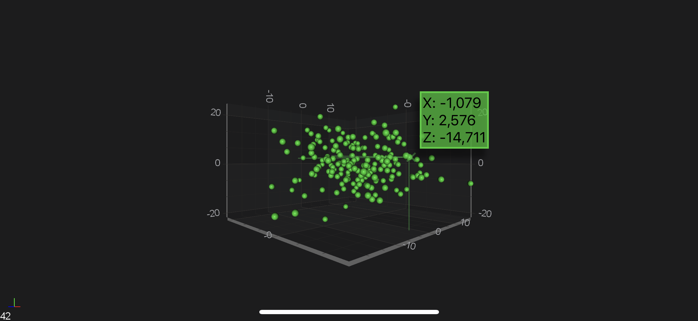

# SciChart Android 3D Tutorial - Cursors and Tooltips

In the previous tutorials we've showed how to [Create a Simple 3D Chart](xref:tutorials3d.SciChartAndroidTutorial-CreateSimpleScatterChart3D) and add some [Zoom and Rotate](xref:tutorials3d.SciChartAndroidTutorial-ZoomingAndRotating) interaction via the [Chart Modifiers 3D API](xref:chartModifier3DAPIs.ChartModifier3DAPIs).

In this SciChart Android 3D tutorial we're going show how to add a **cursor** and **tooltip** to that chart.

## Getting Started
This tutorial is suitable for **Java** and **Kotlin**.

> [!NOTE]
> Source code for this tutorial can be found at our Github Repository: [!include[Java and Kotlin Tutorials 3D Repository](JavaKotlinTutorials3DLink.md)]

Let's define what is Cursor ant Tooltip:
- **cursor** ⁠— a tablet or cell phone obviously does not have a mouse. Instead the mouse is your finer and the cursor is where you place your finger. It appears as a small x (cross).
- **tooltip** — is text that displays when you push the cursor onto an object, like a point plotted on a chart. You have to push the cursor onto the coordinate for the text to appear. In the case of the example below you probably need to use two fingers to zoom into the chart to make the points appear large enough so that you can see them.

## The TooltipModifier3D
We can add more renderable on the surface by simple adding them into [renderableSeries](xref:com.scichart.charting3d.visuals.ISciChartSurface3D.getRenderableSeries()) collection property.
Similarly we can an add **additional modifiers**, such as a [Tooltip Modifier 3D](xref:chartModifier3DAPIs.InteractivityTooltipModifier3D), which provides in SciChart.

In addition to modifiers we added in the previous tutorial, we are going to add <xref:com.scichart.charting3d.modifiers.TooltipModifier3D> similarly, with the code below:

# [Java](#tab/java)
[!code-java[CreateTooltipModifier](../../../samples/tutorials-native/tutorials-3d/tutorial-3/java/src/main/java/com/scichart/tutorial/MainActivity.java#CreateTooltipModifier)]
[!code-java[AddModifiers](../../../samples/tutorials-native/tutorials-3d/tutorial-3/java/src/main/java/com/scichart/tutorial/MainActivity.java#AddModifiers)]
# [Java with Builders API](#tab/javaBuilder)
[!code-java[CreateTooltipModifier](../../../samples/tutorials-native/tutorials-3d/tutorial-3/javaBuilder/src/main/java/com/scichart/tutorial/MainActivity.java#CreateTooltipModifier)]
[!code-java[AddModifiers](../../../samples/tutorials-native/tutorials-3d/tutorial-3/javaBuilder/src/main/java/com/scichart/tutorial/MainActivity.java#AddModifiers)]
# [Kotlin](#tab/kotlin)
[!code-swift[CreateTooltipModifier](../../../samples/tutorials-native/tutorials-3d/tutorial-3/kotlin/src/main/java/com/scichart/tutorial/MainActivity.kt#CreateTooltipModifier)]
[!code-swift[AddModifiers](../../../samples/tutorials-native/tutorials-3d/tutorial-3/kotlin/src/main/java/com/scichart/tutorial/MainActivity.kt#AddModifiers)]
# [Xamarin.Android](#tab/xamarin)
[!code-cs[CreateTooltipModifier](../../../samples/tutorials-xamarin/tutorials-3d/tutorial-03/MainActivity.cs#CreateTooltipModifier)]
[!code-cs[AddModifiers](../../../samples/tutorials-xamarin/tutorials-3d/tutorial-03/MainActivity.cs#AddModifiers)]
***

> [!NOTE]
> We used `executeOnPointerCount = 2` for <xref:com.scichart.charting3d.modifiers.OrbitModifier3D> to omit conflict while using **TooltipModifier3D**

## Where to Go From Here?
You can download the final project from our [!include[Java and Kotlin Tutorials Repository](JavaKotlinTutorials3DLink.md)].

Also, you can found **next tutorial** from this series here - [SciChart Android 3D Tutorial - Plotting Realtime Data](xref:tutorials3d.SciChartAndroidTutorial-PlottingRealtimeData)

Of course, this is not the maximum limit of what you can achieve with the SciChart Android 3D.
You can find more information about modifiers which are used in this tutorial in the articles below:
- [Zoom Extents Modifier 3D](xref:chartModifier3DAPIs.ZoomAndPanZoomExtentsModifier3D)
- [Pinch Zoom Modifier 3D](xref:chartModifier3DAPIs.ZoomAndPanPinchZoomModifier3D)
- [Orbit Modifier 3D](xref:chartModifier3DAPIs.ZoomAndPanOrbitModifier3D)
- [Tooltip Modifier 3D](xref:chartModifier3DAPIs.InteractivityTooltipModifier3D)

Finally, start exploring. The SciChart Android library and functionality is quite extensive. 
You can look into our [SciChart Android Examples Suite](https://www.scichart.com/examples/android-chart/) which are full of 2D and 3D examples, which are also available on our [GitHub](https://github.com/ABTSoftware/SciChart.Android.Examples)
